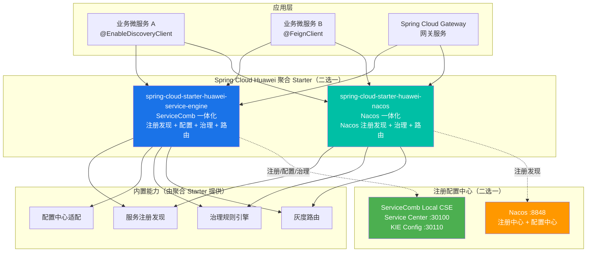
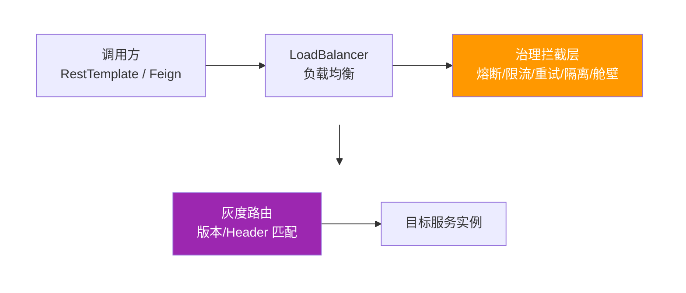
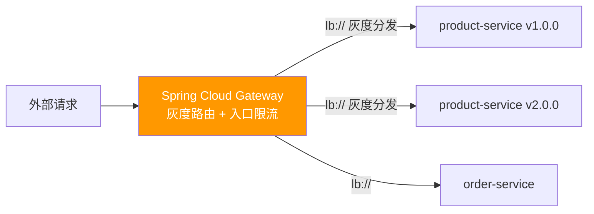

# SpringCloudHuawei集成最佳实践

## 实践版本表

| 组件 | 版本 | 对应实践工程 |
|------|------|--------------|
| Java | 17 | 两个工程统一运行基线 |
| Spring Boot | 3.4.4 | 两个工程父 POM |
| Spring Cloud | 2024.0.1 | 两个工程父 POM |
| Spring Cloud Huawei | 1.11.11-2024.0.x | 两个工程依赖管理 |
| Local CSE | 2.1.8 | `spring-cloud-huawei-servicecomb` |
| Nacos | 2.1.0 | `spring-cloud-huawei-nacos` |

本文内容对应 `spring-cloud-huawei-servicecomb` 和 `spring-cloud-huawei-nacos` 两个实践工程。版本组合应作为整体使用，避免只升级其中一个框架组件。

## 1. 解决方案说明

### 1.1 需求背景

在微服务架构快速发展的背景下，Spring Cloud 生态虽然提供了丰富的服务治理能力，但在实际项目中仍面临以下挑战：

1. **多注册中心适配复杂**：企业内部可能同时存在 Eureka、Consul、Nacos、ServiceComb Service Center 等多种注册中心，需要统一的适配方案。

2. **治理能力碎片化**：原生 Spring Cloud 的熔断（Resilience4j）、限流、重试等治理能力分散在不同的组件中，配置方式不统一，运维管理成本高。

3. **治理规则发布不统一**：治理规则如果只固化在本地配置中，调整时通常需要重新发布应用；实践工程分别通过 KIE 和 Nacos Config 管理可动态加载的规则。

4. **华为云栈生态融合**：企业在使用华为云栈（HCS）时，需要与 ServiceComb 体系（Service Center、KIE 配置中心）深度集成，原生 Spring Cloud 缺乏开箱即用的适配方案。

**Spring Cloud Huawei 应运而生**，作为华为开源的 Spring Cloud 增强套件，它在保持 Spring Cloud 编程模型的基础上，提供了：

- 统一的服务注册发现适配层（支持 ServiceComb SC、Nacos）
- 统一的配置中心适配层（支持 ServiceComb KIE、Nacos Config）
- 完整的微服务治理能力（灰度发布、熔断降级、流量限流、重试、隔离、舱壁、故障注入）
- 与 Spring Cloud 服务发现、负载均衡和声明式调用模型衔接的治理能力
- 动态治理规则支持（通过 KIE 配置中心实时推送）

### 1.2 方案概述

Spring Cloud Huawei 整体架构如下：



**聚合 Starter 与内置能力说明：**

Spring Cloud Huawei 在 2024.0.x 版本线采用**聚合 Starter**的方式集成，业务工程只需引入一个聚合 Starter，即可获得注册发现、配置、治理、灰度路由等全部能力，无需分别引入细分模块：

| 聚合 Starter | 适用注册中心 | 内置能力 |
|--------------|--------------|----------|
| `spring-cloud-starter-huawei-service-engine` | ServiceComb Service Center + KIE | 注册发现 + 配置中心 + 服务治理 + 灰度路由 |
| `spring-cloud-starter-huawei-nacos` | Nacos | Nacos 注册发现 + 服务治理（ServiceComb 引擎）+ 灰度路由 |

> **说明**：`spring-cloud-starter-huawei-nacos` 是华为封装的 Nacos 集成 Starter，注册发现走 Nacos，但治理与灰度能力仍复用 ServiceComb 治理引擎（`servicecomb.*` 配置生效）。它与阿里原生的 Nacos Starter 不同。

**选型决策参考：**

根据企业实际环境和团队技术栈，选择合适的注册中心体系：

| 场景 | 推荐方案 | 核心理由 |
|------|---------|---------|
| **已有 ServiceComb / CSE 基础设施** | ServiceComb | 工程直接使用 Service Center 注册发现，并通过 KIE 发布配置和治理规则 |
| **已有 Nacos 基础设施** | Nacos | 工程使用同一 Nacos 实例承载注册发现与集中配置 |
| **需要按应用和服务隔离配置** | 按现有平台选择 | ServiceComb 使用 application、service 和 labels；Nacos 使用 namespace、group 和 dataId |

> **提示**：两个工程的治理规则都使用 `servicecomb.*` 配置模型，但实践模块并非完全相同。ServiceComb 工程额外包含 KIE 配置演示和故障注入模块；选择时应以当前工程模块和客户基础设施为准。

**与原生 Spring Cloud 的关系：**

Spring Cloud Huawei **不是替代**原生 Spring Cloud，而是**增强和扩展**：

- **复用 Spring Cloud 核心抽象**：`DiscoveryClient`、`LoadBalancerClient`、`FeignClient` 等接口保持不变，业务代码无需修改。
- **接入调用治理**：治理规则作用于通过服务名发起的调用链路，业务代码继续使用 `RestTemplate` 或 OpenFeign。
- **兼容原生组件**：可以与 Spring Cloud Gateway、Spring Cloud OpenFeign 等原生组件无缝集成。

### 1.3 方案目的

本文档面向**微服务开发人员**和**架构师**，旨在帮助读者：

1. **理解 Spring Cloud Huawei 核心功能**：掌握服务注册发现、配置中心、服务治理、灰度路由四大核心模块的功能特性。

2. **掌握基本集成方法**：通过 Maven 依赖配置、核心配置项说明、代码集成示例，快速完成项目集成。

3. **为深度实践打基础**：了解各模块的配置入口和扩展点，为后续深入学习《注册配置中心适配对接最佳实践》和《微服务治理典型场景的最佳实践》做好准备。

**阅读建议：**

- 如需了解 ServiceComb SC / Nacos 的详细对接步骤，请阅读《注册配置中心适配对接最佳实践》。
- 如需掌握灰度发布、熔断降级等治理场景的完整实战，请阅读《微服务治理典型场景的最佳实践》。

### 1.4 依赖管理与选型说明

本文实践的配套版本见文首“实践版本表”。本节进一步说明注册配置中心选型和 Maven 依赖管理方式。

**版本选择建议：**

- **Spring Cloud Huawei 版本**：建议使用 `1.11.11-2024.0.x`，与 Spring Cloud 2024.0.x 版本适配。
- **注册配置中心选择**：
  - 华为云栈（HCS）/ ServiceComb 生态：推荐使用 **ServiceComb Local CSE**（Service Center + KIE 一体化）。
  - 已有 Nacos 基础设施或开源环境：推荐使用 **Nacos**（注册配置一体化）。两个工程均通过华为封装的 `spring-cloud-starter-huawei-nacos` 接入 Nacos，治理能力仍复用 ServiceComb 引擎。
- **JDK 版本**：Spring Boot 3.x 要求 JDK 17 及以上，本项目实测基于 JDK 17。

**依赖管理 BOM：**

在项目根 `pom.xml` 中引入 Spring Cloud Huawei BOM（必须在 Spring Boot / Spring Cloud BOM **之前**引入，确保版本优先级）：

```xml
<dependencyManagement>
    <dependencies>
        <!-- Spring Cloud Huawei BOM（必须放在最前面） -->
        <dependency>
            <groupId>com.huaweicloud</groupId>
            <artifactId>spring-cloud-huawei-dependencies</artifactId>
            <version>1.11.11-2024.0.x</version>
            <type>pom</type>
            <scope>import</scope>
        </dependency>

        <!-- Spring Boot BOM -->
        <dependency>
            <groupId>org.springframework.boot</groupId>
            <artifactId>spring-boot-dependencies</artifactId>
            <version>3.4.4</version>
            <type>pom</type>
            <scope>import</scope>
        </dependency>

        <!-- Spring Cloud BOM -->
        <dependency>
            <groupId>org.springframework.cloud</groupId>
            <artifactId>spring-cloud-dependencies</artifactId>
            <version>2024.0.1</version>
            <type>pom</type>
            <scope>import</scope>
        </dependency>
    </dependencies>
</dependencyManagement>
```


## 2. Spring Cloud Huawei 集成最佳实践

### 2.1 服务注册发现集成

#### 2.1.1 核心功能说明

服务注册发现是微服务架构的基础能力，Spring Cloud Huawei 提供了统一的注册发现适配层：

- **自动注册**：服务启动时自动向注册中心注册实例信息（IP、端口、元数据）。
- **服务发现**：通过 `DiscoveryClient` 或 `LoadBalancerClient` 发现目标服务实例。
- **健康检查**：定期发送心跳，注册中心自动摘除不健康实例。
- **元数据管理**：两个工程都为实例设置 version；ServiceComb 使用 `service.version`，Nacos 使用 `discovery.metadata.version`，为灰度路由提供实例标签。

#### 2.1.2 Maven 依赖配置

使用 ServiceComb 体系时，引入 service-engine 依赖：

```xml
<dependency>
    <groupId>com.huaweicloud</groupId>
    <artifactId>spring-cloud-starter-huawei-service-engine</artifactId>
</dependency>
```

该 Starter 聚合了服务注册发现、配置中心、服务治理三大能力，是 ServiceComb 体系集成的推荐入口。

来源：`spring-cloud-huawei-servicecomb/product-service/pom.xml`。

#### 2.1.3 核心配置项

ServiceComb 体系的注册配置需放在 `bootstrap.yml`（在应用上下文启动前加载）：

```yaml
spring:
  application:
    name: product-service
  cloud:
    servicecomb:
      service:
        application: ${CAS_APPLICATION_NAME:demo-application}  # 应用名（应用级服务发现）
        name: ${spring.application.name}                        # 微服务名称
        version: ${CAS_INSTANCE_VERSION:1.0.0}                  # 服务版本（灰度发布关键字段，第一公民）
      discovery:
        address: ${PAAS_CSE_SC_ENDPOINT:http://127.0.0.1:30100} # Service Center 地址
      config:
        serverAddr: ${PAAS_CSE_CC_ENDPOINT:http://127.0.0.1:30110}
        serverType: kie
```

来源：`spring-cloud-huawei-servicecomb/product-service/src/main/resources/bootstrap.yml`。

> **说明**：实践工程通过相同的 `service.application` 组织可互相发现的服务，并使用 `service.version` 作为灰度路由的实例标签。Consumer 使用的逻辑服务名必须与 Provider 的 `service.name` 一致。

#### 2.1.4 代码集成方式

在主启动类添加 `@EnableDiscoveryClient` 注解：

```java
package com.huaweicloud.samples.servicecomb.product;

import org.springframework.boot.SpringApplication;
import org.springframework.boot.autoconfigure.SpringBootApplication;
import org.springframework.cloud.client.discovery.EnableDiscoveryClient;

@SpringBootApplication
@EnableDiscoveryClient
public class ProductApplication {
    public static void main(String[] args) {
        SpringApplication.run(ProductApplication.class, args);
    }
}
```

来源：`spring-cloud-huawei-servicecomb/product-service/src/main/java/com/huaweicloud/samples/servicecomb/product/ProductApplication.java`。

#### 2.1.5 支持的注册中心

| 注册中心 | 对应工程 | 服务身份配置 |
|----------|----------|--------------|
| ServiceComb Service Center | `spring-cloud-huawei-servicecomb` | application、name、version |
| Nacos | `spring-cloud-huawei-nacos` | namespace、group、service name、metadata |

#### 2.1.6 集成验证

完成上述配置后，通过以下方式验证服务注册发现是否正常：

**方式一：查看注册中心控制台**

ServiceComb 体系：
```bash
# 访问 Service Center 前端控制台
http://localhost:30103

# 在控制台查看：
# - 已注册的微服务列表（按 application 分组）
# - 每个服务的实例列表（IP、端口、版本、健康状态）
```

Nacos 体系：
```bash
# 访问 Nacos 控制台
http://localhost:8848/nacos

# 在"服务管理 → 服务列表"中查看已注册服务
```

**方式二：REST API 验证**

ServiceComb：
```bash
# 查询所有微服务
curl "http://localhost:30100/registry/v4/default/registry/microservices" \
  -H "X-Domain-Name: default" | jq '.services[] | {serviceId, serviceName}'

# 查询指定服务的实例
curl "http://localhost:30100/registry/v4/default/registry/microservices/{serviceId}/instances" \
  -H "X-Domain-Name: default" | jq
```

Nacos：
```bash
# 查询服务实例列表
curl "http://localhost:8848/nacos/v1/ns/instance/list?serviceName=product-service&groupName=CORE_GROUP&namespaceId=dev" | jq '.hosts[] | {ip, port, metadata}'
```

**方式三：按当前业务接口验证服务发现**

两个工程的订单服务都通过逻辑服务名 `product-service` 发起调用。以下接口与工程中的 `OrderController` 一致：

```bash
curl "http://localhost:8082/api/orders?productId=1" | jq '.productInfo | {service, version, port}'
```

返回商品服务的 `service`、`version` 和 `port`，说明订单服务已经通过注册中心选择到 Provider。来源：`spring-cloud-huawei-servicecomb/order-service/src/main/java/com/huaweicloud/samples/servicecomb/order/controller/OrderController.java` 和 `spring-cloud-huawei-nacos/order-service/src/main/java/com/huaweicloud/samples/nacos/order/controller/OrderController.java`。


### 2.2 配置中心集成

#### 2.2.1 核心功能说明

配置中心提供集中化的配置管理和动态刷新能力：

- **集中配置管理**：将业务配置、治理规则统一存储在配置中心。
- **动态刷新**：订阅开启刷新并且 Bean 具备明确刷新边界时，配置变更可以在不重启应用的情况下重新绑定。
- **配置坐标隔离**：KIE 使用 labels 和 key，Nacos 使用 namespace、group 和 dataId，避免不同应用误读配置。
- **治理规则下发**：熔断、限流、灰度等治理规则可通过配置中心动态推送。

#### 2.2.2 Maven 依赖配置

配置中心能力已内置在聚合 Starter 中，无需单独引入配置模块：

```xml
<!-- ServiceComb 体系：service-engine 已内置配置中心（KIE）能力 -->
<dependency>
    <groupId>com.huaweicloud</groupId>
    <artifactId>spring-cloud-starter-huawei-service-engine</artifactId>
</dependency>
```

> 注：在 Spring Cloud Huawei 2024.0.x 版本线中，配置能力由聚合 Starter 统一提供，无需单独引入细分配置模块。

#### 2.2.3 核心配置项

ServiceComb 工程的 `kie-config-demo` 在 `bootstrap.yml` 中声明 KIE 地址、配置标签和文件型配置源：

```yaml
spring:
  application:
    name: kie-config-demo
  cloud:
    servicecomb:
      config:
        serverAddr: ${PAAS_CSE_CC_ENDPOINT:http://127.0.0.1:30110}
        serverType: kie
        kie:
          customLabel: ${spring.application.name}
          customLabelValue: ${INSTANCE_TAG:default}
        fileSource: application.yaml,testing.yaml
```

来源：`spring-cloud-huawei-servicecomb/kie-config-demo/src/main/resources/bootstrap.yml`。

Nacos 工程通过 namespace、group 和 dataId 订阅共享规则，并显式开启刷新：

```yaml
spring:
  cloud:
    nacos:
      config:
        server-addr: ${NACOS_SERVER_ADDR:localhost:8848}
        group: CORE_GROUP
        namespace: ${NACOS_NAMESPACE:dev}
        file-extension: yaml
        shared-configs:
          - data-id: gray-routing.yaml
            group: CORE_GROUP
            refresh: true
```

来源：`spring-cloud-huawei-nacos/order-service/src/main/resources/bootstrap.yaml`。

#### 2.2.4 代码集成方式

ServiceComb 工程使用 `@ConfigurationProperties` 批量绑定业务配置，并用 `@RefreshScope` 建立刷新边界：

```java
package com.huaweicloud.samples.servicecomb.kieconfig.config;

import org.springframework.boot.context.properties.ConfigurationProperties;
import org.springframework.cloud.context.config.annotation.RefreshScope;
import org.springframework.stereotype.Component;

@Component
@RefreshScope
@ConfigurationProperties(prefix = "app")
public class BusinessConfig {

    private String tenantId = "default";
    private Notification notification = new Notification();
    private LimitConfig limit = new LimitConfig();
    private Feature feature = new Feature();

    // 嵌套配置类和 getter/setter 见工程源码
}
```

来源：`spring-cloud-huawei-servicecomb/kie-config-demo/src/main/java/com/huaweicloud/samples/servicecomb/kieconfig/config/BusinessConfig.java`。

#### 2.2.5 支持的配置中心

| 配置中心 | 当前工程中的配置坐标 | 当前实践内容 |
|----------|------------------------|--------------|
| ServiceComb KIE | domain、app、service、environment、key、value_type | properties 业务配置、文件型配置、灰度与故障注入规则 |
| Nacos Config | namespace=`dev`、group=`CORE_GROUP`、dataId=`gray-routing.yaml` | 灰度路由共享配置 |

#### 2.2.6 集成验证

KIE 初始化脚本按当前应用标签发布 properties 类型的业务配置。请求体字段与工程脚本保持一致：

```bash
curl -X POST "http://localhost:30110/v1/default/kie/kv" \
  -H "Content-Type: application/json" \
  -d '{
    "key": "app.business.config",
    "value": "app.tenant-id=tenant-001\napp.limit.qps=500",
    "labels": {
      "app": "demo-application",
      "service": "kie-config-demo",
      "environment": ""
    },
    "value_type": "properties",
    "status": "enabled"
  }'

curl http://localhost:8084/api/conf/business | jq
```

来源：`spring-cloud-huawei-servicecomb/kie-init/init-route-rules.sh` 和 `spring-cloud-huawei-servicecomb/kie-config-demo/src/main/java/com/huaweicloud/samples/servicecomb/kieconfig/controller/ConfController.java`。

Nacos 初始化脚本发布工程自带的灰度规则文件，应用再通过 `shared-configs` 订阅：

```bash
curl -X POST "http://localhost:8848/nacos/v1/cs/configs" \
  --data-urlencode "dataId=gray-routing.yaml" \
  --data-urlencode "group=CORE_GROUP" \
  --data-urlencode "tenant=dev" \
  --data-urlencode "type=yaml" \
  --data-urlencode "content@spring-cloud-huawei-nacos/scripts/gray-routing.yaml"
```

来源：`spring-cloud-huawei-nacos/scripts/nacos-init.sh` 和 `spring-cloud-huawei-nacos/scripts/gray-routing.yaml`。

> **提示**：配置发布成功不等于应用已经加载。KIE 应核对 labels、value_type 和 fileSource；Nacos 应核对 namespace、group、dataId 和 `refresh`。业务配置 Bean 还需要明确的绑定前缀与刷新边界。


### 2.3 服务调用集成

Spring Cloud Huawei 支持两种主流的服务间调用方式，两者都会经过治理拦截层（熔断、限流、重试等自动生效）。

#### 2.3.1 RestTemplate + LoadBalancer

通过 `@LoadBalanced` 注解为 RestTemplate 开启负载均衡能力：

```java
package com.huaweicloud.samples.nacos.order.config;

import org.springframework.cloud.client.loadbalancer.LoadBalanced;
import org.springframework.context.annotation.Bean;
import org.springframework.context.annotation.Configuration;
import org.springframework.web.client.RestTemplate;

@Configuration
public class RestConfig {

    @Bean
    @LoadBalanced
    public RestTemplate restTemplate() {
        return new RestTemplate();
    }
}
```

来源：`spring-cloud-huawei-nacos/order-service/src/main/java/com/huaweicloud/samples/nacos/order/config/RestConfig.java`。

调用时使用服务名代替具体 IP：

```java
package com.huaweicloud.samples.nacos.order.service;

import org.springframework.core.ParameterizedTypeReference;
import org.springframework.http.HttpEntity;
import org.springframework.http.HttpMethod;
import org.springframework.http.ResponseEntity;
import org.springframework.stereotype.Service;
import org.springframework.web.client.RestTemplate;

import java.util.Map;

@Service
public class ProductService {

    private static final ParameterizedTypeReference<Map<String, Object>> MAP_RESPONSE_TYPE =
            new ParameterizedTypeReference<>() { };
    private final RestTemplate restTemplate;

    public ProductService(RestTemplate restTemplate) {
        this.restTemplate = restTemplate;
    }

    public Map<String, Object> getProduct(Long id) {
        return get("http://product-service/api/products/" + id);
    }

    private Map<String, Object> get(String url) {
        ResponseEntity<Map<String, Object>> response = restTemplate.exchange(
                url,
                HttpMethod.GET,
                HttpEntity.EMPTY,
                MAP_RESPONSE_TYPE);
        return response.getBody();
    }
}
```

来源：`spring-cloud-huawei-nacos/order-service/src/main/java/com/huaweicloud/samples/nacos/order/service/ProductService.java`。

#### 2.3.2 OpenFeign 声明式调用

通过 `@FeignClient` 定义声明式接口，代码更简洁：

```java
package com.huaweicloud.samples.servicecomb.order.feign;

import com.huaweicloud.samples.servicecomb.order.feign.fallback.ProductClientFallbackFactory;
import org.springframework.cloud.openfeign.FeignClient;
import org.springframework.web.bind.annotation.GetMapping;
import org.springframework.web.bind.annotation.PathVariable;

import java.util.Map;

@FeignClient(
    name = "product-service",
    fallbackFactory = ProductClientFallbackFactory.class
)
public interface ProductClient {

    @GetMapping("/api/products/{id}")
    Map<String, Object> getProduct(@PathVariable("id") Long id);

    @GetMapping("/api/products")
    Map<String, Object> listProducts();
}
```

来源：`spring-cloud-huawei-servicecomb/order-service/src/main/java/com/huaweicloud/samples/servicecomb/order/feign/ProductClient.java`。

在主启动类开启 Feign：

```java
package com.huaweicloud.samples.servicecomb.order;

import org.springframework.boot.SpringApplication;
import org.springframework.boot.autoconfigure.SpringBootApplication;
import org.springframework.cloud.client.discovery.EnableDiscoveryClient;
import org.springframework.cloud.openfeign.EnableFeignClients;

@SpringBootApplication
@EnableDiscoveryClient
@EnableFeignClients(basePackages = "com.huaweicloud.samples.servicecomb.order.feign")
public class OrderApplication {
    public static void main(String[] args) {
        SpringApplication.run(OrderApplication.class, args);
    }
}
```

来源：`spring-cloud-huawei-servicecomb/order-service/src/main/java/com/huaweicloud/samples/servicecomb/order/OrderApplication.java`。

配合 `fallbackFactory` 实现降级：

```java
private Map<String, Object> buildFallback(Long productId, boolean circuitOpen) {
    Map<String, Object> result = new LinkedHashMap<>();
    result.put("service", "order-service (fallback)");
    result.put("fallback", true);
    result.put("circuitBreakerOpen", circuitOpen);
    if (productId != null) {
        result.put("productId", productId);
    }
    result.put("message", circuitOpen
            ? "商品服务熔断已开启，请稍后重试"
            : "商品服务暂时不可用，请稍后重试");
    return result;
}
```

来源：`spring-cloud-huawei-servicecomb/order-service/src/main/java/com/huaweicloud/samples/servicecomb/order/feign/fallback/ProductClientFallbackFactory.java`。`create` 方法返回完整的 `ProductClient` 实现，各接口统一调用上述结果构造方法。

#### 2.3.3 调用链路与治理拦截点



**关键点**：两种调用方式都使用逻辑服务名 `product-service`，实例地址由注册发现结果提供。治理规则通过 `servicecomb.matchGroup` 匹配调用，再应用路由、重试、熔断或隔离策略；业务代码不保存 Provider IP。

#### 2.3.4 集成验证

当前工程的订单接口使用查询参数 `productId`，不是路径参数：

```bash
curl "http://localhost:8082/api/orders?productId=1" | jq
```

ServiceComb 工程的 `order-service` 使用 OpenFeign；Nacos 工程的 `order-service` 使用 RestTemplate。Nacos 工程还提供独立的 OpenFeign 模块，可通过 `feign` profile 启动：

```bash
docker compose --profile feign up -d --build
curl "http://localhost:8084/api/orders-fg?productId=1" | jq
```

Provider 不可用时，订单接口的 `productInfo` 返回工程定义的降级字段：

```bash
curl "http://localhost:8082/api/orders?productId=1" | jq '.productInfo'
# service: order-service (fallback)
# fallback: true
# message: 商品服务暂时不可用，请稍后重试
```

> **提示**：如果调用失败，检查：
> 1. 目标服务是否已在注册中心注册（通过 2.1.6 验证）
> 2. RestTemplate 是否添加了 `@LoadBalanced` 注解
> 3. Feign 接口的 `name` 参数是否与目标服务名一致
> 4. 网络是否互通（Docker Compose 场景检查网络配置）


### 2.4 微服务治理集成

两个工程都使用聚合 Starter 提供的治理配置模型。ServiceComb 工程覆盖灰度、熔断、限流、重试、实例隔离、舱壁和故障注入；Nacos 工程覆盖灰度、熔断、限流、重试、实例隔离和舱壁。本节只引用当前工程中存在的规则。

治理能力无需单独引入依赖，聚合 Starter（`service-engine` 或 `huawei-nacos`）已内置治理引擎：

```xml
<!-- ServiceComb 体系：service-engine 已内置治理引擎 -->
<dependency>
    <groupId>com.huaweicloud</groupId>
    <artifactId>spring-cloud-starter-huawei-service-engine</artifactId>
</dependency>
```

治理规则的通用配置结构：先用 `servicecomb.matchGroup` 定义匹配组，再针对匹配组配置具体治理策略。

#### 2.4.1 灰度发布

**核心功能**：基于服务版本号或请求 Header 将流量按权重分发到不同版本实例，实现金丝雀发布、蓝绿部署。

**基本配置项**：

```yaml
servicecomb:
  routeRule:
    product-service: |
      - precedence: 2
        match:
          headers:
            X-Gray-Tag:
              exact: gray
        route:
          - weight: 100
            tags:
              version: 2.0.0
```

来源：`spring-cloud-huawei-servicecomb/order-service/src/main/resources/application.yml`。

#### 2.4.2 熔断降级

**核心功能**：当目标服务错误率或慢调用率超过阈值时，自动熔断快速失败，避免服务雪崩。

**基本配置项**：

```yaml
servicecomb:
  matchGroup:
    circuit-consumer-error50: |
      matches:
        - apiPath:
            prefix: "/api/consumer/circuit/error50"
  circuitBreaker:
    circuit-consumer-error50: |
      minimumNumberOfCalls: 6
      slidingWindowSize: 10
      slidingWindowType: COUNT_BASED
      failureRateThreshold: 50
      waitDurationInOpenState: 15000
      permittedNumberOfCallsInHalfOpenState: 3
      recordFailureStatus:
        - 500
        - 502
        - 503
```

来源：`spring-cloud-huawei-servicecomb/circuit-breaker-consumer/src/main/resources/application.yml`。

#### 2.4.3 流量限流

**核心功能**：基于 QPS 令牌桶算法限制单位时间内的请求量，保护系统不被突发流量压垮。

**基本配置项**：

```yaml
servicecomb:
  matchGroup:
    rate-limit-test: |
      matches:
        - apiPath:
            prefix: "/api/orders/test/rate-limit"
  rateLimiting:
    rate-limit-test: |
      rate: 2
      limitRefreshPeriod: 5000
      timeoutDuration: 0
```

来源：`spring-cloud-huawei-servicecomb/order-service/src/main/resources/application.yml` 和 `spring-cloud-huawei-nacos/order-service/src/main/resources/application.yml`。

#### 2.4.4 重试治理

**核心功能**：调用失败时按策略自动重试，支持跨实例重试和状态码断言，提升调用成功率。

**基本配置项**：

```yaml
servicecomb:
  matchGroup:
    retryOperation: |
      matches:
        - apiPath:
            exact: "/test-retry"
  retry:
    retryOperation: |
      maxAttempts: 3
      retryOnSame: 1
      retryOnResponseStatus:
        - 500
        - 502
        - 503
      waitDuration: 1
```

来源：`spring-cloud-huawei-nacos/retry-consumer/src/main/resources/application.yml`。

#### 2.4.5 实例隔离

**核心功能**：当某个 Provider 实例错误率超阈值时，将其临时隔离，故障恢复后自动重新纳入。

**基本配置项**：

```yaml
servicecomb:
  matchGroup:
    minimumOperation: |
      matches:
        - apiPath:
            exact: "/minimum-calls"
  instanceIsolation:
    minimumOperation: |
      minimumNumberOfCalls: 10
      slidingWindowSize: 10
      slidingWindowType: COUNT_BASED
      failureRateThreshold: 50
      waitDurationInOpenState: 1000
      permittedNumberOfCallsInHalfOpenState: 2
      recordFailureStatus:
        - 500
        - 502
        - 503
```

来源：`spring-cloud-huawei-nacos/isolation-consumer/src/main/resources/application.yml`。

#### 2.4.6 舱壁隔离

**核心功能**：限制对某个服务的并发调用数，防止单个服务耗尽调用方线程池资源。

**基本配置项**：

```yaml
servicecomb:
  matchGroup:
    bulkRateLimitingOperation: |
      matches:
        - apiPath:
            prefix: "/bulk-rate-limiting"
  instanceBulkhead:
    bulkRateLimitingOperation: |
      maxConcurrentCalls: 2
      maxWaitDuration: 0
```

来源：`spring-cloud-huawei-servicecomb/bulkhead-consumer/src/main/resources/application.yml` 和 `spring-cloud-huawei-nacos/bulkhead-consumer/src/main/resources/application.yml`。

#### 2.4.7 故障注入

**核心功能**：主动向调用链路注入延迟或异常，用于混沌工程和容错能力测试。

**基本配置项**：

```yaml
servicecomb:
  matchGroup:
    callNormalOperation: |
      matches:
        - apiPath:
            exact: /api/call
          serviceName: fault-injection-normal-provider
  faultInjection:
    callNormalOperation: |
      type: abort
      percentage: 50
      fallbackType: ThrowException
      forceClosed: false
```

来源：`spring-cloud-huawei-servicecomb/kie-init/init-route-rules.sh`。该规则由 KIE 发布到 `fault-injection-consumer`，Nacos 工程当前未包含故障注入模块。


### 2.5 网关集成

#### 2.5.1 Spring Cloud Gateway 集成架构

Spring Cloud Huawei 通过独立的网关 Starter 增强 Spring Cloud Gateway，使网关也具备服务发现、灰度路由、限流能力。



#### 2.5.2 Maven 依赖配置

网关服务使用专用的 gateway Starter，配合 Spring Cloud Gateway（WebFlux）：

```xml
<!-- ServiceComb 体系网关增强 -->
<dependency>
    <groupId>com.huaweicloud</groupId>
    <artifactId>spring-cloud-starter-huawei-service-engine-gateway</artifactId>
</dependency>
<!-- Spring Cloud Gateway（WebFlux，不要引入 spring-boot-starter-web） -->
<dependency>
    <groupId>org.springframework.cloud</groupId>
    <artifactId>spring-cloud-starter-gateway</artifactId>
</dependency>
```

来源：`spring-cloud-huawei-servicecomb/gateway/pom.xml`。Nacos 对应依赖见 `spring-cloud-huawei-nacos/gateway/pom.xml`。

> **提示**：Nacos 体系网关则使用 `spring-cloud-starter-huawei-nacos-gateway`，并需额外引入 `spring-cloud-starter-bootstrap` 以启用 `bootstrap.yaml` 加载。

#### 2.5.3 网关灰度路由配置

```yaml
spring:
  cloud:
    gateway:
      routes:
        - id: product-route
          uri: lb://product-service
          predicates:
            - Path=/api/products/**

servicecomb:
  routeRule:
    product-service: |
      - precedence: 2
        match:
          headers:
            X-Gray-Tag:
              exact: gray
        route:
          - weight: 30
            tags:
              version: 1.0.0
          - weight: 70
            tags:
              version: 2.0.0
      - precedence: 1
        match: {}
        route:
          - weight: 100
            tags:
              version: 1.0.0
```

Gateway 的 `lb://product-service` 路由来自 `spring-cloud-huawei-servicecomb/gateway/src/main/resources/application.yml`；上述灰度规则来自 `spring-cloud-huawei-servicecomb/kie-init/init-route-rules.sh`，由 KIE 按 gateway 标签发布。Nacos 工程使用 `gray-routing.yaml`，并通过 `headerContextMapper` 将请求头 `X-Gray-Tag` 映射为规则中的 `gray-tag`。

#### 2.5.4 网关限流配置

```yaml
servicecomb:
  matchGroup:
    product-api: |
      matches:
        - apiPath:
            prefix: "/api/products"
  rateLimiting:
    product-api: |
      rate: 20
      limitRefreshPeriod: 1000
      timeoutDuration: 0
```

来源：`spring-cloud-huawei-servicecomb/gateway/src/main/resources/application.yml`。

## 3. 附录

### 3.1 Maven 依赖完整清单

下表为两个实践工程实际使用的依赖清单（Spring Cloud Huawei 2024.0.x 版本线，均为聚合 Starter，无需单独引入细分模块）：

| 依赖 | 用途 | 适用模块 |
|------|------|----------|
| `spring-cloud-huawei-dependencies` | BOM 版本管理（1.11.11-2024.0.x） | 根 pom |
| `spring-cloud-starter-huawei-service-engine` | ServiceComb 一体化：注册发现+配置+治理+路由 | ServiceComb 体系业务服务 |
| `spring-cloud-starter-huawei-service-engine-gateway` | ServiceComb 体系网关增强 | ServiceComb 体系网关 |
| `spring-cloud-starter-huawei-nacos` | Nacos 一体化：Nacos 注册发现+治理+路由 | Nacos 体系业务服务 |
| `spring-cloud-starter-huawei-nacos-gateway` | Nacos 体系网关增强 | Nacos 体系网关 |
| `spring-cloud-starter-gateway` | Spring Cloud Gateway（WebFlux） | 网关服务 |
| `spring-cloud-starter-bootstrap` | 启用 bootstrap.yaml 加载 | Nacos 体系网关 |

### 3.2 配置参数速查表

| 配置项 | 说明 | 所在文件 |
|--------|------|----------|
| `spring.application.name` | Spring 应用名 | ServiceComb：bootstrap.yml；Nacos：application.yml |
| `spring.cloud.servicecomb.service.application` | ServiceComb 应用范围 | bootstrap.yml |
| `spring.cloud.servicecomb.service.name` | ServiceComb 微服务名 | bootstrap.yml |
| `spring.cloud.servicecomb.service.version` | ServiceComb 实例版本 | bootstrap.yml |
| `spring.cloud.servicecomb.discovery.address` | Service Center 地址 | bootstrap.yml |
| `spring.cloud.servicecomb.config.serverAddr` | 配置中心地址 | bootstrap.yml |
| `spring.cloud.nacos.discovery.server-addr` | Nacos 注册中心地址 | application.yml |
| `spring.cloud.nacos.discovery.namespace` | Nacos 注册 namespace | application.yml |
| `spring.cloud.nacos.discovery.group` | Nacos 注册 group | application.yml |
| `spring.cloud.nacos.config.shared-configs` | Nacos 共享配置订阅 | bootstrap.yaml |
| `servicecomb.matchGroup.*` | 治理规则匹配组 | application.yml / KIE |
| `servicecomb.circuitBreaker.*` | 熔断规则 | application.yml / KIE |
| `servicecomb.rateLimiting.*` | 限流规则 | application.yml / KIE |
| `servicecomb.retry.*` | 重试规则 | application.yml / KIE |
| `servicecomb.routeRule.*` | 灰度路由规则 | application.yml / KIE |

### 3.3 常见集成问题排查

| 问题现象 | 错误日志关键字 | 可能原因 | 解决方法 |
|----------|---------------|----------|----------|
| **服务无法注册** | `Connection refused: localhost:30100`<br/>`UnknownHostException: local-cse` | 注册中心地址错误或容器网络不通 | ServiceComb 检查 `discovery.address`；Nacos 检查 server-addr、namespace 和 group |
| **配置中心不生效** | `Could not locate PropertySource`<br/>订阅结果为空 | 发布坐标与订阅坐标不一致 | KIE 核对 labels、value_type、fileSource；Nacos 核对 namespace、group、dataId 和 refresh |
| **治理规则不生效** | `No matching rule for path /api/...`<br/>`MatchGroup [xxx] not found` | matchGroup 未匹配到目标 apiPath | 检查 matchGroup 的 apiPath prefix 与实际路径是否一致；确认治理规则已加载（查看日志） |
| **Feign 调用降级失效** | `FeignException: 500 Internal Server Error`<br/>无 fallback 日志 | 未配置 fallbackFactory 或未启用熔断 | 为 @FeignClient 添加 `fallbackFactory` 属性；检查熔断规则是否配置 |
| **BOM 版本冲突** | `NoSuchMethodError: ServiceComb...`<br/>`ClassNotFoundException: com.huaweicloud...` | Huawei BOM 未放在最前，被 Spring Boot/Cloud BOM 覆盖 | 确保 `spring-cloud-huawei-dependencies` 在 `<dependencyManagement>` 的第一位 |
| **灰度路由不生效** | `Instance version not found`<br/>`No route rule matched` | 实例 version 元数据、请求头映射或路由规则不匹配 | ServiceComb 检查 `service.version` 和 `X-Gray-Tag`；Nacos同时检查 metadata.version 与 `gray-tag` 映射 |
| **Nacos bootstrap.yaml 不加载** | 配置中心连接失败或 `gray-routing.yaml` 未订阅 | Nacos Gateway 缺少 bootstrap 支持依赖 | 核对 `spring-cloud-starter-bootstrap` 以及 bootstrap.yaml 中的 shared-configs |

**排查技巧**：

1. **启用 DEBUG 日志**：在 `application.yml` 中添加
   ```yaml
   logging:
     level:
       com.huaweicloud: DEBUG
       org.apache.servicecomb: DEBUG
   ```

2. **验证配置加载**：KIE 回读 `/v1/default/kie/kv`，Nacos 回读 `/nacos/v1/cs/configs`，再确认应用日志中没有订阅坐标或解析错误

3. **检查注册实例元数据**：通过注册中心 API 查询实例详情，确认 version、labels 等元数据是否正确注册

4. **网络连通性测试**：在容器内 `curl` 注册中心/配置中心地址，排除网络问题
