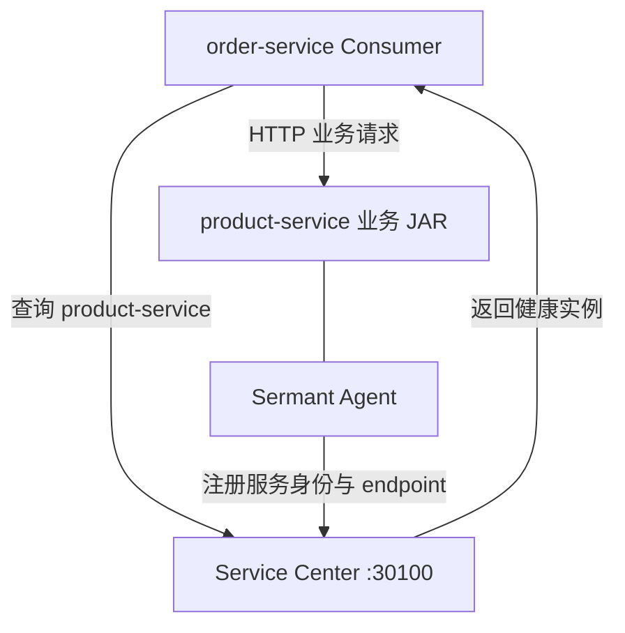
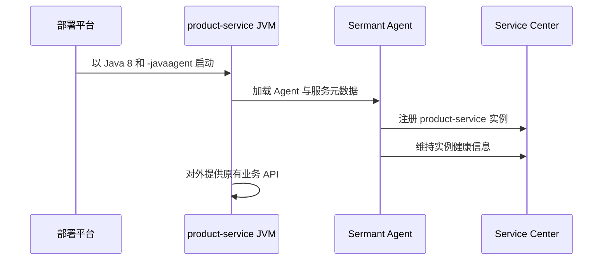
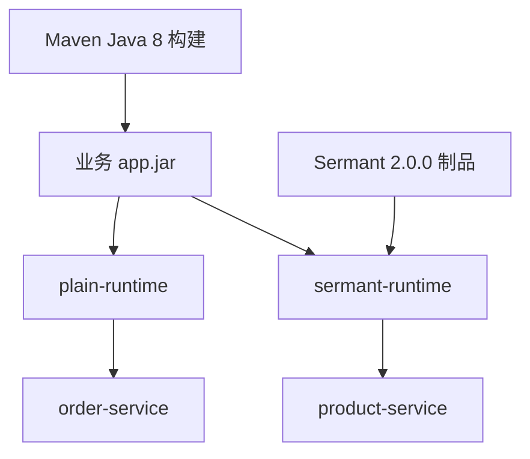
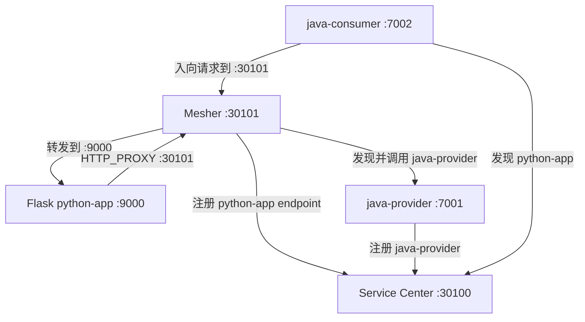
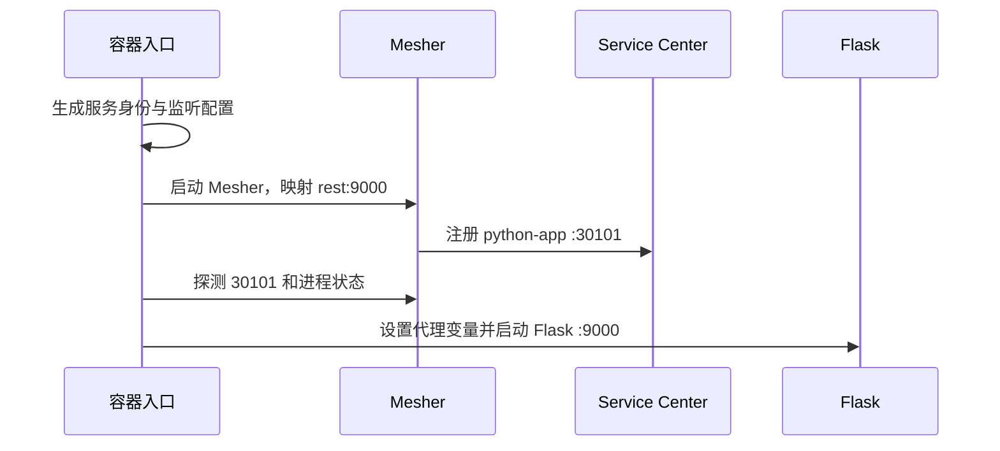
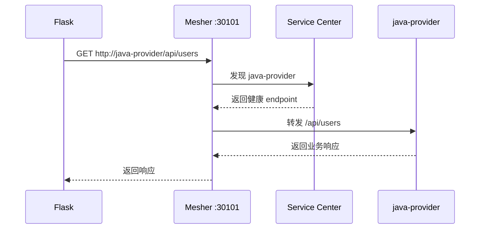
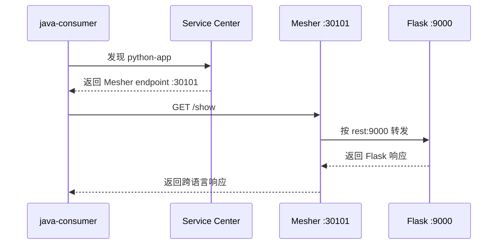

# 单体应用改造上云最佳实践

本文面向需要让现有应用接入 ServiceComb 微服务基础设施的开发人员，提供两条互相独立的实践路线：Java 应用使用 Sermant Java Agent，非 Java HTTP 应用使用 Mesher 代理。文档只讨论服务注册、发现和跨服务调用，不涉及业务拆分、数据库、数据迁移或 CI。

本文对应两个独立实践工程：

- `sermant-cse-demo`：普通 Spring Boot Provider 通过 Sermant 注册到 Service Center，Consumer 按逻辑服务名发现并调用。
- `mesher-python-sidecar-demo`：Flask 应用通过 Mesher 完成注册、入向代理和出向服务发现。

两个大章分别说明各自架构、配置和注意事项。选择哪一章只取决于目标应用的运行时和接入方式，不需要在同一应用中叠加 Sermant 与 Mesher。

## 实践版本表

| 组件 | 实践版本 | 适用范围 | 工程证据 |
| --- | --- | --- | --- |
| Java | 8 | Sermant Provider 与 Consumer 的编译、运行基线 | `sermant-cse-demo/pom.xml` |
| Spring Boot | 2.7.18 | Sermant 工程的 Java 应用基线 | `sermant-cse-demo/pom.xml` |
| Spring Cloud | 2021.0.8 | Sermant 工程 Consumer 的服务发现与负载均衡 | `sermant-cse-demo/pom.xml` |
| Spring Cloud Huawei | 1.11.15-2021.0.x | Sermant 工程 Consumer 的 ServiceComb 发现客户端 | `sermant-cse-demo/pom.xml` |
| Sermant | 2.0.0 | Java Provider 的 Agent 注册能力 | `sermant-cse-demo/Dockerfile` |
| Python | 3.11 | Mesher 工程的 Flask 业务运行时 | `mesher-python-sidecar-demo/python-app/Dockerfile` |
| Flask | 3.1.3 | Python REST 应用 | `mesher-python-sidecar-demo/python-app/requirements.txt` |
| requests | 2.32.5 | Python 出向 HTTP 调用 | `mesher-python-sidecar-demo/python-app/requirements.txt` |
| Mesher | 1.8.1 | Python 应用的注册、发现和双向代理 | `mesher-python-sidecar-demo/mesher/Dockerfile` |
| Mesher 源码提交 | `f35f82e` | 固定 v1.8.1 构建内容 | `mesher-python-sidecar-demo/mesher/Dockerfile` |
| Java 互通夹具 | 17 | Mesher 工程 Java Provider/Consumer | `mesher-python-sidecar-demo/pom.xml` |
| Local CSE | 2.1.8 | 两个实践工程的 Service Center、KIE 和 Dashboard | 两个工程的 `local-cse/Local-CSE-2.1.8-linux-amd64.zip` |

版本表包含两套独立运行基线。Sermant 工程必须使用 Java 8；Mesher 工程中的 Flask 使用 Python 3.11，Java 17 只属于跨语言互通夹具，不能用它替代 Sermant 工程的 Java 8 约束。

## 1 解决方案说明

### 1.1 文档目标与适用范围

本文用于指导已有 HTTP 应用接入 ServiceComb 服务注册发现基础设施。实践重点是应用如何声明稳定服务身份、如何注册可达 endpoint，以及调用方如何通过逻辑服务名完成跨服务访问。

文档不要求调整现有业务分层，也不讨论服务拆分、数据库、数据迁移和持续集成。业务接口及请求响应模型继续由应用维护，ServiceComb 接入能力由运行时 Agent、代理进程或调用方发现客户端承担。

### 1.2 两条独立实践路线

| 实践路线 | 目标应用 | 接入位置 | 对应工程 | 主要结果 |
| --- | --- | --- | --- | --- |
| Sermant | Java / Spring Boot 应用 | JVM 启动参数与 Agent 配置 | `sermant-cse-demo` | Provider 注册到 Service Center，Consumer 按逻辑服务名调用 |
| Mesher | Python 等非 Java HTTP 应用 | 业务进程旁的 HTTP 代理 | `mesher-python-sidecar-demo` | 代理完成服务注册，并承接入向和出向调用 |

两条路线互相独立。Java 应用选择 Sermant 路线时不需要部署 Mesher；非 Java 应用选择 Mesher 路线时不需要引入 Sermant。集成方应按目标应用运行时、部署控制能力和网络模型选择对应章节。

### 1.3 ServiceComb 基础设施边界

两个实践工程都使用 Service Center 保存微服务和实例信息，使用 Local CSE 提供本地演示基础设施。接入方需要共同关注以下契约，但具体配置方式分别在 Sermant 和 Mesher 章节说明。

| 契约 | 作用 | 需要保持一致的对象 |
| --- | --- | --- |
| 服务名 | 调用方使用的逻辑地址 | Provider 注册名与 Consumer 调用目标 |
| application | 服务发现隔离范围 | Provider 与 Consumer 的应用标识 |
| version | 实例发布身份 | 注册元数据与发布版本策略 |
| endpoint | 实例真实访问入口 | 注册记录与运行网络中的可达地址 |
| Service Center 地址 | 注册和发现入口 | 应用、Agent 或 Mesher 所在网络 |

Service Center 只返回注册记录，不替代业务协议约定。即使服务发现成功，调用双方仍需对 HTTP 方法、路径、请求参数和响应结构保持一致。

### 1.4 文档组织与工程对应关系

第 2 章只说明 `sermant-cse-demo`，按场景设计、架构设计、实践准备、接入实践、实践说明和注意事项组织。第 3 章只说明 `mesher-python-sidecar-demo`，使用相同章节骨架。两个章节中的版本、启动方式和网络参数不能相互替换。

## 2 Java 应用基于 Sermant 接入 ServiceComb

本章只对应 `sermant-cse-demo`。目标应用是 `product-service`，它保留普通 Spring Boot Web 业务代码，在 JVM 启动时附加 Sermant Agent，将服务实例注册到 Service Center。`order-service` 用于展示其他微服务如何按逻辑服务名访问该 Provider。

### 2.1 场景设计

#### 2.1.1 场景背景

目标 Provider 是已有的 Spring Boot HTTP 应用。应用已经能够通过固定端口提供业务接口，但尚未把实例身份和可达地址注册到 Service Center，其他服务也无法通过稳定逻辑服务名发现它。

本场景将注册能力放在 JVM 运行层：业务 JAR 继续保留原有 Controller 和业务模型，部署时附加 Sermant Agent，由 Agent 将 Provider 身份接入 ServiceComb 基础设施。

#### 2.1.2 实践目标与边界

Sermant 路线适用于满足以下条件的 Java 应用：

- 应用以独立 JVM 进程或容器运行。
- 当前版本组合在 Sermant 兼容范围内。
- Provider 需要接入 Service Center，但希望减少业务源码中的微服务 SDK 依赖。
- 业务 HTTP 接口、请求模型和响应模型继续保持现有约定。
- 部署平台允许控制 JVM 启动参数和 Agent 制品。

本实践不包含模块拆分，也不要求把 Controller、Service 或数据访问层重新组织为多个工程。接入点集中在依赖基线、应用身份、Agent 配置、启动命令和部署参数。

实践完成后应形成三个稳定契约：Provider 以 `product-service` 注册，注册记录位于 `demo-application`，Consumer 使用 `http://product-service/...` 发起负载均衡调用。直接写入 Provider IP 不属于本实践的调用方式。

#### 2.1.3 组件职责

| 组件 | 职责 | 集成方关注点 |
| --- | --- | --- |
| `product-service` | 提供现有业务 API | 服务名稳定、健康端点可用 |
| Sermant Agent | 在 JVM 启动时接入注册能力 | Agent 版本、配置和启动参数固定 |
| Service Center | 保存服务与健康实例 | application、服务名和 endpoint 正确 |
| `order-service` | 按逻辑服务名发现 Provider | 与 Provider 使用同一 application |

### 2.2 架构设计

#### 2.2.1 目标架构



业务 API 可直接访问只能证明 Web 应用已启动，不能证明实例已由 Sermant 注册。注册身份和逻辑服务名调用需要分别观察。

#### 2.2.2 服务注册路径

`product-service` 启动时加载 Sermant Agent。Agent 读取 JVM 系统属性中的 application 和 version，并结合 `spring.application.name`、应用监听端口和运行网络生成注册身份，然后连接 Service Center 创建或更新实例记录。

注册链路发生在 Provider JVM 内部，但注册结果面向整个服务发现域。应用监听成功、Agent 加载成功和 Service Center 中存在健康实例是三个不同状态，需要分别理解。

#### 2.2.3 服务发现与调用路径

`order-service` 通过 Spring Cloud Huawei 发现客户端连接 Service Center。负载均衡 `RestTemplate` 解析 URI 中的 `product-service`，获取同一 application 下的健康实例，再把 HTTP 请求发送到选中的 endpoint。

Consumer 不依赖 Provider 容器名称和临时 IP。服务名承担稳定调用契约，Service Center 中的 endpoint 承担运行时寻址，两者不能混为一个配置项。

#### 2.2.4 业务应用与 Agent 边界

业务应用负责 HTTP API、业务逻辑、健康端点和自身监听端口；Sermant Agent 负责连接注册中心并补充服务注册能力；部署配置负责固定 Agent 制品、注册地址和 JVM 元数据。该职责划分使业务代码不需要直接编写 Service Center 注册逻辑。

### 2.3 实践准备

#### 2.3.1 Java 8 与组件版本基线

Sermant 工程明确固定 Java 8，不以主机上“存在某个 Java 8”作为唯一判断。根 POM 同时约束源码级别、字节码目标和 Maven 运行 JDK。

来源：`sermant-cse-demo/pom.xml`。

```xml
<properties>
    <java.version>1.8</java.version>
    <maven.compiler.source>${java.version}</maven.compiler.source>
    <maven.compiler.target>${java.version}</maven.compiler.target>
    <spring-boot.version>2.7.18</spring-boot.version>
    <spring-cloud.version>2021.0.8</spring-cloud.version>
    <spring-cloud-huawei.version>1.11.15-2021.0.x</spring-cloud-huawei.version>
</properties>
```

Maven Enforcer 在 `validate` 阶段限定运行 JDK：

```xml
<requireJavaVersion>
    <version>[1.8,1.9)</version>
</requireJavaVersion>
```

Docker 构建和运行镜像也使用 Java 8：

来源：`sermant-cse-demo/Dockerfile`。

```dockerfile
FROM maven:3.9.9-eclipse-temurin-8 AS build

# Maven 构建步骤

FROM eclipse-temurin:8-jre AS runtime-base
```

因此需要同时核对：

| 层次 | Java 8 证据 | 常见问题 |
| --- | --- | --- |
| Maven 进程 | Enforcer 接受 `[1.8,1.9)` | `JAVA_HOME` 指向其他 JDK |
| 编译参数 | source/target 为 `1.8` | 子模块自行覆盖 Compiler 配置 |
| 产物 | class-file major version 为 `52` | 使用错误 JDK 或插件参数生成高版本字节码 |
| 容器运行时 | `eclipse-temurin:8-jre` | 构建使用 Java 8、运行镜像却使用其他主版本 |

Java 8、Spring Boot 2.7.18、Spring Cloud 2021.0.8 和 Sermant 2.0.0 应作为一个经过验证的组合管理，不单独替换其中某一项后直接进入客户环境。

#### 2.3.2 ServiceComb 基础设施

实践工程通过 `local-cse` 提供 Service Center，注册发现地址为 `http://local-cse:30100`。该名称只在 Compose 网络内成立；部署到 Kubernetes、虚拟机或物理机时，需要替换为 Provider 和 Consumer 都可访问的实际地址。

本场景只使用注册发现能力，因此 Provider 侧关闭 Sermant 动态配置服务，Consumer 侧关闭 Spring Cloud Huawei 配置中心客户端。关闭未使用能力可以减少配置来源，避免把注册问题与配置中心问题混在一起定位。

#### 2.3.3 服务身份与网络要求

准备阶段需要确定稳定服务名 `product-service`、application `demo-application`、实例版本 `1.0.0` 和 Provider 业务端口 `8081`。Service Center 返回的 endpoint 必须能从 Consumer 网络访问，不能注册仅在 Provider 本机有效的回环地址。

### 2.4 接入实践

#### 2.4.1 Provider 业务代码边界

Provider 保留普通 Spring Boot 主类：

来源：`sermant-cse-demo/product-service/src/main/java/com/huaweicloud/samples/sermant/product/ProductApplication.java`。

```java
@SpringBootApplication
public class ProductApplication {
    public static void main(String[] args) {
        SpringApplication.run(ProductApplication.class, args);
    }
}
```

业务 Controller 继续提供原有 HTTP 接口，不需要把注册逻辑写入 Controller：

来源：`sermant-cse-demo/product-service/src/main/java/com/huaweicloud/samples/sermant/product/controller/ProductController.java`。

```java
@RestController
@RequestMapping("/api/products")
public class ProductController {

    @GetMapping("/{id}")
    public Product getProduct(@PathVariable Long id) {
        Product product = PRODUCTS.get(id);
        if (product == null) {
            throw new ResponseStatusException(
                HttpStatus.NOT_FOUND,
                "Product not found: " + id
            );
        }
        return product;
    }
}
```

这种边界让业务代码继续关注 API 和业务模型，Agent 接入由镜像和启动配置管理。

#### 2.4.2 Provider 依赖边界

Provider 引入 Web、Actuator、共享 DTO 和 `spring-cloud-commons`，没有直接引入 ServiceComb 业务 Starter。

来源：`sermant-cse-demo/product-service/pom.xml`。

```xml
<dependency>
    <groupId>org.springframework.boot</groupId>
    <artifactId>spring-boot-starter-web</artifactId>
</dependency>
<dependency>
    <groupId>org.springframework.cloud</groupId>
    <artifactId>spring-cloud-commons</artifactId>
</dependency>
<dependency>
    <groupId>org.springframework.boot</groupId>
    <artifactId>spring-boot-starter-actuator</artifactId>
</dependency>
```

`spring-cloud-commons` 提供应用自动注册生命周期的接入点。目标应用如果完全不使用 Spring Cloud Commons，需要先确认 Sermant 对该技术栈和注册入口的支持方式，不能仅附加 Agent 就假定一定会注册。

#### 2.4.3 应用身份与自动注册

Provider 的本地配置只声明业务端口、稳定服务名和自动注册开关。

来源：`sermant-cse-demo/product-service/src/main/resources/application.yml`。

```yaml
server:
  port: ${SERVER_PORT:8081}

spring:
  application:
    name: product-service
  cloud:
    service-registry:
      auto-registration:
        enabled: true
```

身份字段来源分为两层：

| 身份信息 | 来源 | 示例 |
| --- | --- | --- |
| 服务名 | `spring.application.name` | `product-service` |
| application | JVM 系统属性 | `demo-application` |
| 实例版本 | JVM 系统属性 | `1.0.0` |
| endpoint | 应用监听与运行网络 | 容器内 `8081` |

Consumer 使用的逻辑服务名必须与 `product-service` 完全一致。application 用于划分发现范围，实例版本用于记录发布身份，不应使用容器名称或临时主机名代替这些稳定字段。

#### 2.4.4 Agent 制品固定

Dockerfile 固定 Sermant 版本、下载地址和 SHA-256：

来源：`sermant-cse-demo/Dockerfile`。

```dockerfile
FROM alpine:3.20 AS sermant-download

ARG SERMANT_VERSION=2.0.0
ARG SERMANT_SHA256=a2c2e532f2cb3c85e8da3cb0718fa0ea5e81d35eeeb77eafb6e30cdeabb67855
ARG SERMANT_URL=https://github.com/sermant-io/Sermant/releases/download/v${SERMANT_VERSION}/sermant-${SERMANT_VERSION}.tar.gz

RUN curl -fsSL --retry 3 -o /tmp/sermant.tar.gz "$SERMANT_URL" \
    && echo "$SERMANT_SHA256  /tmp/sermant.tar.gz" | sha256sum -c -
```

固定版本和摘要可以避免构建过程静默获取不同内容。客户项目发布 Agent 时还应记录制品来源、审批版本和适配的 JDK/Spring 组合。

#### 2.4.5 Agent 注册配置

实践镜像在构建阶段完成三项必要设置：

1. 注册地址指向 `http://local-cse:30100`。
2. 开启 Spring 自动注册接入。
3. 关闭本实践不使用的动态配置服务。

来源：`sermant-cse-demo/Dockerfile`。

```dockerfile
RUN sed -i \
      's|address: http://localhost:30100|address: http://local-cse:30100|g' \
      /opt/sermant/agent/pluginPackage/service-registry/config/config.yaml \
    && sed -i \
      's|enableSpringRegister: false|enableSpringRegister: true|g' \
      /opt/sermant/agent/pluginPackage/service-registry/config/config.yaml \
    && sed -i \
      's|agent.service.dynamic.config.enable=true|agent.service.dynamic.config.enable=false|g' \
      /opt/sermant/agent/config/config.properties
```

客户环境应使用从 Provider 网络可达的 Service Center 地址。Compose 中的 `local-cse` 只是容器服务名，不适用于 Kubernetes、虚拟机或主机进程的其他网络环境。

#### 2.4.6 JVM 启动关系

Provider 运行时在普通 `java -jar` 命令上增加 Agent 和服务元数据：

```bash
java \
  -javaagent:/opt/sermant/agent/sermant-agent.jar \
  -Dservice.meta.application=demo-application \
  -Dservice.meta.version=1.0.0 \
  -jar /app/app.jar
```

实际 Dockerfile 从环境变量读取 application 和 version：

```dockerfile
ENTRYPOINT ["sh", "-c", "exec java -javaagent:/opt/sermant/agent/sermant-agent.jar -Dservice.meta.application=\"${CAS_APPLICATION_NAME:-demo-application}\" -Dservice.meta.version=\"${CAS_INSTANCE_VERSION:-1.0.0}\" -jar /app/app.jar"]
```



部署模板应把 Agent 路径、application、version 和 Service Center 地址作为一组启动参数审查。只增加 `-javaagent` 而遗漏服务身份或注册地址，无法形成完整注册记录。

#### 2.4.7 Consumer 发现配置

Consumer 使用 Spring Cloud Huawei 连接同一个 Service Center，并把 application 设置为与 Provider 一致。

来源：`sermant-cse-demo/order-service/src/main/resources/bootstrap.yml`。

```yaml
spring:
  application:
    name: order-service
  cloud:
    servicecomb:
      discovery:
        enabled: true
        address: ${PAAS_CSE_SC_ENDPOINT:http://localhost:30100}
        appName: ${CAS_APPLICATION_NAME:demo-application}
        allowCrossApp: false
      config:
        enabled: false
```

本实践只需要注册发现，因此关闭配置中心客户端。`allowCrossApp: false` 明确要求 Provider 与 Consumer 位于同一 application；如果 application 不一致，业务接口直接访问可能成功，但逻辑服务名发现会失败。

#### 2.4.8 逻辑服务名调用

Consumer 创建负载均衡 RestTemplate：

来源：`sermant-cse-demo/order-service/src/main/java/com/huaweicloud/samples/sermant/order/OrderApplication.java`。

```java
@Bean
@LoadBalanced
public RestTemplate restTemplate() {
    return new RestTemplate();
}
```

Controller 使用 `product-service`，不保存 Provider 地址：

来源：`sermant-cse-demo/order-service/src/main/java/com/huaweicloud/samples/sermant/order/controller/OrderController.java`。

```java
return restOperations.getForObject(
    "http://product-service/api/products/{id}",
    Product.class,
    productId
);
```

`product-service` 是注册契约。修改应用名时必须同步更新 Consumer 调用目标和相关治理配置。

#### 2.4.9 镜像与部署关系

根 Dockerfile 先按 `MODULE` 构建业务 JAR，再提供普通运行层和 Sermant 运行层。Provider 使用 `sermant-runtime`，Consumer 使用 `plain-runtime`。



这两种运行层复用同一个业务 JAR，差异集中在运行镜像和 JVM 启动入口。客户项目可以采用等价的镜像、虚拟机启动脚本或容器编排参数，只要 Agent 制品和启动参数受到统一管理。

### 2.5 实践说明

#### 2.5.1 Provider 注册过程

Provider 的注册信息由多处配置共同形成：`spring.application.name` 提供服务名，JVM 系统属性提供 application 和 version，Spring Boot 监听端口提供业务 endpoint，Agent 配置提供 Service Center 地址。任何一项缺失或不一致，都可能造成应用已启动但注册记录不完整。

Agent 注册不是 Controller 请求触发的业务动作，而是应用启动生命周期中的基础设施动作。集成方应把 Agent 加载日志、Service Center 实例记录和业务健康端点作为不同观察面。

#### 2.5.2 Consumer 发现和调用过程

Consumer 收到订单请求后，`RestTemplate` 先从 URI 识别逻辑服务名，再由负载均衡组件查询可用实例并选择 endpoint，最后执行普通 HTTP 调用。Provider 扩缩容或地址变化时，只需要更新注册记录，Consumer 业务代码不需要修改目标 IP。

本工程的 Consumer 直接使用 Spring Cloud Huawei 发现客户端，Provider 使用 Sermant Agent 注册。这种组合用于说明注册方和调用方可以采用不同接入方式，只要双方遵守相同的服务身份和 HTTP 契约。

#### 2.5.3 关键身份参数关系

| 参数 | Provider 来源 | Consumer 来源 | 不一致时的表现 |
| --- | --- | --- | --- |
| 服务名 | `spring.application.name` | 请求 URI 主机名 | 找不到目标服务 |
| application | `service.meta.application` | `discovery.appName` | 同应用隔离下无实例 |
| version | `service.meta.version` | 通常不固定 | 注册版本与发布预期不一致 |
| endpoint | Provider 监听与网络 | Service Center 返回 | 已发现但连接失败 |
| 注册中心地址 | Agent 配置 | `discovery.address` | 双方看到不同注册数据 |

#### 2.5.4 工程演示模块职责

`product-service` 是待接入 Provider，`order-service` 是逻辑服务名调用方，`local-cse` 是注册发现基础设施。Consumer 不是 Sermant 接入的必要组成部分，但它提供了完整调用视角，用于说明 Provider 注册记录如何被其他微服务消费。

### 2.6 实践注意事项与常见问题

#### 2.6.1 Provider 已启动但没有注册

依次核对：

1. 实际 JVM 是否为 Java 8。
2. `-javaagent` 路径是否指向有效 JAR。
3. Agent 注册配置是否启用 Spring Register。
4. Service Center 地址从 Provider 网络是否可达。
5. `spring.cloud.service-registry.auto-registration.enabled` 是否保持开启。
6. application、服务名和版本是否形成完整身份。

#### 2.6.2 Consumer 找不到 Provider

比较 Provider 注册记录和 Consumer 配置中的 application、逻辑服务名与 Service Center 地址。`allowCrossApp: false` 时，application 不一致会直接形成隔离。

#### 2.6.3 业务接口正常但无法证明 Agent 生效

直接请求 Provider 只经过 Spring Boot Web 层。还需要在 Service Center 中观察 `product-service` 实例、endpoint、application、version，以及实例属性中的 `framework.name=Sermant`，再通过 Consumer 的逻辑服务名请求观察发现链路。

#### 2.6.4 构建与运行 Java 不一致

同时记录 Maven 实际 JDK、POM Enforcer 结果、产物 major version 和运行镜像。只看到系统中安装 Java 8，不代表 Maven 或容器正在使用它。

#### 2.6.5 Agent 与其他 Java Agent 同时使用

监控、诊断或安全 Agent 可能同时附加到 JVM。客户环境需要固定 Agent 顺序和版本组合，并在目标 JDK、Spring Boot 与实际启动参数下验证，不能只根据单 Agent 环境推断兼容性。

## 3 非 Java 应用基于 Mesher 接入 ServiceComb

本章只对应 `mesher-python-sidecar-demo`。目标应用是 Flask `python-app`；Mesher 作为同运行单元内的代理，负责将 `python-app` 注册到 Service Center，并同时承接入向请求和 Python 出向请求。`java-provider` 与 `java-consumer` 仅用于展示跨语言调用契约。

### 3.1 场景设计

#### 3.1.1 场景背景

目标应用是已经能够提供 HTTP 接口的 Flask 服务。业务进程不具备 ServiceComb SDK，也不应在 Python 代码中保存其他服务实例的固定地址。实践通过同一运行单元内的 Mesher 代理补充注册发现能力。

Mesher 同时承担两个方向的接入：对外公布可被其他服务发现的代理 endpoint；对内接收 Python HTTP 客户端的逻辑服务名请求并转发到目标 Provider。

#### 3.1.2 实践目标与边界

Mesher 路线适用于满足以下条件的 HTTP 应用：

- 应用不是 Java，或不希望在业务进程中引入 ServiceComb SDK。
- 业务出向请求使用标准 HTTP 客户端，并能通过代理变量进入 Mesher。
- 部署平台允许 Mesher 与业务应用共享网络命名空间或可直连网络。
- 入向流量可以先到达 Mesher，再由 Mesher 转发到业务端口。
- 服务名、application、版本和 endpoint 可由部署配置统一管理。

实践工程采用 Flask 与 Mesher 同容器的保守演示结构。客户平台可以使用等价 Sidecar 运行单元，但必须保持本章描述的网络、端口、身份和启动顺序关系。

实践完成后，Service Center 中的 `python-app` endpoint 指向 Mesher `30101`；远端 Consumer 经 Mesher 进入 Flask `9000`；Python 访问 `java-provider` 时，标准 HTTP 请求先进入本地 Mesher，再由代理完成服务发现。

#### 3.1.3 组件职责

| 组件 | 职责 | 集成方关注点 |
| --- | --- | --- |
| Flask `python-app` | 提供业务 API 并发起标准 HTTP 请求 | 业务端口、请求路径和超时 |
| Mesher | 注册 `python-app`，处理入向和出向代理 | 服务身份、监听地址和 Handler Chain |
| Service Center | 保存 Python 与 Java 服务实例 | application、服务名和 endpoint |
| `java-provider` | 提供 Python 出向调用目标 | HTTP 契约与注册身份 |
| `java-consumer` | 展示对 Python 的入向调用 | 使用逻辑服务名 `python-app` |

### 3.2 架构设计

#### 3.2.1 目标架构

Mesher 对 Python 应用提供两个方向的接入能力：



Service Center 中 `python-app` 的 endpoint 应指向 Mesher `30101`，不是 Flask `9000`。远端调用方先进入 Mesher，再由 Mesher 转到 Flask 业务端口。

#### 3.2.2 服务注册架构

Mesher 读取 `chassis.yaml` 和入口脚本生成的服务身份，以 `python-app`、`demo-application` 和 `1.0.0` 创建微服务实例。注册 endpoint 使用 Mesher 的对外监听地址，使远端 Consumer 的请求必然先经过代理。

#### 3.2.3 入向代理架构

远端 Consumer 从 Service Center 获取 `python-app` 的 `:30101` endpoint，请求到达 Mesher 后，根据启动参数中的 `rest:9000` 映射转发到 Flask。Flask 业务端口不直接承担注册入口职责。

#### 3.2.4 出向服务调用架构

Flask 使用 `requests` 访问 `http://java-provider/...`。代理环境变量把请求交给本地 Mesher，Mesher 解析逻辑服务名、发现健康实例并转发请求。Python 业务代码不直接调用 Service Center API。

#### 3.2.5 Python 与 Mesher 进程边界

Python 和 Mesher 是两个独立进程。Mesher 就绪不代表 Flask 业务接口正常，Flask 返回成功也不代表代理仍具备注册和转发能力，因此启动顺序和健康检查必须同时覆盖两个进程。

### 3.3 实践准备

#### 3.3.1 Python、Mesher 与组件版本基线

Python 业务镜像固定为 3.11：

来源：`mesher-python-sidecar-demo/python-app/Dockerfile`。

```dockerfile
FROM python:3.11-slim
```

Python 依赖使用精确版本：

来源：`mesher-python-sidecar-demo/python-app/requirements.txt`。

```text
Flask==3.1.3
requests==2.32.5
```

Mesher 基础镜像从 v1.8.1 源码构建，并校验短提交号 `f35f82e`。版本 Tag 与提交号一起固定，可以避免源码内容漂移。

#### 3.3.2 ServiceComb 基础设施

Mesher 使用 `registry.type: servicecenter` 连接 `http://local-cse:30100`。Java 互通模块连接同一个 Service Center，并使用相同 application。客户环境替换基础设施地址时，需要同时保证 Mesher、Java Provider 和 Java Consumer 的网络可达性。

本实践的 KIE 和 Dashboard 由 Local CSE 一并提供，但 Python 接入主链路只依赖 Service Center。不要把配置中心不可用与服务注册失败视为同一个问题。

#### 3.3.3 网络、端口和服务身份要求

`python-app` 使用三个不同含义的地址：Flask 业务端口 `9000`、Mesher 本地代理入口 `30101`、Service Center `30100`。远端 Consumer 必须能够访问注册记录中的 `30101`，而 Flask 与 Mesher 必须在同一容器或等价共享网络单元内互相访问。

### 3.4 接入实践

#### 3.4.1 Mesher 可复现构建

来源：`mesher-python-sidecar-demo/mesher/Dockerfile`。

```dockerfile
FROM golang:1.23-alpine AS builder

WORKDIR /build
ARG MESHER_VERSION=v1.8.1
ARG MESHER_COMMIT=f35f82e

RUN git clone --depth 1 --branch ${MESHER_VERSION} \
      https://github.com/apache/servicecomb-mesher.git /build/mesher \
    && test "$(git -C /build/mesher rev-parse --short HEAD)" = "${MESHER_COMMIT}"

WORKDIR /build/mesher
RUN CGO_ENABLED=0 GOOS=linux go build \
    -ldflags="-s -w" \
    -o /out/mesher \
    ./cmd/mesher
```

构建路径必须是 `/build/mesher`，最终二进制是 `/out/mesher`，运行镜像中保存为 `/opt/mesher/mesher`。Python 镜像只复制已经构建完成的 Mesher 二进制和配置，不在 Python 运行层重新下载浮动版本。

#### 3.4.2 Python 镜像边界

Python Dockerfile 从本地 Mesher 基础镜像复制二进制和配置，再安装 Flask 依赖。

来源：`mesher-python-sidecar-demo/python-app/Dockerfile`。

```dockerfile
FROM mesher-sidecar-v181:local AS mesher

FROM python:3.11-slim

COPY --from=mesher /opt/mesher/mesher /opt/mesher/mesher
COPY --from=mesher /opt/mesher/conf /opt/mesher/conf

COPY python-app/requirements.txt .
RUN pip install --no-cache-dir -r requirements.txt

COPY python-app/app.py \
     python-app/chassis.yaml \
     python-app/docker-entrypoint.sh ./
```

客户镜像仓库应保存已验证的 Mesher 基础镜像和 Python 应用镜像，并为二者使用不可变版本标识。

#### 3.4.3 服务身份与注册配置

Mesher 的 `chassis.yaml` 声明 `python-app` 身份、注册中心和代理监听地址。

来源：`mesher-python-sidecar-demo/python-app/chassis.yaml`。

```yaml
servicecomb:
  service:
    name: python-app
    app: demo-application
    version: 1.0.0
    properties:
      allowCrossApp: true
  protocols:
    http:
      listenAddress: 127.0.0.1:30101
  registry:
    type: servicecenter
    address: http://local-cse:30100
    scope: full
    watch: false
    autoIPIndex: false
```

字段含义：

| 字段 | 示例 | 注意事项 |
| --- | --- | --- |
| `service.name` | `python-app` | 远端 Consumer 使用的逻辑服务名 |
| `service.app` | `demo-application` | Mesher 配置键为 `app`，不是 `application` |
| `service.version` | `1.0.0` | 与部署版本策略一致 |
| `protocols.http.listenAddress` | `:30101` | Service Center 中公布的代理 endpoint |
| `registry.address` | `local-cse:30100` | 必须从 Mesher 网络可达 |
| `autoIPIndex` | `false` | 使用入口脚本注入的实际地址 |

`allowCrossApp: true` 只属于演示配置。客户环境应根据租户和业务隔离要求决定是否允许跨 application 发现，不把开放范围作为默认值。

#### 3.4.4 动态监听地址

镜像内的 `chassis.yaml` 使用 `127.0.0.1` 作为模板，入口脚本在容器启动时识别实际容器 IP，并替换三个 `listenAddress`。

来源：`mesher-python-sidecar-demo/python-app/docker-entrypoint.sh`。

```sh
net_name=$(ip -o -4 route show to default | awk '{print $5}')
listen_addr=$(ip -o -4 addr show "$net_name" 2>/dev/null \
  | grep -oE '[0-9]+\.[0-9]+\.[0-9]+\.[0-9]+' \
  | head -n 1 || true)

sed -i \
  "s/listenAddress: [0-9.]*/listenAddress: $listen_addr/g" \
  "$MESHER_CONF_DIR/chassis.yaml"
```

注册 endpoint 必须能够从远端 Consumer 所在网络访问。如果仍注册为 `127.0.0.1:30101`，代理在本容器内可能正常，但其他服务无法建立入向连接。

#### 3.4.5 双进程启动顺序

实践工程在一个容器内运行 Mesher 和 Flask。Mesher 先后台启动，入口脚本确认 `30101` 可连接后，再以前台进程启动 Flask。



来源：`mesher-python-sidecar-demo/python-app/docker-entrypoint.sh`。

```sh
/opt/mesher/mesher \
  --config=/etc/mesher/conf/mesher.yaml \
  --service-ports="rest:$APP_PORT" &
MESHER_PID=$!

# 真实脚本在有界循环中检查 Mesher 进程和 30101 端口

export HTTP_PROXY=http://127.0.0.1:30101
export http_proxy=http://127.0.0.1:30101
exec python /app/app.py
```

固定睡眠时间不能可靠表达代理就绪状态。入口脚本同时检查 Mesher PID 和监听端口；Mesher 提前退出时，容器应直接失败，不继续启动一个无法接入服务发现的 Flask 进程。

#### 3.4.6 出向代理实践

Flask `/show` 使用逻辑服务名 `java-provider` 发起标准 HTTP 请求：

来源：`mesher-python-sidecar-demo/python-app/app.py`。

```python
java_provider = os.environ.get(
    "JAVA_PROVIDER_SERVICE",
    "java-provider",
)

response = request_get(
    f"http://{java_provider}/api/users",
    timeout=10,
)
```

Python 代码没有保存 Provider IP。`requests` 读取 `HTTP_PROXY=http://127.0.0.1:30101`，把请求交给 Mesher；Mesher 根据 `java-provider` 查询 Service Center 并选择实例。



#### 3.4.7 `NO_PROXY` 边界

入口脚本只排除本地进程和基础设施地址：

```sh
export NO_PROXY=127.0.0.1,localhost,local-cse,service-center
export no_proxy=127.0.0.1,localhost,local-cse,service-center
```

不要把 `java-provider` 等目标逻辑服务名加入 `NO_PROXY`，否则 Python HTTP 客户端会尝试直接通过 DNS 访问目标，绕过 Mesher 的服务发现和治理链路。

#### 3.4.8 入向代理实践

远端 Consumer 使用逻辑服务名 `python-app`：

来源：`mesher-python-sidecar-demo/java-consumer/src/main/java/com/huaweicloud/samples/mesher/consumer/feign/PythonAppClient.java`。

```java
@FeignClient(name = "python-app")
public interface PythonAppClient {

    @GetMapping("/show")
    Map<String, Object> show();
}
```

入向请求链路：



因此入向链路的公开 endpoint 是 `30101`，Flask `9000` 是代理后的业务端口。只让远端 Consumer 直接访问 `9000`，会绕开 Mesher 注册身份。

#### 3.4.9 Handler Chain

Mesher 配置分别声明出向和入向处理链：

来源：`mesher-python-sidecar-demo/python-app/chassis.yaml`。

```yaml
servicecomb:
  handler:
    chain:
      Consumer:
        outgoing: router,ratelimiter-consumer,loadbalance,transport
      Provider:
        incoming: router,loadbalance,ratelimiter-provider,transport
```

从接入方案角度理解：Consumer 出向链负责处理 Python 发出的逻辑服务名请求，Provider 入向链负责接收远端请求并转到 Flask。升级 Mesher 或调整链配置时，需要同时关注两个方向，不能只确认出向调用成功。

#### 3.4.10 健康边界

Python 容器的健康检查同时覆盖 Flask `/health` 和 Mesher `30101`：

来源：`mesher-python-sidecar-demo/python-app/Dockerfile`。

```dockerfile
HEALTHCHECK --interval=5s --timeout=3s --retries=10 --start-period=15s \
  CMD python -c "import socket, urllib.request; urllib.request.urlopen('http://127.0.0.1:9000/health', timeout=2).read(); connection=socket.create_connection(('127.0.0.1', 30101), 2); connection.close()" || exit 1
```

这两个信号分别代表业务进程和代理进程。只检查 Flask 返回 200，无法判断注册代理是否仍能接收入向连接；只检查 Mesher 端口，也无法判断业务应用是否正常提供接口。

### 3.5 实践说明

#### 3.5.1 Mesher 注册过程

容器入口脚本先确定运行网络中的实际 IPv4 地址，再生成 Mesher 使用的监听和服务描述配置。Mesher 启动后以 `python-app` 身份连接 Service Center，公布 `实际地址:30101`。Flask 的 `9000` 只作为代理后端，不直接写入远端发现记录。

注册过程依赖服务身份、实际监听地址和 Service Center 地址三组信息。固定镜像模板中的 `127.0.0.1` 只能用于本地占位，必须在启动阶段替换为远端 Consumer 可达的地址。

#### 3.5.2 入向请求处理过程

Java Consumer 通过逻辑服务名发现 `python-app`，取得 Mesher endpoint 后发送业务请求。Mesher 的 Provider 入向链接收请求，并按 `--service-ports="rest:9000"` 将原路径转发给 Flask。响应沿相同链路返回调用方。

入向代理使 Python 业务进程不需要理解 Service Center 协议，但业务应用仍负责 HTTP 路径和响应契约。代理只负责寻址和转发，不会自动修正调用双方不一致的 API 定义。

#### 3.5.3 出向请求处理过程

Flask 通过标准 HTTP 客户端请求 `java-provider`。`HTTP_PROXY` 使该请求进入本地 Mesher，Consumer 出向链执行逻辑服务名解析、实例选择和传输。`NO_PROXY` 只排除本地进程及基础设施地址，不能排除需要由 Mesher 发现的业务服务名。

该设计保持 Python 代码与 Provider 运行地址解耦。Provider 扩缩容或实例地址变化时，由 Service Center 和 Mesher 更新运行时寻址，Python 请求 URL 仍使用稳定服务名。

#### 3.5.4 Java 互通模块职责

`java-provider` 提供 `/api/users`，用于展示 Python 经 Mesher 发起出向逻辑服务名调用。`java-consumer` 使用 Feign 调用 `python-app`，用于展示远端服务如何通过 Mesher endpoint 进入 Flask。

它们的版本基线是 Java 17、Spring Boot 3.4.4、Spring Cloud 2024.0.1 和 Spring Cloud Huawei 1.11.11-2024.0.x。该基线只属于 Mesher 工程的互通夹具，不改变 Python 应用的运行时，也不应与 Sermant 章节的 Java 8 组合混用。

### 3.6 实践注意事项与常见问题

#### 3.6.1 Service Center 中没有 `python-app`

依次核对 Mesher 是否启动、Service Center 地址是否可达、生成的 `microservice.yaml` 是否包含正确服务名/application/version，以及 `chassis.yaml` 是否使用 `registry.type: servicecenter`。

#### 3.6.2 `python-app` endpoint 是 `9000`

正确公开 endpoint 应是 Mesher `30101`。`9000` 只属于 Flask 业务进程。检查 `listenAddress` 注入、`autoIPIndex: false` 和 Mesher 注册日志。

#### 3.6.3 Python 无法调用 `java-provider`

依次核对 `HTTP_PROXY`、`NO_PROXY`、逻辑服务名、Service Center 中的 Java Provider 实例和 Python 请求超时。若 `java-provider` 被加入 `NO_PROXY`，请求会绕开 Mesher。

#### 3.6.4 Java Consumer 无法调用 Python

检查 Consumer 是否使用逻辑服务名 `python-app`、Service Center 返回的 endpoint 是否为可达的 `:30101`、Mesher 是否将入向 `rest` 映射到 `9000`，以及 Flask `/show` 是否正常响应。

#### 3.6.5 Flask 正常但容器仍不健康

健康探针还会连接 Mesher `30101`。检查 Mesher PID、监听端口和启动日志，不要只查看 Flask 日志。

#### 3.6.6 容器中注册了不可达 IP

入口脚本优先从默认路由网卡获取 IPv4 地址。若运行平台网络模型不同，需要使用平台提供的 Pod/容器 IP 注入方式，并确保远端 Consumer 能访问该地址。

#### 3.6.7 代理环境变量影响其他请求

为基础设施和本地管理接口设置精确 `NO_PROXY`，同时保留业务逻辑服务名走 Mesher。对 HTTPS、认证代理或非 HTTP 协议，需要单独评估 Mesher 和客户端支持范围。

完成本章阅读后，应用开发人员应能够从部署配置中明确回答：由谁注册 `python-app`、Service Center 中公布哪个 endpoint、入向请求如何到达 Flask、Python 出向请求如何进入 Mesher，以及代理和业务进程分别用什么健康信号判断。

## 4 附录

### 4.1 Sermant 工程文件索引

| 实践主题 | 工程文件 |
| --- | --- |
| Java 8、Spring 与 Maven 约束 | `sermant-cse-demo/pom.xml` |
| Provider 依赖 | `sermant-cse-demo/product-service/pom.xml` |
| Provider 服务身份 | `sermant-cse-demo/product-service/src/main/resources/application.yml` |
| Provider 业务接口 | `sermant-cse-demo/product-service/src/main/java/com/huaweicloud/samples/sermant/product/controller/ProductController.java` |
| Agent 下载、配置和启动 | `sermant-cse-demo/Dockerfile` |
| Consumer 发现 | `sermant-cse-demo/order-service/src/main/resources/bootstrap.yml` |
| Consumer 逻辑调用 | `sermant-cse-demo/order-service/src/main/java/com/huaweicloud/samples/sermant/order/controller/OrderController.java` |
| 基础设施与运行参数 | `sermant-cse-demo/docker-compose.yml` |

### 4.2 Mesher 工程文件索引

| 实践主题 | 工程文件 |
| --- | --- |
| Python、Flask 与 requests 版本 | `mesher-python-sidecar-demo/python-app/Dockerfile`、`mesher-python-sidecar-demo/python-app/requirements.txt` |
| Mesher 版本与二进制构建 | `mesher-python-sidecar-demo/mesher/Dockerfile` |
| 服务身份、注册和 Handler Chain | `mesher-python-sidecar-demo/python-app/chassis.yaml` |
| 监听地址、双进程和代理变量 | `mesher-python-sidecar-demo/python-app/docker-entrypoint.sh` |
| Flask 接口与出向调用 | `mesher-python-sidecar-demo/python-app/app.py` |
| Python/Mesher 镜像边界 | `mesher-python-sidecar-demo/python-app/Dockerfile` |
| Java Provider | `mesher-python-sidecar-demo/java-provider` |
| Java Consumer | `mesher-python-sidecar-demo/java-consumer` |
| 基础设施与运行参数 | `mesher-python-sidecar-demo/docker-compose.yml` |

### 4.3 关键身份与端口速查

| 实践路线 | 注册服务名 | application | 对外 endpoint | 业务后端 | 注册组件 |
| --- | --- | --- | --- | --- | --- |
| Sermant | `product-service` | `demo-application` | `product-service:8081` | Spring Boot `8081` | Sermant Agent |
| Mesher | `python-app` | `demo-application` | Mesher `30101` | Flask `9000` | Mesher |

| 地址或端口 | 用途 | 使用方 |
| --- | --- | --- |
| Service Center `30100` | 服务注册和发现 | Sermant、Mesher、Java Consumer/Provider |
| Mesher `30101` | Python 应用的注册 endpoint、入向入口和本地出向代理 | 远端 Consumer、Flask HTTP 客户端 |
| Flask `9000` | Python 业务后端端口 | Mesher |
| `product-service:8081` | Sermant Provider 业务 endpoint | `order-service` |
| `java-provider:7001` | Mesher 出向调用目标 | Mesher |
