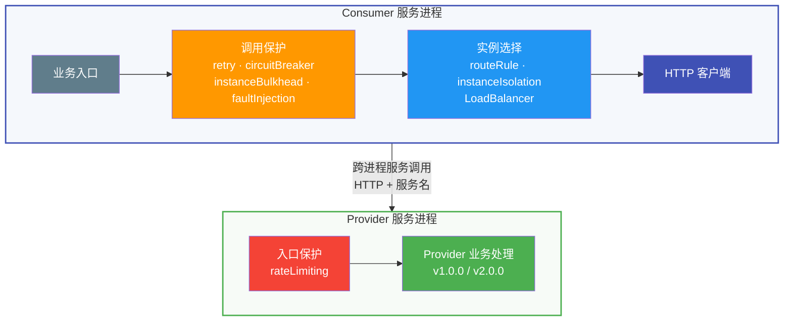
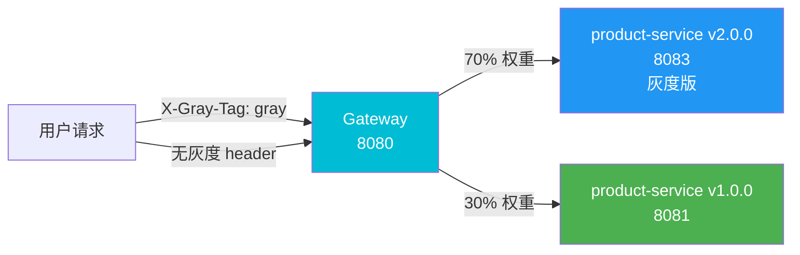
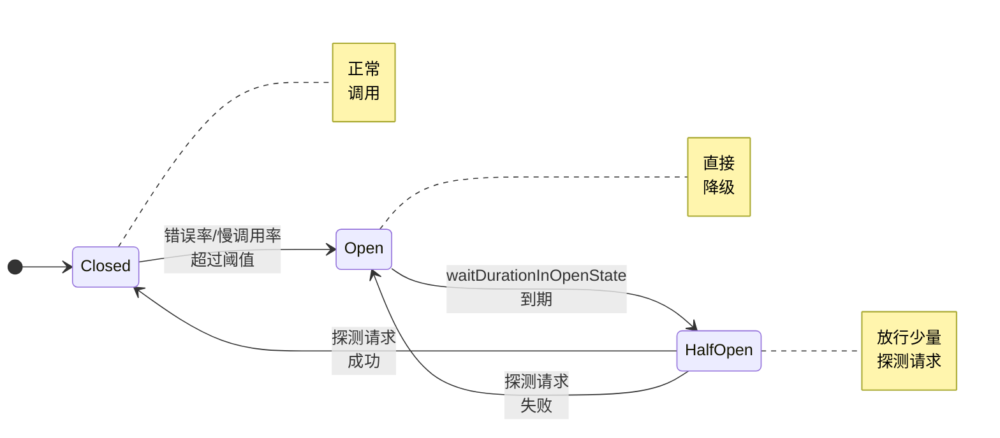
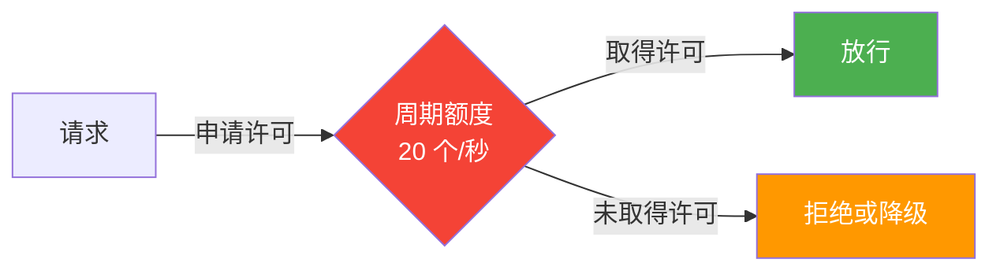
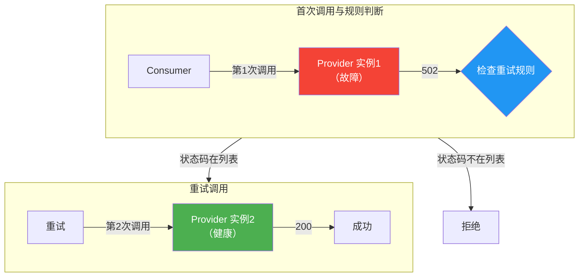
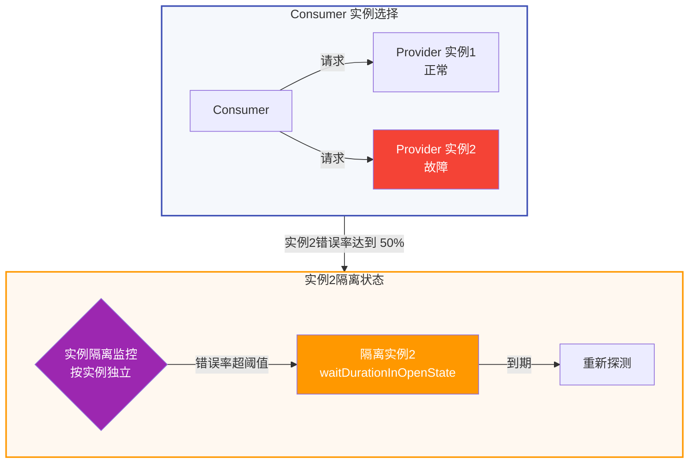
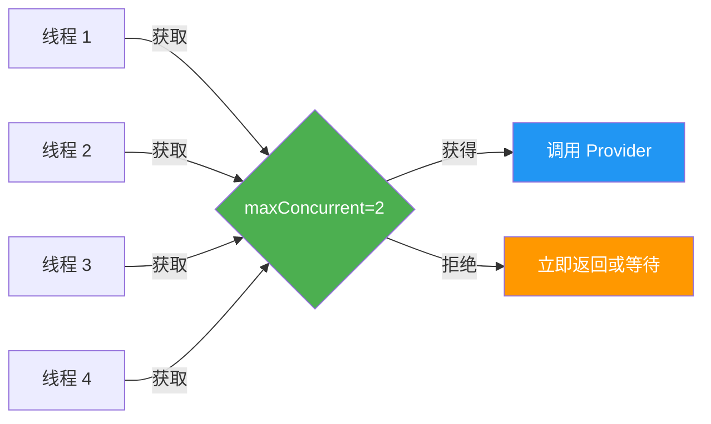
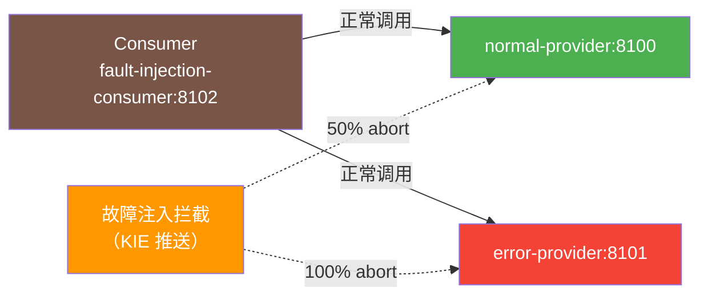

# 微服务治理典型场景的最佳实践

## 实践版本表

| 组件 | 版本 | 工程依据 |
|------|------|----------|
| Java | 17 | `spring-cloud-huawei-servicecomb/pom.xml` |
| Spring Boot | 3.4.4 | `spring-cloud-huawei-servicecomb/pom.xml` |
| Spring Cloud | 2024.0.1 | `spring-cloud-huawei-servicecomb/pom.xml` |
| Spring Cloud Huawei | 1.11.11-2024.0.x | `spring-cloud-huawei-servicecomb/pom.xml` |
| Local CSE | 2.1.8 | `spring-cloud-huawei-servicecomb/local-cse` |

## 1 解决方案说明

### 1.1 治理能力全景

本文基于 `spring-cloud-huawei-servicecomb` 工程说明灰度路由、熔断、限流、重试、实例隔离、舱壁和故障注入七类治理场景。内容重点是治理位置、规则匹配、参数关系和工程实现；具体能力是否进入调用链，以所用 Starter、规则来源和 matchGroup 是否命中为准。

**治理能力全景图：**



**七大治理能力速查表：**

| 治理能力 | 主要位置 | 作用粒度 | 关键词 |
|---------|---------|----------|--------|
| 灰度路由 | Gateway / Consumer 负载均衡 | Provider 实例选择 | `routeRule` |
| 熔断降级 | Consumer 调用链 | matchGroup 对应调用 | `circuitBreaker` |
| 流量限流 | Gateway / 业务服务入口 | 当前应用实例 | `rateLimiting` |
| 重试治理 | Consumer 调用链 | 一次下游调用 | `retry` |
| 实例隔离 | Consumer 负载均衡 | Provider 实例 | `instanceIsolation` |
| 舱壁隔离 | Consumer 调用链 | 并发调用配额 | `instanceBulkhead` |
| 故障注入 | Consumer → Provider 调用链 | 指定 API 和服务 | `faultInjection` |

- **Consumer 侧：** 调用保护和实例选择均在 Consumer 服务进程内完成；实例选择完成后，由 HTTP 客户端向目标 Provider 实例发起跨进程调用。
- **Provider 侧：** `rateLimiting` 在 Provider 服务入口处理，命中限流规则后不再进入业务处理。
- **Gateway 定位：** Gateway 调用后端服务时属于 Consumer；接收外部请求时属于入口侧，因此也可在 Gateway 入口执行限流。
- **图示范围：** 全景图以一次 Consumer → Provider 调用说明治理位置，不表示各过滤器固定按图中顺序执行；实际生效能力由 Starter、调用方式和规则匹配结果决定。

### 1.2 文档组织

每个治理场景采用统一结构：

```
场景说明  → 架构设计
         → 工程配置片段
         → 参数关系
         → 实践注意事项
```

### 1.3 工程模块清单

**治理演示模块端口清单：**

| 模块 | 端口 | 用途 |
|------|------|------|
| `product-service` | 8081 | 业务核心服务 v1 |
| `product-service-v2` | 8083 | 业务核心服务 v2（灰度版本） |
| `order-service` | 8082 | 业务核心服务（Consumer） |
| `gateway` | 8080 | API 网关（路由 + 限流） |
| `circuit-breaker-provider` | 8096 | 熔断 Provider（错误注入） |
| `circuit-breaker-consumer` | 8097 | Consumer 侧熔断规则 |
| `retry-provider` | 8090 | 重试 Provider（模拟错误） |
| `retry-consumer` | 8091 | 重试 Consumer |
| `isolation-provider` | 8092 | 实例隔离 Provider |
| `isolation-consumer` | 8093 | 实例隔离 Consumer |
| `bulkhead-provider` | 8094 | 舱壁 Provider（模拟耗时） |
| `bulkhead-consumer` | 8095 | 舱壁 Consumer |
| `fault-injection-normal-provider` | 8100 | 正常响应 Provider |
| `fault-injection-error-provider` | 8101 | 错误响应 Provider |
| `fault-injection-consumer` | 8102 | 故障注入 Consumer |

## 2 微服务治理典型场景最佳实践

### 2.1 灰度发布最佳实践

#### 2.1.1 场景说明

**典型场景**：

- **金丝雀发布**：将 5% 流量路由到新版本（v2.0.0），观察稳定性后逐步放大比例
- **蓝绿部署**：新旧版本并行部署，通过路由规则瞬间切换
- **按用户灰度**：特定用户（带 `X-Gray-Tag: gray` header）路由到新版本
- **A/B 测试**：按权重分发流量，对比业务指标

**核心原理**：基于服务注册版本（`spring.cloud.servicecomb.service.version`）和请求 Header，将流量按 `tags.version` 与权重选择到不同实例。

#### 2.1.2 架构设计



**关键流程**：

1. 请求携带（或不携带）`X-Gray-Tag: gray` header 到达 Gateway
2. Gateway 通过 `routeRule` 规则匹配 header → 按 `tags.version` 权重分发
3. 无 header 请求命中"默认路由"（precedence 较小），回到 v1.0.0

#### 2.1.3 Gateway 灰度路由实现

Gateway 灰度路由规则由 **KIE 配置中心动态推送**（`kie-init/init-route-rules.sh`），而非写在 `gateway/application.yml`：

**KIE 推送的路由规则（governance.yaml）：**

```yaml
servicecomb:
  routeRule:
    product-service: |
      - precedence: 2
        match:
          headers:
            X-Gray-Tag:
              exact: gray
        route:
          - weight: 30
            tags:
              version: 1.0.0
          - weight: 70
            tags:
              version: 2.0.0
      - precedence: 1
        match: {}
        route:
          - weight: 100
            tags:
              version: 1.0.0
```

**关键配置参数说明：**

| 参数 | 说明 | 示例 |
|------|------|------|
| `precedence` | 规则优先级（数字越大越优先） | 2 > 1 |
| `match.headers.X-Gray-Tag.exact` | 灰度 header 精确匹配（来自 `headerContextMapper`） | `gray` |
| `route[].weight` | 路由权重（百分比） | 70 / 30 |
| `route[].tags.version` | 目标实例版本（需与注册版本匹配） | `2.0.0` |
| `match: {}` | 空匹配（兜底规则，匹配所有未命中规则的请求） | — |

> **注意**：路由规则以 KIE key `governance.yaml` 管理，并使用 YAML block scalar 保持嵌套规则为完整字符串。Gateway 在 `spring-cloud-huawei-servicecomb/gateway/src/main/resources/bootstrap.yml` 中通过 `fileSource` 订阅该配置。

#### 2.1.4 Gateway application.yml 关键配置

当前 Gateway 的 `application.yml` 只保存入口限流规则，灰度 `routeRule` 由 KIE 下发：

**文件：`gateway/src/main/resources/application.yml`**

```yaml
server:
  port: 8080

spring:
  cloud:
    gateway:
      routes:
        - id: product-route
          uri: lb://product-service
          predicates:
            - Path=/api/products/**
        - id: order-route
          uri: lb://order-service
          predicates:
            - Path=/api/orders/**

servicecomb:
  # 灰度路由规则由 kie-init 推送到 KIE（local-cse:30110）
  # gateway 的 application.yml 不配置 routeRule，避免覆盖 KIE 动态规则

  # 限流规则（网关入口）
  matchGroup:
    product-api: |
      matches:
        - apiPath:
            prefix: "/api/products"
    order-api: |
      matches:
        - apiPath:
            prefix: "/api/orders"
  rateLimiting:
    product-api: |
      rate: 20
      limitRefreshPeriod: 1000
      timeoutDuration: 0
    order-api: |
      rate: 10
      limitRefreshPeriod: 1000
      timeoutDuration: 0
```

#### 2.1.5 实践注意事项

| 维度 | 建议 |
|------|------|
| **粒度** | 实例级（按 `tags.version` 过滤实例） |
| **规则位置** | KIE 配置中心；发布后检查 Gateway 的订阅与路由日志 |
| **header 配置** | `spring.cloud.servicecomb.context.headerContextMapper: X-Gray-Tag: X-Gray-Tag` |
| **优先级** | 数字越大越优先；无 `match` 的兜底规则 precedence 最小 |
| **注意事项** | 当前 Gateway 不配置本地 `routeRule`，避免与 KIE 中的同名规则形成来源冲突 |


### 2.2 熔断降级最佳实践

#### 2.2.1 场景说明

**典型场景**：

- 服务雪崩防护：当某个 Provider 故障率超过阈值时，立即熔断，避免拖垮整个调用链
- 快速失败：调用方不用一直等待故障 Provider 返回，直接走降级逻辑
- 故障隔离：熔断打开后，调用方直接降级，不再向故障 Provider 发送请求，保护 Provider 资源

**核心原理**：基于滑动窗口统计错误率或慢调用率。匹配规则的调用超过阈值后进入 Open 状态并快速失败；经过 `waitDurationInOpenState` 后进入 Half-Open 状态，以少量调用判断是否恢复到 Closed。

#### 2.2.2 架构设计



**当前工程的职责划分：**

| 模块 | 作用 | 工程实现 |
|------|------|----------|
| `circuit-breaker-provider` | 提供正常、错误和慢响应端点 | 仅模拟下游行为，不配置熔断规则 |
| `circuit-breaker-consumer` | 统计下游调用结果并执行熔断 | 在自身 `application.yml` 配置 `matchGroup` 和 `circuitBreaker` |

#### 2.2.3 Provider 故障端点

Provider 端点位于 `spring-cloud-huawei-servicecomb/circuit-breaker-provider/src/main/java/com/huaweicloud/samples/servicecomb/circuitbreaker/provider/CircuitBreakerProviderController.java`：

| 端点 | 行为 | 用途 |
|------|------|------|
| `/api/circuit/normal` | 返回 200 | 验证正常路径不受熔断影响 |
| `/api/circuit/error50` | 50% 返回 502，50% 返回 200 | 触发错误率熔断 |
| `/api/circuit/error100` | 100% 返回 502 | 验证 100% 错误场景 |
| `/api/circuit/slow` | 每次 sleep 1500ms | 触发慢调用熔断 |
| `/api/circuit/always-ok` | 永远返回 200 | 熔断打开后验证正常端点 |
| `/api/circuit/stats` | 返回各端点调用计数 | 辅助观察调用是否到达 Provider |
| `/api/circuit/reset` | 重置所有计数 | 清理观察状态 |

#### 2.2.4 Consumer 侧熔断实现

**文件：`circuit-breaker-consumer/src/main/resources/application.yml`**

Consumer 侧熔断规则写在 Consumer 自身的 `application.yml` 中（按 Consumer 入站 API 路径匹配）：

```yaml
server:
  port: 8097

servicecomb:
  # Consumer 侧熔断：监控 Consumer 调用 Provider 的成功率
  matchGroup:
    circuit-consumer-error50: |
      matches:
        - apiPath:
            prefix: "/api/consumer/circuit/error50"
    circuit-consumer-slow: |
      matches:
        - apiPath:
            prefix: "/api/consumer/circuit/slow"
    circuit-consumer-normal: |
      matches:
        - apiPath:
            prefix: "/api/consumer/circuit/normal"
    circuit-consumer-fallback: |
      matches:
        - apiPath:
            prefix: "/api/consumer/circuit/fallback"
    circuit-consumer-provider-cb: |
      matches:
        - apiPath:
            prefix: "/api/consumer/circuit/provider-cb"

  circuitBreaker:
    # 实验 A：错误率 50% 触发熔断
    circuit-consumer-error50: |
      minimumNumberOfCalls: 6
      slidingWindowSize: 10
      slidingWindowType: COUNT_BASED
      failureRateThreshold: 50
      slowCallRateThreshold: 100
      slowCallDurationThreshold: 1000
      waitDurationInOpenState: 15000
      permittedNumberOfCallsInHalfOpenState: 3
      recordFailureStatus:
        - 500
        - 502
        - 503

    # 实验 B：慢调用 50% 触发熔断
    circuit-consumer-slow: |
      minimumNumberOfCalls: 4
      slidingWindowSize: 8
      slidingWindowType: COUNT_BASED
      slowCallRateThreshold: 50
      slowCallDurationThreshold: 1000
      waitDurationInOpenState: 15000
      permittedNumberOfCallsInHalfOpenState: 2

    # 实验 C：正常接口（不会触发熔断）
    circuit-consumer-normal: |
      minimumNumberOfCalls: 10
      slidingWindowSize: 10
      slidingWindowType: COUNT_BASED
      failureRateThreshold: 50

    # 实验 D：降级验证
    circuit-consumer-fallback: |
      minimumNumberOfCalls: 6
      slidingWindowSize: 10
      slidingWindowType: COUNT_BASED
      failureRateThreshold: 50
      waitDurationInOpenState: 15000
      permittedNumberOfCallsInHalfOpenState: 3
      recordFailureStatus:
        - 500
        - 502
        - 503

    # 实验 E：Provider 故障调用对照
    circuit-consumer-provider-cb: |
      minimumNumberOfCalls: 6
      slidingWindowSize: 10
      slidingWindowType: COUNT_BASED
      failureRateThreshold: 50
      waitDurationInOpenState: 15000
      permittedNumberOfCallsInHalfOpenState: 3
      recordFailureStatus:
        - 500
        - 502
        - 503
```

**关键配置参数说明：**

| 参数 | 说明 | 示例 |
|------|------|------|
| `minimumNumberOfCalls` | 最小调用数（达到此值才统计错误率） | 6 |
| `slidingWindowSize` | 滑动窗口大小（最近 N 次调用） | 10 |
| `slidingWindowType` | 滑动窗口类型（计数/时间） | `COUNT_BASED` |
| `failureRateThreshold` | 错误率阈值（百分比） | 50 |
| `slowCallRateThreshold` | 慢调用率阈值 | 50 |
| `slowCallDurationThreshold` | 慢调用时长阈值（毫秒） | 1000 |
| `waitDurationInOpenState` | 熔断打开状态持续时间（毫秒） | 15000 |
| `permittedNumberOfCallsInHalfOpenState` | 半开状态允许探测数 | 3 |
| `recordFailureStatus` | 计入失败的 HTTP 状态码 | 500/502/503 |

降级响应由业务入口明确处理。当前 Controller 在调用异常时区分熔断打开与其他错误，源码为 `spring-cloud-huawei-servicecomb/circuit-breaker-consumer/src/main/java/com/huaweicloud/samples/servicecomb/circuitbreaker/consumer/CircuitBreakerConsumerController.java`：

```java
@GetMapping("/api/consumer/circuit/fallback")
public String fallback() {
    try {
        return "CALL_OK:" + restTemplate.getForObject(
            PROVIDER + "/always-ok", String.class);
    } catch (Exception exception) {
        String message = safeMessage(exception);
        if (message.contains("circuitBreaker is open")
            || message.contains("Consumer circuitBreaker")) {
            return "CONSUMER_CB_OPEN:Fallback triggered by consumer-side circuit breaker";
        }
        return "ERROR:" + abbreviate(message, 80);
    }
}
```

#### 2.2.5 实践注意事项

| 维度 | 建议 |
|------|------|
| **粒度** | 实例级 |
| **工程位置** | 当前规则位于 `circuit-breaker-consumer`，Provider 负责提供可观察的故障响应 |
| **阈值关系** | 先达到 `minimumNumberOfCalls`，再根据窗口中的失败率或慢调用率判断 |
| **恢复时间** | `waitDurationInOpenState` 到期后进入探测阶段，是否关闭取决于探测结果 |
| **注意事项** | `recordFailureStatus` 应只包含需要计为系统故障的状态码，避免把业务错误计入熔断 |


### 2.3 流量限流最佳实践

#### 2.3.1 场景说明

**典型场景**：

- 系统过载保护：突发流量超过系统承载能力时，限流保护核心服务
- 防刷/防爬：限制单 IP / 用户的请求频率
- 流量保护：当请求速率超过实例处理预算时拒绝或等待请求

**核心原理**：在 `limitRefreshPeriod` 周期内提供 `rate` 个许可。请求无法在 `timeoutDuration` 内取得许可时被拒绝。当前工程设置 `timeoutDuration: 0`，表示不等待许可。

#### 2.3.2 架构设计



#### 2.3.3 网关入口限流实现

**文件：`gateway/src/main/resources/application.yml`**

```yaml
servicecomb:
  matchGroup:
    product-api: |
      matches:
        - apiPath:
            prefix: "/api/products"
    order-api: |
      matches:
        - apiPath:
            prefix: "/api/orders"
  rateLimiting:
    product-api: |
      rate: 20
      limitRefreshPeriod: 1000
      timeoutDuration: 0
    order-api: |
      rate: 10
      limitRefreshPeriod: 1000
      timeoutDuration: 0
```

**关键配置参数说明：**

| 参数 | 说明 | 示例 |
|------|------|------|
| `rate` | 每周期允许的请求数 | 20 |
| `limitRefreshPeriod` | 令牌刷新周期（毫秒） | 1000（即每秒 20 个令牌） |
| `timeoutDuration` | 等待令牌的超时时间（毫秒，0 表示立即拒绝） | 0 |

#### 2.3.4 业务服务限流实现

**文件：`order-service/src/main/resources/application.yml`**

```yaml
servicecomb:
  matchGroup:
    rate-limit-test: |
      matches:
        - apiPath:
            prefix: "/api/orders/test/rate-limit"

  rateLimiting:
    rate-limit-test: |
      rate: 2
      limitRefreshPeriod: 5000
      timeoutDuration: 0
```

**说明**：该规则每 5 秒提供 2 个许可，用于清晰观察限流行为。实际阈值应结合实例数量、入口流量和接口处理能力确定。

#### 2.3.5 实践注意事项

| 维度 | 建议 |
|------|------|
| **粒度** | 实例级（每个实例独立计算令牌桶） |
| **网关 vs 实例限流选择** | 全局限流 → Gateway；特定接口保护 → 实例 |
| **rate 设置原则** | 根据单实例处理能力和实例数量确定，不能直接把集群总 QPS 写入每个实例 |
| **timeoutDuration** | 0 表示立即拒绝；大于 0 会引入排队等待，应纳入端到端超时预算 |
| **注意事项** | 当前规则来自本地 `application.yml`；如需集中配置，应先验证 KIE 标签、fileSource 和刷新边界 |


### 2.4 重试治理最佳实践

#### 2.4.1 场景说明

**典型场景**：

- 瞬时故障恢复：网络抖动导致单次调用失败，重试一次后成功
- 跨实例负载均衡：故障实例上的请求重试到健康实例
- 慢调用优化：等待 Provider 响应超时时，重试到其他实例

**核心原理**：在调用失败时按策略自动重试，可配置最大重试次数、是否同实例重试、按状态码过滤重试等。

#### 2.4.2 架构设计



#### 2.4.3 重试实现

**文件：`retry-consumer/src/main/resources/application.yml`**

工程实现了 6 种重试场景，全面展示重试治理的灵活性：

```yaml
servicecomb:
  matchGroup:
    # 1. 基础重试：路径匹配
    retryOperation: |
      matches:
        - apiPath:
            exact: "/retry"
    # 2. 状态码重试：路径匹配
    statusOperation: |
      matches:
        - apiPath:
            exact: "/status-retry"
    # 3. 跨服务重试：serviceName 不匹配（演示匹配失效）
    serviceOperation: |
      matches:
        - apiPath:
            exact: "/retry-service-name"
          serviceName: retry-consumer-wrong
    # 4. 同实例重试 1 次
    onSameOneOperation: |
      matches:
        - apiPath:
            exact: "/on-same-retry-one"
    # 5. 同实例重试 2 次
    onSameTwoOperation: |
      matches:
        - apiPath:
            exact: "/on-same-retry-two"

  retry:
    # 1. 基础重试：最多 3 次，同实例 1 次
    retryOperation: |
      maxAttempts: 3
      retryOnSame: 1
      retryOnResponseStatus:
        - 502
        - 503
      waitDuration: 50

    # 2. 状态码重试：500 在列表内触发，400 在列表外不触发
    statusOperation: |
      maxAttempts: 3
      retryOnResponseStatus:
        - 502
        - 503
        - 500
      waitDuration: 1

    # 3. serviceName 不匹配 → 策略不生效
    serviceOperation: |
      maxAttempts: 3
      retryOnSame: 0
      retryOnResponseStatus:
        - 502
        - 503
      waitDuration: 3000

    # 4. 同实例重试 1 次 → 无法恢复
    onSameOneOperation: |
      maxAttempts: 1
      retryOnSame: 1
      retryOnResponseStatus:
        - 502
        - 503
      waitDuration: 1

    # 5. 跨实例重试场景
    onSameTwoOperation: |
      maxAttempts: 2
      retryOnResponseStatus:
        - 502
        - 503
      waitDuration: 1
```

#### 2.4.4 关键配置参数说明

| 参数 | 说明 | 示例 |
|------|------|------|
| `maxAttempts` | 最大尝试次数配置 | 3 |
| `retryOnSame` | 在同一实例上的最大重试次数（0 = 总是跨实例） | 0/1/2 |
| `retryOnResponseStatus` | 触发重试的 HTTP 状态码列表 | 502, 503 |
| `waitDuration` | 重试前等待时间（毫秒） | 50 |

**重试策略详解**：

- **`retryOnSame`**：控制同一实例上的重试次数；其余尝试是否切换实例还取决于可用实例列表。
- **`retryOnResponseStatus`**：只有列入的响应状态才进入重试判断，4xx 业务错误通常不应重试。
- **`serviceName` 不匹配**：重试规则整体失效，演示 `matchGroup` 精确匹配的重要性

#### 2.4.5 实践注意事项

| 维度 | 建议 |
|------|------|
| **粒度** | Consumer 实例级 |
| **`retryOnSame` 设置** | 根据实例数量和故障类型选择；避免持续命中已知故障实例 |
| **`maxAttempts`** | 将总尝试次数纳入调用超时和后端容量评估 |
| **状态码列表** | 仅包含真正的瞬时故障（502/503/504），不要包含 4xx 业务错误 |
| **注意事项** | 重试会放大后端压力，必须配合限流使用；幂等接口才能安全重试 |


### 2.5 实例隔离最佳实践

#### 2.5.1 场景说明

**典型场景**：

- 故障实例自动摘除：当某个 Provider 实例错误率超阈值时，将其临时隔离，停止向其发送请求
- 恢复探测：经过 `waitDurationInOpenState` 后重新评估该实例
- 保护 Consumer：避免故障实例拖慢整个调用链

**核心原理**：与熔断类似（基于滑动窗口统计），但**粒度更细**——熔断是按 `apiPath` 触发，实例隔离是按具体 Provider 实例触发。Consumer 端对每个 Provider 实例独立计算错误率。

#### 2.5.2 架构设计



#### 2.5.3 实例隔离实现

**文件：`isolation-consumer/src/main/resources/application.yml`**

工程实现了 10 种隔离场景，全面展示实例隔离的灵活性：

```yaml
servicecomb:
  matchGroup:
    # 1. 最小调用数测试
    minimumOperation: |
      matches:
        - apiPath:
            prefix: "/minimum-calls"
    # 2. 错误率测试
    percentOperation: |
      matches:
        - apiPath:
            prefix: "/failed-percent"
    # 3. 慢调用测试
    slowOperation: |
      matches:
        - apiPath:
            prefix: "/slow-call"
    # 4. 强制关闭
    forceClosedOperation: |
      matches:
        - apiPath:
            prefix: "/force-closed"
    # 5. 强制开启
    forceOpenOperation: |
      matches:
        - apiPath:
            prefix: "/force-open"
    # 6. 跨服务强制开启
    forceOpenServiceOperation: |
      matches:
        - apiPath:
            prefix: "/force-open-service"
          serviceName: isolation-provider
    # 7. 自定义错误码
    errorCodeOperation: |
      matches:
        - apiPath:
            prefix: "/error-code"

  instanceIsolation:
    minimumOperation: |
      minimumNumberOfCalls: 10
      slidingWindowSize: 10
      slidingWindowType: COUNT_BASED
      failureRateThreshold: 50
      waitDurationInOpenState: 60000
      recordFailureStatus:
        - 502
        - 503

    percentOperation: |
      minimumNumberOfCalls: 10
      slidingWindowSize: 10
      slidingWindowType: COUNT_BASED
      failureRateThreshold: 50

    slowOperation: |
      minimumNumberOfCalls: 10
      slidingWindowSize: 10
      slidingWindowType: COUNT_BASED
      slowCallRateThreshold: 50
      slowCallDurationThreshold: 2000

    forceClosedOperation: |
      minimumNumberOfCalls: 10
      slidingWindowSize: 10
      slidingWindowType: COUNT_BASED
      failureRateThreshold: 50
      forceClosed: true

    forceOpenOperation: |
      minimumNumberOfCalls: 10
      slidingWindowSize: 10
      slidingWindowType: COUNT_BASED
      failureRateThreshold: 50
      forceOpen: true

    forceOpenServiceOperation: |
      minimumNumberOfCalls: 10
      slidingWindowSize: 10
      slidingWindowType: COUNT_BASED
      failureRateThreshold: 50
      forceOpen: true

    errorCodeOperation: |
      minimumNumberOfCalls: 2
      slidingWindowSize: 2
      slidingWindowType: COUNT_BASED
      failureRateThreshold: 50
      recordFailureStatus:
        - 500
```

#### 2.5.4 关键配置参数说明

| 参数 | 说明 | 示例 |
|------|------|------|
| `minimumNumberOfCalls` | 最小调用数（达到此值才统计错误率） | 10 |
| `slidingWindowSize` | 滑动窗口大小 | 10 |
| `failureRateThreshold` | 错误率阈值（百分比） | 50 |
| `slowCallRateThreshold` | 慢调用率阈值 | 50 |
| `slowCallDurationThreshold` | 慢调用时长阈值（毫秒） | 2000 |
| `waitDurationInOpenState` | 隔离持续时间（毫秒） | 60000 |
| `forceOpen` | 强制开启隔离（忽略阈值，调试用） | true |
| `forceClosed` | 强制关闭隔离（永远不隔离，调试用） | true |
| `recordFailureStatus` | 计入失败的 HTTP 状态码 | 500/502/503 |

#### 2.5.5 实践注意事项

| 维度 | 建议 |
|------|------|
| **粒度** | Consumer × Provider 实例（针对每个 Provider 实例独立计算） |
| **vs 熔断的区别** | 熔断按 API 触发，隔离按实例触发；隔离粒度更细 |
| **`waitDurationInOpenState`** | 根据实例恢复时间和探测成本设置 |
| **`forceOpen` / `forceClosed`** | 仅用于调试，生产环境慎用 |
| **注意事项** | 隔离到期后仍需依据后续调用结果重新判断；应结合 `recordFailureStatus` 控制触发范围 |

### 2.6 舱壁隔离最佳实践

#### 2.6.1 场景说明

**典型场景**：

- 线程池保护：限制对某个服务的最大并发调用数，防止单个慢服务耗尽 Consumer 线程池
- 资源隔离：不同服务使用独立的信号量，互不影响
- 背压控制：当服务处理能力不足时，自动拒绝新请求（背压）

**核心原理**：基于并发许可控制下游调用数。调用方在访问 Provider 前获取许可；没有许可时立即拒绝或等待 `maxWaitDuration`。

#### 2.6.2 架构设计



#### 2.6.3 舱壁隔离实现

**文件：`bulkhead-consumer/src/main/resources/application.yml`**

工程实现了 3 种舱壁场景：

```yaml
servicecomb:
  matchGroup:
    # 1. 限流场景：maxWaitDuration=0，立即拒绝
    bulkRateLimitingOperation: |
      matches:
        - apiPath:
            prefix: "/bulk-rate-limiting"
    # 2. 不限流场景：maxWaitDuration=10000，等待令牌
    bulkNoRateLimitingOperation: |
      matches:
        - apiPath:
            prefix: "/bulk-no-rate-limiting"
    # 3. 跨服务场景：serviceName 匹配
    bulkServiceNameOperation: |
      matches:
        - apiPath:
            prefix: "/bulk-service-name"
          serviceName: bulkhead-provider

  instanceBulkhead:
    bulkRateLimitingOperation: |
      maxConcurrentCalls: 2
      maxWaitDuration: 0
    bulkNoRateLimitingOperation: |
      maxConcurrentCalls: 2
      maxWaitDuration: 10000
    bulkServiceNameOperation: |
      maxConcurrentCalls: 2
      maxWaitDuration: 0
```

#### 2.6.4 关键配置参数说明

| 参数 | 说明 | 示例 |
|------|------|------|
| `maxConcurrentCalls` | 最大并发调用数（信号量大小） | 2 |
| `maxWaitDuration` | 等待并发许可的最大时间（毫秒，0 = 立即拒绝） | 0 / 10000 |

#### 2.6.5 实践注意事项

| 维度 | 建议 |
|------|------|
| **粒度** | Consumer 实例级（每个 Consumer 实例独立信号量） |
| **`maxConcurrentCalls` 设置** | 根据 Provider 处理能力、Consumer 并发和实例数确定 |
| **`maxWaitDuration`** | 0 表示快速失败；大于 0 会增加排队时间，必须小于调用超时预算 |
| **注意事项** | 舱壁拒绝会让 Consumer 立即失败，建议配合熔断或降级逻辑 |


### 2.7 故障注入最佳实践

#### 2.7.1 场景说明

**典型场景**：

- 混沌工程：主动注入延迟、异常，验证系统的容错能力
- 压测演练：模拟 Provider 故障，验证熔断、限流、降级是否生效
- 演练环境：主动制造异常，观察错误处理、熔断和降级链路

**核心原理**：在 Consumer → Provider 调用链路上按配置概率注入故障。当前工程使用 `abort`，从 KIE 加载规则，并通过 matchGroup 的 API 路径和 serviceName 限定作用范围。

#### 2.7.2 架构设计



#### 2.7.3 故障注入实现

故障注入规则由 **KIE 配置中心动态推送**（`kie-init/init-route-rules.sh`），**不写在 application.yml 中**。

**KIE 推送的故障注入规则（governance-fault.yaml）：**

```yaml
servicecomb:
  matchGroup:
    callNormalOperation: |
      matches:
        - apiPath:
            exact: /api/call
          serviceName: fault-injection-normal-provider
    callErrorOperation: |
      matches:
        - apiPath:
            exact: /api/error
          serviceName: fault-injection-error-provider
  faultInjection:
    callNormalOperation: |
      type: abort
      percentage: 50
      fallbackType: ThrowException
      forceClosed: false
    callErrorOperation: |
      type: abort
      percentage: 100
      fallbackType: ThrowException
      forceClosed: false
```

**关键配置参数说明：**

| 参数 | 说明 | 示例 |
|------|------|------|
| `type` | 当前规则使用的注入类型 | `abort` |
| `percentage` | 触发故障的概率（百分比） | 50 / 100 |
| `fallbackType` | 注入触发后的处理方式 | `ThrowException` |
| `forceClosed` | 是否强制关闭故障注入（调试用） | false |

#### 2.7.4 观察端点

**Provider 端（`FaultInjectionNormalProviderController`）：**

| 端点 | 行为 |
|------|------|
| `GET /api/call` | 正常返回，被 50% 概率注入故障 |
| `GET /api/stats` | 返回调用计数 |
| `GET /api/reset` | 重置计数 |

**Provider 端（`FaultInjectionErrorProviderController`）：**

| 端点 | 行为 |
|------|------|
| `GET /api/error` | 返回 500，被 100% 注入故障 |
| `GET /api/stats` | 返回调用计数 |
| `GET /api/reset` | 重置计数 |

**Consumer 端（`FaultInjectionConsumerController`）：**

| 端点 | 行为 |
|------|------|
| `GET /api/fault-test/call-normal` | 调用 normal-provider（50% 注入） |
| `GET /api/fault-test/call-error` | 调用 error-provider（100% 注入） |
| `GET /api/fault-test/stats/{iterations}` | 统计注入比例 |
| `GET /api/fault-test/preview` | 查看当前治理规则 |

#### 2.7.5 实践注意事项

| 维度 | 建议 |
|------|------|
| **粒度** | matchGroup 指定的 API 和服务调用 |
| **规则位置** | KIE 配置中心，当前键为 `governance-fault.yaml` |
| **环境边界** | 通过 KIE labels 将规则限定在专用演练环境和指定服务 |
| **适用场景** | 验证错误处理、熔断和降级链路 |
| **注意事项** | 故障注入会影响真实请求、日志和监控指标，不应向客户生产流量开放 |

### 2.8 治理能力综合应用

#### 2.8.1 治理能力速查表

| 治理能力 | 作用位置 | 主要条件 | 适用场景 |
|---------|---------|----------|---------|
| 灰度路由 | 负载均衡选择 | Header、版本、权重 | 版本流量控制 |
| 熔断 | Consumer 调用链 | 错误率、慢调用率 | 持续故障快速失败 |
| 限流 | Gateway 或服务入口 | 周期许可数 | 入口过载保护 |
| 重试 | Consumer 调用链 | 响应状态、尝试次数 | 瞬时故障恢复 |
| 实例隔离 | Consumer 负载均衡 | 单实例错误率或慢调用率 | 故障实例摘除 |
| 舱壁 | Consumer 调用链 | 最大并发和等待时间 | 慢服务资源保护 |
| 故障注入 | 指定下游调用 | 概率、API、服务名 | 容错演练 |

#### 2.8.2 治理能力组合使用建议

| 组合 | 作用 | 需要共同评估的参数 |
|------|------|--------------------|
| 限流 + 舱壁 | 控制入口速率和并发占用 | rate、刷新周期、最大并发、等待时间 |
| 重试 + 熔断 | 恢复瞬时故障并阻止持续失败 | 尝试次数、单次超时、窗口、失败率 |
| 实例隔离 + 重试 | 摘除异常实例并选择其他实例 | 实例数、隔离窗口、同实例重试次数 |
| 灰度路由 + 熔断 | 控制新版本流量并限制异常扩散 | 灰度权重、版本标签、熔断统计范围 |

组合治理时先计算最坏情况下的总调用次数和总等待时间。重试会放大流量，排队会增加延迟，熔断与隔离又依赖统计窗口；参数不能逐项独立设置。

#### 2.8.3 规则来源边界

当前工程同时演示本地规则和 KIE 文件规则：

- Gateway 的限流规则来自本地 `application.yml`。
- Gateway 的灰度 `routeRule` 来自 KIE 的 `governance.yaml`。
- 重试、熔断、实例隔离和舱壁规则来自各 Consumer 模块的 `application.yml`。
- 故障注入规则来自 KIE 的 `governance-fault.yaml`。

同一属性不要在本地和 KIE 中重复定义。当前 Gateway 源码注释明确指出，本地 `routeRule` 会影响 KIE 同名规则，因此示例只保留 KIE 来源。


## 3 附录

### 3.1 工程文件索引

| 治理内容 | 工程文件 |
|----------|----------|
| 灰度路由 KIE 发布 | `spring-cloud-huawei-servicecomb/kie-init/init-route-rules.sh` |
| Gateway 路由与入口限流 | `spring-cloud-huawei-servicecomb/gateway/src/main/resources/application.yml` |
| Order 灰度路由与接口限流 | `spring-cloud-huawei-servicecomb/order-service/src/main/resources/application.yml` |
| Consumer 熔断降级入口 | `spring-cloud-huawei-servicecomb/circuit-breaker-consumer/src/main/java/com/huaweicloud/samples/servicecomb/circuitbreaker/consumer/CircuitBreakerConsumerController.java` |
| Consumer 熔断规则 | `spring-cloud-huawei-servicecomb/circuit-breaker-consumer/src/main/resources/application.yml` |
| 熔断故障端点 | `spring-cloud-huawei-servicecomb/circuit-breaker-provider/src/main/java/com/huaweicloud/samples/servicecomb/circuitbreaker/provider/CircuitBreakerProviderController.java` |
| 重试规则 | `spring-cloud-huawei-servicecomb/retry-consumer/src/main/resources/application.yml` |
| 实例隔离规则 | `spring-cloud-huawei-servicecomb/isolation-consumer/src/main/resources/application.yml` |
| 舱壁规则 | `spring-cloud-huawei-servicecomb/bulkhead-consumer/src/main/resources/application.yml` |
| 故障注入规则 | `spring-cloud-huawei-servicecomb/kie-init/init-route-rules.sh` |
| 故障注入调用入口 | `spring-cloud-huawei-servicecomb/fault-injection-consumer/src/main/java/com/huaweicloud/samples/servicecomb/faultinjection/consumer/FaultInjectionConsumerController.java` |

### 3.2 治理位置与粒度速查

| 能力 | 规则所在侧 | 主要匹配依据 | 保护或选择对象 |
|------|------------|--------------|----------------|
| 灰度路由 | Gateway 或 Consumer | Header、服务名、版本标签 | Provider 实例 |
| 限流 | Gateway 或业务服务入口 | API 路径 | 当前应用实例 |
| 重试 | Consumer | API 路径、服务名、响应状态 | 一次下游调用 |
| 熔断 | Consumer | Consumer 入站路径及下游结果 | 调用链 |
| 实例隔离 | Consumer | API 路径、服务名、单实例统计 | Provider 实例 |
| 舱壁 | Consumer | API 路径、服务名 | 并发调用配额 |
| 故障注入 | Consumer 调用链 | API 路径、服务名 | 指定调用 |

### 3.3 常见问题排查

| 问题现象 | 核对内容 |
|----------|----------|
| 规则完全未生效 | 确认应用已引入对应 Starter，并检查规则层级和配置源 |
| 只有部分请求命中 | 检查 `matchGroup` 的 `apiPath`、`serviceName` 与实际入口 |
| 灰度请求未到目标版本 | 检查 Header、`tags.version`、实例注册版本和 KIE labels |
| KIE 规则已发布但未进入应用 | 检查 `fileSource`、app/service/environment 标签和订阅日志 |
| 熔断或实例隔离没有打开 | 检查最小调用数、窗口、失败状态码及实际响应 |
| 重试放大了流量 | 缩小尝试次数，只为幂等操作配置可重试状态码 |
| 舱壁频繁拒绝 | 结合下游耗时和 Consumer 并发量调整并发上限及等待时间 |
| 多个规则互相影响 | 分别确认每个规则的匹配组，再观察组合后的超时和调用次数 |

治理规则发布成功只表示配置源接受了数据。最终应沿“规则来源 → 属性加载 → matchGroup 命中 → 治理状态 → 业务结果”逐层定位。
