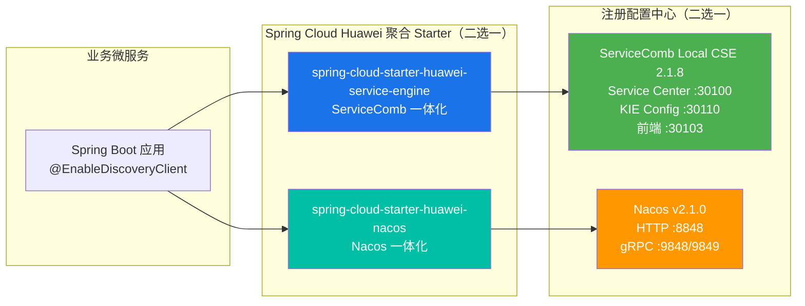
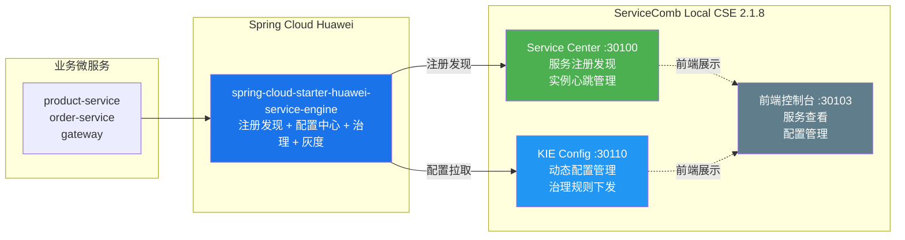
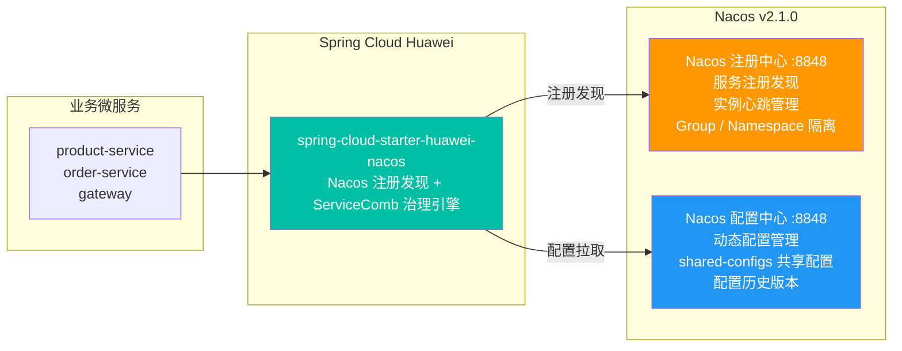

# 注册配置中心适配对接最佳实践

## 实践版本表

| 组件 | 版本 | 工程依据 |
|------|------|----------|
| Java | 17 | 两个工程根 `pom.xml` |
| Spring Boot | 3.4.4 | 两个工程根 `pom.xml` |
| Spring Cloud | 2024.0.1 | 两个工程根 `pom.xml` |
| Spring Cloud Huawei | 1.11.11-2024.0.x | 两个工程根 `pom.xml` |
| Local CSE | 2.1.8 | `spring-cloud-huawei-servicecomb/local-cse` |
| Nacos | 2.1.0 | `spring-cloud-huawei-nacos/docker-compose.yml` |

## 1 解决方案说明

### 1.1 对接方案概述

Spring Cloud Huawei 基于 Spring Cloud 编程模型，通过不同的聚合 Starter 分别接入 ServiceComb 和 Nacos。两条路线都可以使用服务名调用和 Spring Cloud OpenFeign，但 Starter、注册信息、配置坐标及治理规则的存放位置不同。实践时应先选定基础设施，再按照对应工程完成依赖和配置。

**对接架构：**



**核心特性：**

- **统一调用方式**：两条路线均可通过服务名配合 `@FeignClient` 或 `@LoadBalanced RestTemplate` 发起调用。
- **聚合 Starter**：示例工程分别使用 ServiceComb Starter 和 Nacos Starter 集成注册发现、配置及相关治理组件。
- **配置坐标明确**：ServiceComb 使用 application、service 和环境标签；Nacos 使用 namespace、group 和 Data ID。两套坐标不能混用。

### 1.2 两种对接方案对比

| 维度 | ServiceComb 对接方案 | Nacos 对接方案 |
|------|---------------------|---------------|
| **Maven Starter** | `spring-cloud-starter-huawei-service-engine` | `spring-cloud-starter-huawei-nacos` |
| **注册中心** | ServiceComb Service Center (SC) | Nacos |
| **配置中心** | ServiceComb KIE | Nacos Config |
| **服务发现范围** | 由 `service.application` 和服务名确定 | 由 namespace、group 和服务名确定 |
| **版本字段** | `spring.cloud.servicecomb.service.version` | `spring.cloud.nacos.discovery.metadata.version` |
| **配置文件** | bootstrap.yml | bootstrap.yaml |
| **典型端口** | SC :30100 / KIE :30110 / 前端 :30103 | HTTP :8848 / gRPC :9848、9849 |
| **适用场景** | 华为云栈（HCS）环境、ServiceComb 生态 | 已有 Nacos 基础设施或开源环境 |
| **工程中的治理配置** | 本地 `application.yml` 或 KIE 文件配置 | 本地 `application.yml` 或 Nacos共享配置 |

> **说明**：本文使用 `spring-cloud-starter-huawei-nacos`，不是阿里原生的 `spring-cloud-starter-alibaba-nacos-discovery`。依赖名称和配置方式以示例工程为准。

### 1.3 依赖版本说明

两个工程使用相同的 Java、Spring Boot、Spring Cloud 和 Spring Cloud Huawei 版本；基础设施分别为 Local CSE 和 Nacos：

| 序号 | 组件 | 版本 | 说明 |
|:---:|------|------|------|
| 1 | Java | 17 | JDK 17 LTS |
| 2 | Spring Boot | 3.4.4 | 基于 Spring Boot 3.x |
| 3 | Spring Cloud | 2024.0.1 | Spring Cloud 2024.0.x 稳定版 |
| 4 | Spring Cloud Huawei | 1.11.11-2024.0.x | 与 Spring Cloud 2024.0.x 适配 |
| 5 | ServiceComb Local CSE | 2.1.8 | SC :30100 / KIE :30110 / 前端 :30103 |
| 6 | Nacos | 2.1.0 | HTTP :8848 / gRPC :9848、9849 |

**依赖管理 BOM（在根 pom.xml 中按顺序引入）：**

```xml
<dependencyManagement>
    <dependencies>
        <!-- Spring Cloud Huawei BOM -->
        <dependency>
            <groupId>com.huaweicloud</groupId>
            <artifactId>spring-cloud-huawei-dependencies</artifactId>
            <version>1.11.11-2024.0.x</version>
            <type>pom</type>
            <scope>import</scope>
        </dependency>

        <!-- Spring Boot BOM -->
        <dependency>
            <groupId>org.springframework.boot</groupId>
            <artifactId>spring-boot-dependencies</artifactId>
            <version>3.4.4</version>
            <type>pom</type>
            <scope>import</scope>
        </dependency>

        <!-- Spring Cloud BOM -->
        <dependency>
            <groupId>org.springframework.cloud</groupId>
            <artifactId>spring-cloud-dependencies</artifactId>
            <version>2024.0.1</version>
            <type>pom</type>
            <scope>import</scope>
        </dependency>
    </dependencies>
</dependencyManagement>
```


## 2 对接实践

### 2.1 ServiceComb 对接实践

#### 2.1.1 对接架构

ServiceComb 对接方案使用华为开源的 ServiceComb 微服务引擎套件，包括 Service Center（注册中心）和 KIE（配置中心）。通过 `spring-cloud-starter-huawei-service-engine` 聚合 Starter 与 ServiceComb 体系集成。



**关键特性：**

- **应用级服务发现**：示例将 `spring.cloud.servicecomb.service.application` 统一设置为 `demo-application`。
- **显式服务版本**：`spring.cloud.servicecomb.service.version` 随服务实例注册，路由规则可按版本标签选择实例。
- **fileSource 机制**：支持在 KIE 中以文件形式管理复杂治理规则（如灰度路由规则），通过 YAML block scalar 嵌套配置。

#### 2.1.2 Maven 依赖配置

在业务服务的 `pom.xml` 中引入 ServiceComb 聚合 Starter：

```xml
<dependencies>
    <!-- ServiceComb 体系聚合 Starter：注册发现 + 配置中心 + 治理 + 灰度 -->
    <dependency>
        <groupId>com.huaweicloud</groupId>
        <artifactId>spring-cloud-starter-huawei-service-engine</artifactId>
    </dependency>

    <!-- Spring Boot Web（业务服务需要） -->
    <dependency>
        <groupId>org.springframework.boot</groupId>
        <artifactId>spring-boot-starter-web</artifactId>
    </dependency>
</dependencies>
```

**网关服务依赖：**

```xml
<dependencies>
    <!-- ServiceComb 网关增强 -->
    <dependency>
        <groupId>com.huaweicloud</groupId>
        <artifactId>spring-cloud-starter-huawei-service-engine-gateway</artifactId>
    </dependency>

    <!-- Spring Cloud Gateway（WebFlux，不要引入 spring-boot-starter-web） -->
    <dependency>
        <groupId>org.springframework.cloud</groupId>
        <artifactId>spring-cloud-starter-gateway</artifactId>
    </dependency>
</dependencies>
```

> **注意**：网关使用 WebFlux 技术栈，不能与 `spring-boot-starter-web` 同时引入。

#### 2.1.3 典型配置示例（bootstrap.yml）

ServiceComb 体系的注册配置需放在 `bootstrap.yml`（在应用上下文启动前加载），以下为实测的完整配置示例：

```yaml
spring:
  application:
    name: product-service

  cloud:
    servicecomb:
      # 服务标识（应用级服务发现）
      service:
        application: ${CAS_APPLICATION_NAME:demo-application}  # 应用名
        name: ${spring.application.name}                        # 微服务名称
        version: ${CAS_INSTANCE_VERSION:1.0.0}                  # 服务版本

      # 注册中心配置
      discovery:
        address: ${PAAS_CSE_SC_ENDPOINT:http://127.0.0.1:30100}

      # 配置中心配置
      config:
        serverAddr: ${PAAS_CSE_CC_ENDPOINT:http://127.0.0.1:30110}
        serverType: kie
```

**关键配置项说明：**

| 配置项 | 说明 | 示例值 |
|--------|------|--------|
| `spring.application.name` | 微服务名称（Spring Cloud 标准字段） | `product-service` |
| `spring.cloud.servicecomb.service.application` | 应用名 | `demo-application` |
| `spring.cloud.servicecomb.service.name` | 微服务名称（通常引用 `spring.application.name`） | `${spring.application.name}` |
| `spring.cloud.servicecomb.service.version` | 服务注册版本，路由规则可按该版本选择实例 | `1.0.0`、`2.0.0` |
| `spring.cloud.servicecomb.discovery.address` | Service Center 注册中心地址 | `http://127.0.0.1:30100` |
| `spring.cloud.servicecomb.config.serverAddr` | KIE 配置中心地址 | `http://127.0.0.1:30110` |
| `spring.cloud.servicecomb.config.serverType` | 配置中心类型 | `kie` |
| `spring.cloud.servicecomb.config.fileSource` | 文件型配置源（可选） | `application.yaml,testing.yaml` |

**应用级服务发现说明：**

ServiceComb 的服务身份包含 application、服务名和版本。示例工程中的调用方和被调用方统一使用 `demo-application`：

- **ServiceComb**：`demo-application` 应用下的 `product-service`、`order-service` 可以互相发现；但 `other-application` 下的服务无法被发现。
- **Nacos**：示例统一使用 namespace `dev` 和 group `CORE_GROUP`，调用双方应保持发现坐标一致。

**服务版本说明：**

`spring.cloud.servicecomb.service.version` 是 ServiceComb 服务身份的一部分。在示例的灰度路由场景中：

- `product-service` v1.0.0 → 稳定版本
- `product-service` v2.0.0 → 灰度版本

通过路由规则可以将带有 `X-Gray-Tag: gray` 的请求路由到 v2.0.0 实例，其余请求路由到 v1.0.0 实例。

**fileSource 机制说明（可选）：**

当需要在 KIE 中管理复杂的治理规则（如灰度路由规则、熔断配置）时，可使用 `fileSource` 机制：

```yaml
spring:
  cloud:
    servicecomb:
      config:
        fileSource: application.yaml,testing.yaml
```

示例工程在 `spring-cloud-huawei-servicecomb/kie-config-demo/src/main/resources/bootstrap.yml` 中配置 `fileSource: application.yaml,testing.yaml`。KIE 对应键值将作为 YAML 配置源载入 Spring Environment；复杂规则必须保留 YAML block scalar 的层级和缩进。


#### 2.1.4 代码集成

在主启动类添加 `@EnableDiscoveryClient` 注解启用服务注册发现：

```java
package com.huaweicloud.samples.servicecomb.product;

import org.springframework.boot.SpringApplication;
import org.springframework.boot.autoconfigure.SpringBootApplication;
import org.springframework.cloud.client.discovery.EnableDiscoveryClient;

@SpringBootApplication
@EnableDiscoveryClient
public class ProductApplication {
    public static void main(String[] args) {
        SpringApplication.run(ProductApplication.class, args);
    }
}
```

**服务调用示例（Feign）：**

当前 ServiceComb 工程的 `order-service` 使用 OpenFeign，源码为 `spring-cloud-huawei-servicecomb/order-service/src/main/java/com/huaweicloud/samples/servicecomb/order/feign/ProductClient.java`：

```java
package com.huaweicloud.samples.servicecomb.order.feign;

import org.springframework.cloud.openfeign.FeignClient;
import org.springframework.web.bind.annotation.GetMapping;
import org.springframework.web.bind.annotation.PathVariable;

import java.util.Map;

@FeignClient(
    name = "product-service",
    fallbackFactory = ProductClientFallbackFactory.class
)
public interface ProductClient {

    @GetMapping("/api/products/{id}")
    Map<String, Object> getProduct(@PathVariable("id") Long id);
}

package com.huaweicloud.samples.servicecomb.order;

import org.springframework.boot.SpringApplication;
import org.springframework.boot.autoconfigure.SpringBootApplication;
import org.springframework.cloud.client.discovery.EnableDiscoveryClient;
import org.springframework.cloud.openfeign.EnableFeignClients;

@SpringBootApplication
@EnableDiscoveryClient
@EnableFeignClients(basePackages = "com.huaweicloud.samples.servicecomb.order.feign")
public class OrderApplication {
    public static void main(String[] args) {
        SpringApplication.run(OrderApplication.class, args);
    }
}
```

> **说明**：`@FeignClient` 的 `name` 是被调用服务名，接口路径必须与 Provider Controller 保持一致。降级逻辑位于 `spring-cloud-huawei-servicecomb/order-service/src/main/java/com/huaweicloud/samples/servicecomb/order/feign/fallback/ProductClientFallbackFactory.java`。

#### 2.1.5 对接验证

**方式一：SC 前端控制台查看**

访问 ServiceComb 前端控制台：

```
http://localhost:30103
```

在控制台中可以查看：

- 已注册的微服务列表（按 `application` 分组）
- 每个服务的实例列表（IP、端口、版本、健康状态）
- 实例元数据

**方式二：REST API 验证**

Service Center 提供 REST API 查询服务注册信息：

```bash
# 查询应用下的所有微服务
curl "http://localhost:30100/registry/v4/default/registry/microservices" \
  -H "X-Domain-Name: default" | jq

# 查询指定服务的实例列表
curl "http://localhost:30100/registry/v4/default/registry/instances?appId=demo-application&serviceName=product-service&version=1.0.0" \
  -H "X-Domain-Name: default" | jq

# 输出示例：
# {
#   "instances": [
#     {
#       "serviceId": "...",
#       "hostName": "product-service",
#       "endpoints": ["rest://172.18.0.3:8081"],
#       "version": "1.0.0",
#       "status": "UP",
#       "properties": {...}
#     }
#   ]
# }
```

**方式三：服务名调用验证**

示例工程通过 `order-service` 的实际接口触发对 `product-service` 的 Feign 调用：

```bash
curl "http://localhost:8082/api/orders?productId=1"
```

响应中的 `productInfo` 包含商品服务返回的数据，可据此确认服务发现和调用链已经生效。

**配置中心验证：**

KIE 配置中心提供 REST API 管理配置：

```bash
# 查询所有配置项（v1 API）
curl "http://localhost:30110/v1/default/kie/kv" | jq

# 创建与当前 KIE 示例一致的文本配置项
curl -X POST "http://localhost:30110/v1/default/kie/kv" \
  -H "Content-Type: application/json" \
  -d '{
    "key": "demo.conf.text-message",
    "value": "hello-from-kie-text-type",
    "labels": {
      "app": "demo-application",
      "service": "kie-config-demo",
      "environment": ""
    },
    "value_type": "text",
    "status": "enabled"
  }'
```

当前工程使用 `@RefreshScope` 配合 `@Value` 和 `@ConfigurationProperties` 读取配置，源码分别位于：

- `spring-cloud-huawei-servicecomb/kie-config-demo/src/main/java/com/huaweicloud/samples/servicecomb/kieconfig/controller/ConfController.java`
- `spring-cloud-huawei-servicecomb/kie-config-demo/src/main/java/com/huaweicloud/samples/servicecomb/kieconfig/config/BusinessConfig.java`

读取当前配置：

```bash
curl "http://localhost:8090/api/conf/current"
```

配置是否动态进入 Bean 取决于订阅坐标、配置类型和 Bean 的刷新边界；不能只依据 KIE 接口返回成功判断应用侧已经生效。


### 2.2 Nacos 对接实践

#### 2.2.1 对接架构

Nacos 对接方案使用阿里开源的 Nacos 作为注册配置中心，通过华为封装的 `spring-cloud-starter-huawei-nacos` 与 Nacos 集成。注册发现走 Nacos，治理能力仍复用 ServiceComb 治理引擎。



**关键特性：**

- **Namespace / Group 隔离**：通过 `namespace` 实现环境隔离（dev / test / prod），通过 `group` 实现业务隔离（`CORE_GROUP` / `PAYMENT_GROUP`）。
- **元数据版本**：`metadata.version` 作为实例元数据，由灰度路由规则的 `tags.version` 选择对应实例。
- **shared-configs 共享配置**：支持将灰度路由规则等跨服务配置外置为共享配置文件（如 `gray-routing.yaml`），统一管理并动态刷新。
- **华为封装 Starter**：使用 `spring-cloud-starter-huawei-nacos` 而非阿里原生 Starter，注册发现走 Nacos，但治理能力（熔断、限流、灰度）仍复用 ServiceComb 治理引擎（`servicecomb.*` 配置生效）。

#### 2.2.2 Maven 依赖配置

在业务服务的 `pom.xml` 中引入 Nacos 聚合 Starter：

```xml
<dependencies>
    <!-- Nacos 体系聚合 Starter：Nacos 注册发现 + ServiceComb 治理引擎 + 灰度路由 -->
    <!-- 华为封装，非阿里原生 Starter -->
    <dependency>
        <groupId>com.huaweicloud</groupId>
        <artifactId>spring-cloud-starter-huawei-nacos</artifactId>
    </dependency>

    <!-- Spring Boot Web（业务服务需要） -->
    <dependency>
        <groupId>org.springframework.boot</groupId>
        <artifactId>spring-boot-starter-web</artifactId>
    </dependency>
</dependencies>
```

> **重要说明**：`spring-cloud-starter-huawei-nacos` 是华为封装的 Nacos 集成方案，它与阿里原生的 `spring-cloud-starter-alibaba-nacos-discovery` 不同：
>
> - **注册发现**：使用 Nacos 的注册发现机制（`spring.cloud.nacos.discovery.*` 配置）
> - **治理能力**：复用 ServiceComb 治理引擎（`servicecomb.*` 配置生效，包括熔断、限流、灰度路由）
>
> 这种设计允许用户在使用 Nacos 注册中心的同时，获得 ServiceComb 统一的治理能力和灰度路由机制。

**网关服务依赖：**

```xml
<dependencies>
    <!-- Spring Cloud Gateway（WebFlux，不要引入 spring-boot-starter-web） -->
    <dependency>
        <groupId>org.springframework.cloud</groupId>
        <artifactId>spring-cloud-starter-gateway</artifactId>
    </dependency>

    <!-- Nacos 体系网关增强 -->
    <dependency>
        <groupId>com.huaweicloud</groupId>
        <artifactId>spring-cloud-starter-huawei-nacos-gateway</artifactId>
    </dependency>

    <!-- Spring Cloud 2024 需要 bootstrap 依赖才能读取 bootstrap.yaml -->
    <dependency>
        <groupId>org.springframework.cloud</groupId>
        <artifactId>spring-cloud-starter-bootstrap</artifactId>
    </dependency>
</dependencies>
```

> **注意**：
> 1. 网关使用 WebFlux 技术栈，不能与 `spring-boot-starter-web` 同时引入。
> 2. Spring Cloud 2024.0.x 默认不再自动加载 `bootstrap.yaml`，需显式引入 `spring-cloud-starter-bootstrap` 依赖。

#### 2.2.3 典型配置示例

Nacos 工程的配置按职责拆分到两个文件：

- **`bootstrap.yaml`**：存放配置中心连接（`spring.cloud.nacos.config`）+ 灰度 header 映射（`servicecomb.context.headerContextMapper`）+ 共享配置（`shared-configs`），先于 application 阶段加载。
- **`application.yml`**：存放注册中心（`spring.cloud.nacos.discovery`）+ `servicecomb.*` 治理规则，符合 Spring Boot 标准实践。

**拆分的作用**：注册发现配置在 application 阶段加载，配置中心订阅在 bootstrap 阶段建立；两个文件的坐标必须使用相同的 namespace 和 group。

**bootstrap.yaml**（实测完整配置）：

```yaml
# bootstrap.yaml — 在 application.yml 之前加载
spring:
  cloud:
    nacos:
      # 配置中心
      config:
        server-addr: ${NACOS_SERVER_ADDR:localhost:8848}
        group: CORE_GROUP
        namespace: ${NACOS_NAMESPACE:dev}
        file-extension: yaml
        import-check:
          enabled: false
        # 共享配置（灰度路由规则外置）
        shared-configs:
          - data-id: gray-routing.yaml
            group: CORE_GROUP
            refresh: true

    servicecomb:
      # 将 HTTP header 映射为灰度路由上下文
      context:
        headerContextMapper:
          X-Gray-Tag: gray-tag
```

**application.yml**（实测完整配置）：

```yaml
server:
  port: 8082

spring:
  application:
    name: order-service
  cloud:
    nacos:
      # 注册中心（discovery 在 application 阶段加载）
      discovery:
        server-addr: ${NACOS_SERVER_ADDR:localhost:8848}
        namespace: ${NACOS_NAMESPACE:dev}
        group: CORE_GROUP
        metadata:
          version: "1.0.0"

# Spring Cloud Huawei 治理配置
servicecomb:
  matchGroup:
    rate-limit-test: |
      matches:
        - apiPath:
            prefix: "/api/orders/test/rate-limit"

  rateLimiting:
    rate-limit-test: |
      rate: 2
      limitRefreshPeriod: 5000
      timeoutDuration: 0
```

> **说明**：`spring.application.name` 写在 `application.yml` 而非 `bootstrap.yaml`（Spring Cloud 标准位置）。`spring-cloud-starter-huawei-nacos` 聚合 Starter 已内置 bootstrap 加载能力，业务服务**无需**显式依赖 `spring-cloud-starter-bootstrap`；但**网关服务**仍需显式引入该依赖（详见 2.2.2 节）。

**关键配置项说明：**

| 配置项 | 所在文件 | 说明 | 示例值 |
|--------|---------|------|--------|
| `spring.application.name` | application.yml | 微服务名称（Spring Cloud 标准字段） | `order-service` |
| `spring.cloud.nacos.discovery.server-addr` | application.yml | Nacos 注册中心地址 | `localhost:8848` |
| `spring.cloud.nacos.discovery.group` | application.yml | 服务分组（业务隔离） | `CORE_GROUP` |
| `spring.cloud.nacos.discovery.namespace` | application.yml | 命名空间（环境隔离：dev / test / prod） | `dev` |
| `spring.cloud.nacos.discovery.metadata.version` | application.yml | 版本元数据（灰度发布基础） | `1.0.0`、`2.0.0` |
| `spring.cloud.nacos.config.server-addr` | bootstrap.yaml | Nacos 配置中心地址 | `localhost:8848` |
| `spring.cloud.nacos.config.file-extension` | bootstrap.yaml | 配置文件格式 | `yaml`、`properties` |
| `spring.cloud.nacos.config.import-check.enabled` | bootstrap.yaml | 是否检查配置文件存在性（建议关闭） | `false` |
| `spring.cloud.nacos.config.shared-configs` | bootstrap.yaml | 共享配置列表（如灰度路由规则） | 见下文 |
| `spring.cloud.servicecomb.context.headerContextMapper` | bootstrap.yaml | HTTP header 到灰度标签的映射 | `X-Gray-Tag: gray-tag` |

**Namespace / Group 隔离说明：**

Nacos 提供两层隔离机制：

- **Namespace（命名空间）**：环境隔离，通常用于 dev / test / prod 环境隔离。不同 Namespace 的服务完全隔离，无法互相发现。
  - 示例：`dev` namespace 的服务只能发现 `dev` namespace 的其他服务。

- **Group（分组）**：同一 namespace 内进一步划分服务和配置。示例所有服务统一使用 `CORE_GROUP`；调用双方应保持 group 一致。
  - 示例：`CORE_GROUP`（核心业务）、`PAYMENT_GROUP`（支付业务）。

**实例元数据版本说明：**

`metadata.version` 是 Nacos 实例的元数据字段：

- **ServiceComb**：服务版本通过 `spring.cloud.servicecomb.service.version` 注册。
- **Nacos**：`metadata.version` 是普通元数据，需通过灰度路由规则的 `route.tags.version` 显式匹配。

在灰度发布场景中：

- `product-service` v1.0.0 → 稳定版本（metadata: `version=1.0.0`）
- `product-service` v2.0.0 → 灰度版本（metadata: `version=2.0.0`）

通过灰度路由规则将带有 `X-Gray-Tag: gray` 的请求路由到 v2.0.0 实例。

**shared-configs 共享配置说明：**

`shared-configs` 用于加载跨服务的共享配置文件，典型用途是将灰度路由规则外置到 Nacos 配置中心统一管理：

```yaml
spring:
  cloud:
    nacos:
      config:
        shared-configs:
          - data-id: gray-routing.yaml      # 配置文件 ID
            group: CORE_GROUP                 # 配置分组
            refresh: true                     # 启用动态刷新
```

在 Nacos 控制台创建 `gray-routing.yaml` 配置文件，内容为灰度路由规则：

```yaml
servicecomb:
  routeRule:
    product-service: |
      - precedence: 2
        match:
          headers:
            gray-tag:
              exact: "gray"
        route:
          - weight: 100
            tags:
              version: "2.0.0"
      - precedence: 1
        route:
          - weight: 100
            tags:
              version: "1.0.0"
```

当前工程为该共享配置设置 `refresh: true`。配置发布后，应结合应用订阅日志和实际路由结果确认规则已经刷新。

**灰度标签映射说明：**

`spring.cloud.servicecomb.context.headerContextMapper` 将 HTTP header 映射到灰度上下文：

```yaml
servicecomb:
  context:
    headerContextMapper:
      X-Gray-Tag: gray-tag
```

- **HTTP header**：`X-Gray-Tag: gray`（请求中携带的 header）
- **灰度上下文 key**：`gray-tag`（RouterFilter 读取的 context key）

灰度路由规则的 `match.headers` 使用 context key 匹配：

```yaml
match:
  headers:
    gray-tag:      # 匹配 context key（不是原始 header 名）
      exact: "gray"
```


#### 2.2.4 代码集成

在主启动类添加 `@EnableDiscoveryClient` 注解启用服务注册发现（与 ServiceComb 体系相同）：

```java
package com.huaweicloud.samples.nacos.order;

import org.springframework.boot.SpringApplication;
import org.springframework.boot.autoconfigure.SpringBootApplication;
import org.springframework.cloud.client.discovery.EnableDiscoveryClient;

@SpringBootApplication
@EnableDiscoveryClient
public class OrderApplication {
    public static void main(String[] args) {
        SpringApplication.run(OrderApplication.class, args);
    }
}
```

**服务调用示例（RestTemplate）：**

当前 `order-service` 使用 `@LoadBalanced RestTemplate`，完整源码位于 `spring-cloud-huawei-nacos/order-service/src/main/java/com/huaweicloud/samples/nacos/order/config/RestConfig.java` 和 `spring-cloud-huawei-nacos/order-service/src/main/java/com/huaweicloud/samples/nacos/order/service/ProductService.java`：

```java
@Bean
@LoadBalanced
public RestTemplate restTemplate() {
    return new RestTemplate();
}

public Map<String, Object> getProduct(Long id) {
    return get("http://product-service/api/products/" + id);
}

private Map<String, Object> get(String url) {
    ResponseEntity<Map<String, Object>> response = restTemplate.exchange(
        url, HttpMethod.GET, HttpEntity.EMPTY, MAP_RESPONSE_TYPE);
    return response.getBody();
}
```

**服务调用示例（Feign）：**

Feign 接口和启动类分别位于 `spring-cloud-huawei-nacos/order-service-feign/src/main/java/com/huaweicloud/samples/nacos/order/feign/client/ProductClient.java` 和 `spring-cloud-huawei-nacos/order-service-feign/src/main/java/com/huaweicloud/samples/nacos/order/feign/OrderFeignApplication.java`：

```java
package com.huaweicloud.samples.nacos.order.feign.client;

import org.springframework.cloud.openfeign.FeignClient;
import org.springframework.web.bind.annotation.GetMapping;
import org.springframework.web.bind.annotation.PathVariable;

import java.util.Map;

@FeignClient(
    name = "product-service",
    fallbackFactory = ProductClientFallbackFactory.class
)
public interface ProductClient {

    @GetMapping("/api/products/{id}")
    Map<String, Object> getProduct(@PathVariable("id") Long id);
}
```

```java
@SpringBootApplication
@EnableDiscoveryClient
@EnableFeignClients(basePackages = "com.huaweicloud.samples.nacos.order.feign.client")
public class OrderFeignApplication {
    public static void main(String[] args) {
        SpringApplication.run(OrderFeignApplication.class, args);
    }
}
```

> **说明**：Feign 示例是独立模块 `order-service-feign`，监听 8084 端口；RestTemplate 示例是 `order-service`，监听 8082 端口。不要将两个启动类或调用方式混在同一示例中。

#### 2.2.5 对接验证

**方式一：Nacos 控制台查看**

访问 Nacos 控制台：

```
http://localhost:8848/nacos
```

在控制台中可以查看：

1. **服务管理 → 服务列表**：
   - 选择命名空间（如 `dev`）
   - 查看服务分组（如 `CORE_GROUP`）
   - 查看服务实例列表（IP、端口、权重、健康状态）
   - 查看实例元数据（`version` 等）

2. **配置管理 → 配置列表**：
   - 选择命名空间（如 `dev`）
   - 选择配置分组（如 `CORE_GROUP`）
   - 查看共享配置（如 `gray-routing.yaml`）
   - 查看配置历史版本

**方式二：Open API 验证**

Nacos 提供 REST API 查询服务注册信息：

```bash
# 查询服务实例列表
curl "http://localhost:8848/nacos/v1/ns/instance/list?serviceName=product-service&groupName=CORE_GROUP&namespaceId=dev" | jq

# 输出示例：
# {
#   "name": "CORE_GROUP@@product-service",
#   "groupName": "CORE_GROUP",
#   "clusters": "",
#   "cacheMillis": 10000,
#   "hosts": [
#     {
#       "ip": "172.20.0.3",
#       "port": 8081,
#       "valid": true,
#       "healthy": true,
#       "marked": false,
#       "instanceId": "172.20.0.3#8081#CORE_GROUP#product-service",
#       "metadata": {
#         "version": "1.0.0",
#         "preserved.register.source": "SPRING_CLOUD"
#       },
#       "enabled": true,
#       "weight": 1.0,
#       "clusterName": "DEFAULT",
#       "serviceName": "CORE_GROUP@@product-service",
#       "ephemeral": true
#     }
#   ],
#   "checksum": "",
#   "lastRefTime": 0,
#   "env": "",
#   "reach ProtectionThreshold": false
# }
```

**方式三：服务名调用验证**

当前工程直接通过订单接口触发实际的服务发现和 RestTemplate 调用：

```bash
curl "http://localhost:8082/api/orders?productId=1"
```

响应中的 `productInfo.port` 和 `productInfo.version` 表明最终被调用的商品服务实例。Feign 模块使用以下接口：

```bash
curl "http://localhost:8084/api/orders-fg?productId=1"
```

**配置中心验证：**

当前工程通过 `spring-cloud-huawei-nacos/scripts/nacos-init.sh` 将 `spring-cloud-huawei-nacos/scripts/gray-routing.yaml` 发布到 namespace `dev`、group `CORE_GROUP`、Data ID `gray-routing.yaml`。脚本使用 Nacos Open API 并在发布后回读配置，适合用作配置坐标和发布参数的参考。

**共享配置验证：**

验证 `shared-configs` 中的 `gray-routing.yaml` 是否生效：

1. 运行初始化脚本，或在 Nacos 控制台创建 `gray-routing.yaml`（namespace: `dev`, group: `CORE_GROUP`）
2. 配置灰度路由规则（见 2.2.3 节）
3. 启动两个版本的 `product-service`（v1.0.0 和 v2.0.0）
4. 通过 Gateway 或 Consumer 发送带有 `X-Gray-Tag: gray` 的请求，观察是否路由到 v2.0.0 实例

```bash
# 不带灰度标签的请求（路由到 v1.0.0）
curl http://localhost:8080/api/products/1

# 带灰度标签的请求（路由到 v2.0.0）
curl -H "X-Gray-Tag: gray" http://localhost:8080/api/products/1
```

修改 Nacos 中的 `gray-routing.yaml` 后，应通过订阅日志和带标签请求确认新规则已经进入应用。


## 3 附录

### 3.1 工程文件索引

| 实践内容 | 工程文件 |
|----------|----------|
| ServiceComb 版本与依赖管理 | `spring-cloud-huawei-servicecomb/pom.xml` |
| ServiceComb 服务注册配置 | `spring-cloud-huawei-servicecomb/product-service/src/main/resources/bootstrap.yml` |
| OpenFeign 服务名调用 | `spring-cloud-huawei-servicecomb/order-service/src/main/java/com/huaweicloud/samples/servicecomb/order/feign/ProductClient.java` |
| KIE 配置订阅 | `spring-cloud-huawei-servicecomb/kie-config-demo/src/main/resources/bootstrap.yml` |
| KIE 配置发布 | `spring-cloud-huawei-servicecomb/kie-init/init-route-rules.sh` |
| Nacos 版本与依赖管理 | `spring-cloud-huawei-nacos/pom.xml` |
| Nacos 注册配置 | `spring-cloud-huawei-nacos/order-service/src/main/resources/application.yml` |
| Nacos Config 订阅 | `spring-cloud-huawei-nacos/order-service/src/main/resources/bootstrap.yaml` |
| RestTemplate 服务名调用 | `spring-cloud-huawei-nacos/order-service/src/main/java/com/huaweicloud/samples/nacos/order/service/ProductService.java` |
| Nacos 配置发布 | `spring-cloud-huawei-nacos/scripts/nacos-init.sh` |
| Nacos 灰度路由配置 | `spring-cloud-huawei-nacos/scripts/gray-routing.yaml` |
| Nacos Gateway 注册与路由 | `spring-cloud-huawei-nacos/gateway/src/main/resources/application.yml` |

### 3.2 配置坐标速查

| 维度 | ServiceComb Service Center / KIE | Nacos Registry / Config |
|------|----------------------------------|-------------------------|
| 服务环境隔离 | `service.application` | `discovery.namespace` |
| 服务业务分组 | application 统一规划 | `discovery.group` |
| 服务名 | `service.name` | `spring.application.name` |
| 服务版本 | `service.version` | `discovery.metadata.version` |
| 注册中心地址 | `discovery.address` | `discovery.server-addr` |
| 配置中心地址 | `config.serverAddr` | `config.server-addr` |
| 文件型配置 | KIE key + `fileSource` | Data ID + `shared-configs` |
| 示例配置隔离 | labels 中的 app、service、environment | namespace、group、Data ID |

### 3.3 常见问题排查

#### 3.3.1 ServiceComb

| 问题现象 | 核对内容 |
|----------|----------|
| 服务未注册 | 检查 `PAAS_CSE_SC_ENDPOINT`、网络连通性及 `service.application/name/version` |
| Consumer 找不到 Provider | 检查调用双方的 application、服务名以及 Provider 注册状态 |
| KIE 配置未进入应用 | 检查 `PAAS_CSE_CC_ENDPOINT`、labels、`value_type` 和 `fileSource` |
| YAML 规则解析失败 | 检查 block scalar、缩进以及规则是否仍作为完整字符串加载 |
| 配置发布后 Bean 未变化 | 检查订阅日志、配置坐标、`@RefreshScope` 和属性绑定方式 |

#### 3.3.2 Nacos

| 问题现象 | 核对内容 |
|----------|----------|
| 服务未注册 | 检查 `NACOS_SERVER_ADDR`、namespace、group 和应用名 |
| Consumer 找不到 Provider | 确认双方使用相同 namespace 和 group，并检查目标服务健康实例 |
| `bootstrap.yaml` 未加载 | 核对 Starter；Gateway 还应包含 `spring-cloud-starter-bootstrap` |
| 共享配置未订阅 | 核对 namespace、group、Data ID 和 `refresh: true` |
| 灰度规则未生效 | 检查 `metadata.version`、`headerContextMapper` 和规则中的 `gray-tag` |
| 发布成功但行为未变化 | 回读配置，并结合应用订阅日志和实际请求结果判断 |

配置发布接口成功只说明注册配置中心接受了数据，不能替代应用侧验证。排查时应沿“连接地址 → 隔离坐标 → 数据内容 → 应用订阅 → 实际调用结果”的顺序定位。
