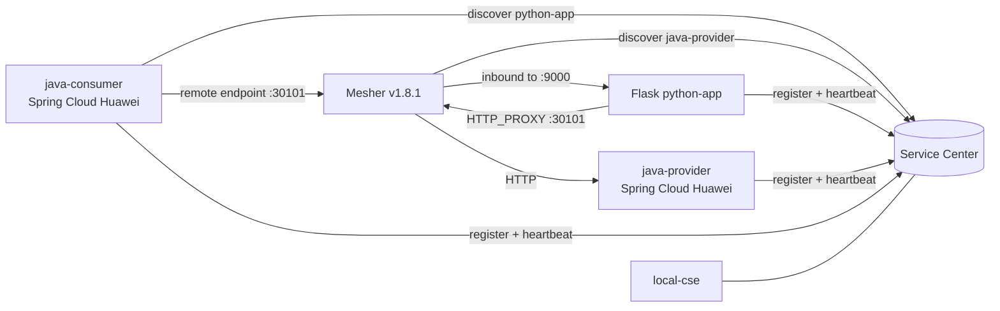

# 架构说明

## 组件职责



- `local-cse` 提供 Service Center、KIE 和 Dashboard；本 Demo 只依赖注册发现能力。
- `java-provider` 使用 Spring Cloud Huawei 注册并提供 `/api/users`。
- `java-consumer` 使用 Spring Cloud Huawei 和 OpenFeign，通过逻辑服务名 `python-app` 调用 `/show`。
- `python-app` 提供 Flask 接口；Mesher 负责其注册、发现、入向和出向代理。
- `python-app` 镜像中保留 Flask 与 Mesher 双进程，这是原示例的保守运行结构。

## 两条代理路径

Python 出向调用：

```text
GET python-app:9000/show
  -> requests 请求 http://java-provider/api/users
  -> HTTP_PROXY 127.0.0.1:30101
  -> Mesher 查询 Service Center
  -> java-provider:7001/api/users
```

Java 入向调用及完整回路：

```text
GET java-consumer:7002/show
  -> Feign 使用逻辑名 python-app
  -> Service Center 返回 Mesher endpoint :30101
  -> Mesher 入向代理到 Flask :9000/show
  -> Flask 再经 Mesher 出向调用 java-provider
```

因此，仅验证 Flask 或 Java HTTP 接口可达不足以证明 Mesher 链路成立；注册 endpoint 和两个方向的业务调用都需要检查。

## 注册与代理配置边界

`python-app/chassis.yaml` 保留 Mesher v1.8.1 的关键约束：

- `service.app` 表示 ServiceComb 应用 ID；不是 `service.application`。
- `autoIPIndex: false` 使注册 endpoint 使用显式注入的容器地址。
- `--service-ports=rest:9000` 把 Mesher 入向请求转发到 Flask。
- Provider incoming chain 包含 `router,loadbalance`，用于解析并转发远端请求。

入口脚本在容器启动时生成 `microservice.yaml`、写入实际容器 IP，启动 Mesher，并在 30 秒内主动探测代理端口。代理就绪后才把 Flask 作为前台进程启动。

## 配置生命周期

Compose 统一注入 Service Center 地址、应用名和实例版本。Java 两个模块在 `bootstrap.yml` 的启动早期启用 ServiceComb 服务发现，并关闭本 Demo 未使用的动态配置客户端。Python 侧同时向 Mesher 注入相同的应用名、服务名和版本。

宿主机端口只用于演示和验证，可通过 `.env` 修改；容器间始终使用服务名和固定容器端口通信。

## 构建拓扑

根 Dockerfile 通过 `MODULE` 构建指定 Java 模块及依赖，避免 Provider 和 Consumer 各自维护重复镜像文件。Mesher 使用独立两阶段 Dockerfile 从源码构建；Python 镜像只复制已经校验的 Mesher 二进制和配置，从而保持职责清晰。
