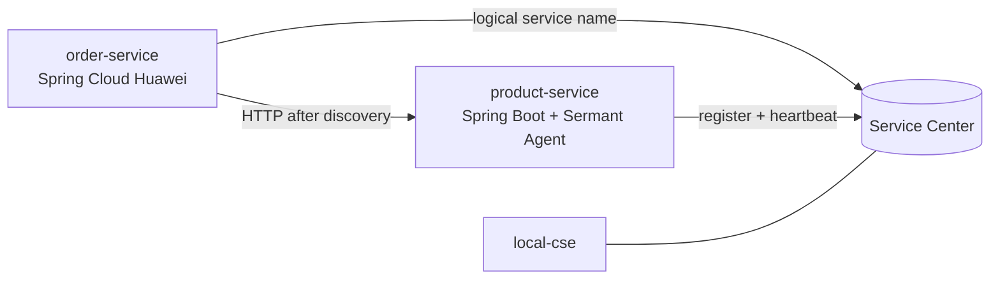

# 架构说明

## 组件职责



- `local-cse` 提供 Service Center、KIE 和 Dashboard。
- `product-service` 是普通 Spring Boot 业务服务，仅保留 `spring-cloud-commons` 以提供自动注册触发点；Sermant Agent 在 JVM 启动时完成注册。
- `order-service` 使用 Spring Cloud Huawei 的 ServiceComb 客户端发现 `product-service`，通过 `@LoadBalanced RestTemplate` 使用逻辑服务名调用。

## 注册与发现边界

Provider 的注册路径：

```text
SpringApplication.run
  -> Spring Cloud Commons AutoServiceRegistration
  -> Sermant 字节码增强拦截
  -> Service Center REST API 注册和心跳
```

Consumer 的发现路径：

```text
http://product-service/...
  -> Spring Cloud LoadBalancer
  -> Spring Cloud Huawei ServiceComb DiscoveryClient
  -> Service Center 实例列表
  -> 具体 Provider endpoint
```

因此，Provider 是否由 Sermant 注册必须通过 Service Center 的 `framework.name=Sermant` 验证，不能只凭 HTTP 调用成功推断。

## 配置生命周期

Compose 只向容器注入 Service Center/KIE 地址、应用名和实例版本。Sermant Provider 镜像在构建阶段固定 Agent 版本，并把注册地址改为 `local-cse:30100`；运行时通过环境变量设置应用名和版本。Consumer 的 `bootstrap.yml` 在启动早期启用服务发现，KIE 配置在本最小示例中关闭。

## 构建拓扑

根 Dockerfile 的 Maven 构建阶段只构建 `MODULE` 及其依赖。`plain-runtime` 用于 Consumer，`sermant-runtime` 在同一可执行 JAR 上叠加 Agent 和注册配置，避免每个模块维护一套重复的 Maven 构建逻辑。
