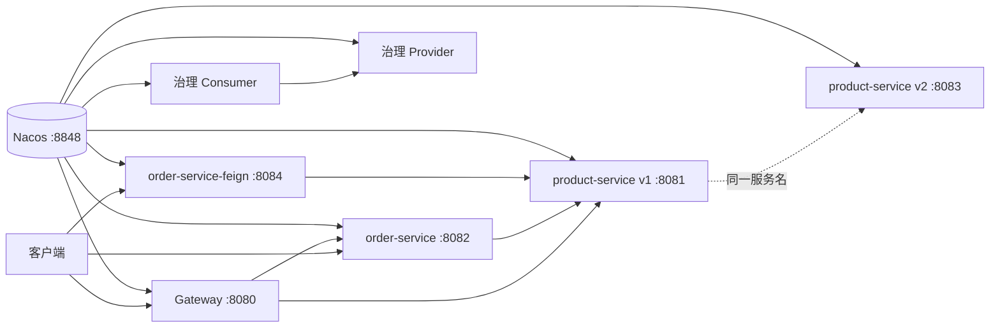
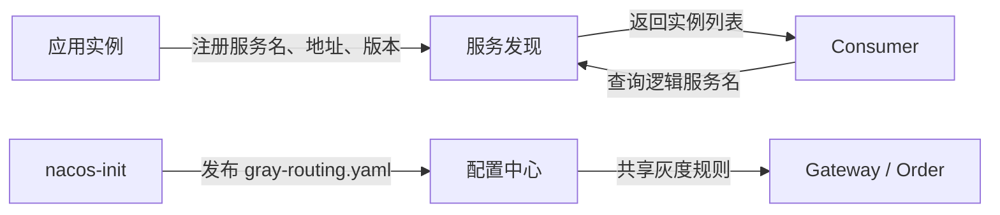
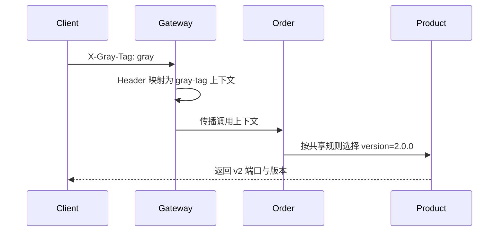
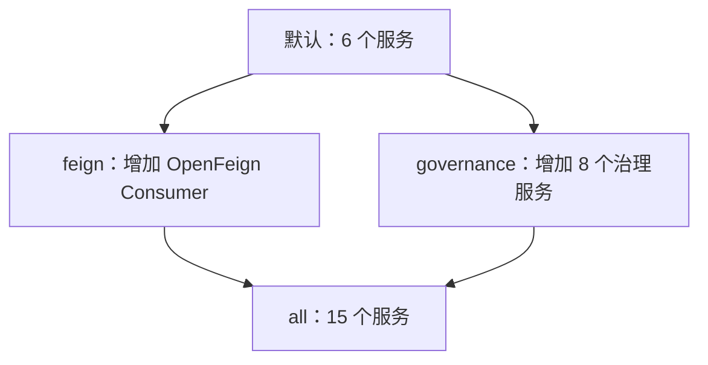

# 架构与配置

## 总体结构



所有应用默认使用 namespace `dev`。核心链路注册到 `CORE_GROUP`，重试和熔断专题分别使用 `RETRY_GROUP`、`CIRCUIT_GROUP`，隔离与舱壁专题使用 `GOVERNANCE_GROUP`，从而避免同名服务和测试状态相互干扰。Compose 通过 `NACOS_SERVER_ADDR` 与 `NACOS_NAMESPACE` 注入环境差异，应用配置保持可在本地和容器间复用。

## 两条运行路径

项目同时使用 Nacos 的服务发现和配置能力，但两者职责不同：



- 服务发现覆盖所有应用，负责实例注册和按服务名调用。
- 远程配置只由 Gateway、Order 和 OpenFeign Order 订阅，负责 Product 双版本灰度规则。
- 其他治理规则保存在专题模块本地配置中，避免远程配置状态影响用例重复执行。

## 启动顺序

1. `nacos` 通过健康检查后变为可用。
2. `nacos-init` 创建 namespace，发布并回读 `gray-routing.yaml`。
3. 业务服务在初始化成功后启动并注册。
4. Consumer 和 Gateway 根据 Nacos 实例列表完成按服务名调用。

初始化脚本是幂等的：namespace 已存在时会继续执行，配置发布失败或回读不一致时则立即退出，避免业务服务在错误配置上启动。

## 核心请求链

普通订单请求：

```text
GET :8082/api/orders?productId=1
  -> order-service
  -> lb://product-service
  -> product-service v1
```

带灰度标签的请求：

```text
GET :8080/api/orders?productId=1
X-Gray-Tag: gray
  -> gateway
  -> order-service
  -> product-service v2
```

路由规则由 `scripts/gray-routing.yaml` 初始化到 Nacos。无标签流量固定命中 v1，标签值为 `gray` 的流量固定命中 v2，便于得到可重复的验证结果。

灰度上下文传播：



因此 TC-3G 观察最终 Product 版本，而不只检查 Gateway 第一跳。

## 配置职责

| 配置位置 | 职责 |
| --- | --- |
| `docker-compose.yml` | 服务拓扑、环境变量、端口、profile、健康检查 |
| `*/src/main/resources/bootstrap.yaml` | 启动早期加载 Nacos 远程配置 |
| `*/src/main/resources/application.yml` | 应用端口、发现参数与治理规则 |
| `scripts/gray-routing.yaml` | Gateway 与 Consumer 共享的灰度规则 |
| `scripts/nacos-init.sh` | namespace 与远程配置的幂等初始化 |

只有需要读取远程灰度规则的 `gateway`、`order-service` 和 `order-service-feign` 配置 Nacos Config；其他模块只启用服务发现，避免重复配置。

namespace、group、Data ID、初始化回读和规则修改流程见[配置生命周期](CONFIGURATION.md)。

## Compose profile



- 默认范围适合首次体验，资源占用最低。
- `feign` 用于验证声明式客户端。
- `governance` 用于重试、隔离、舱壁和熔断专题。
- `all` 用于运行完整 `verify.sh`。

## 治理专题设计

每个高级专题使用独立的 Provider/Consumer 对，避免测试状态相互污染：

| 专题 | 设计重点 |
| --- | --- |
| 重试 | 网络异常、状态码、服务级规则与同实例重试 |
| 实例隔离 | 最小调用数、错误率、慢调用率、强制开关和错误码判断 |
| 舱壁 | 实例并发上限和服务级规则 |
| 熔断 | Provider 错误率、慢调用率和进入业务代码前的请求短路 |

统一调用模型：

```text
verify.sh
  -> 治理 Consumer 测试端点
  -> 带负载均衡的 RestTemplate
  -> 治理 Provider 故障或耗时端点
```

重试关注一次外部请求触发了多少次下游调用；实例隔离关注故障实例是否继续被选择；舱壁关注并发许可；熔断关注 Provider Controller 的真实调用次数是否停止增长。脚本通过结果分布、结构化计数或 Provider 计数判断策略，不将普通 HTTP 失败直接视为治理成功。

## 构建结构

根 `pom.xml` 统一管理版本和 14 个 Maven 子模块。根 `Dockerfile` 先在不依赖 `MODULE` 的共享层完成一次 Maven reactor 构建，再按 `MODULE` 提取目标 JAR；全量构建时，各应用镜像可以复用同一编译层。运行镜像使用固定的非 root 用户。Java 版本由 Maven Enforcer 固定为 17，防止本地和 CI 使用不兼容 JDK。
