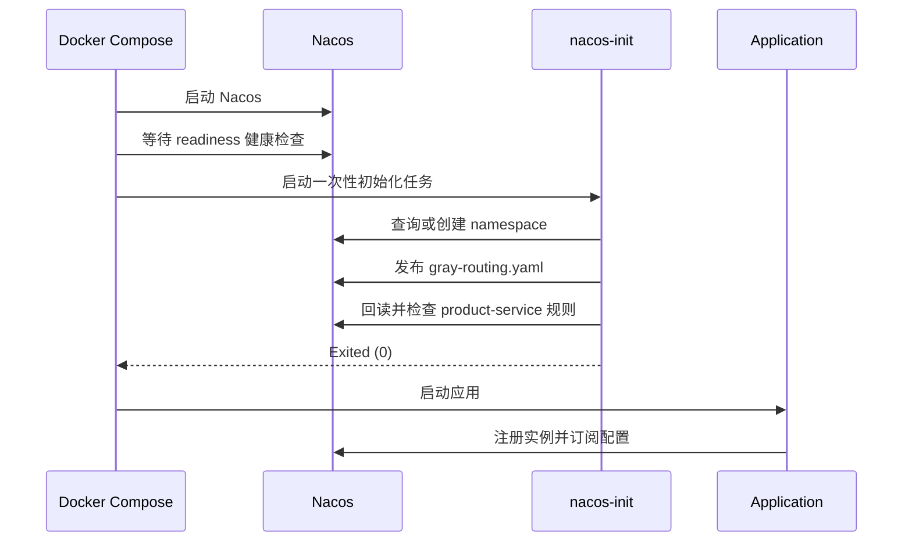

# 配置生命周期

本文档说明本工程如何组织 Nacos 服务发现与远程配置，以及修改灰度规则后如何验证。内容以 Compose、`nacos-init.sh` 和三个配置消费者的当前实现为准。

## 1. namespace、group 和 Data ID

| 层级 | 本工程取值 | 职责 |
| --- | --- | --- |
| namespace | `dev` | 隔离整套演示环境，可通过 `NACOS_NAMESPACE` 修改 |
| `CORE_GROUP` | 核心服务与灰度配置 | Gateway、Order、Product 和 `gray-routing.yaml` |
| `RETRY_GROUP` | 重试专题 | `retry-provider` / `retry-consumer` |
| `CIRCUIT_GROUP` | 熔断专题 | `circuit-breaker-provider` / `circuit-breaker-consumer` |
| `GOVERNANCE_GROUP` | 隔离与舱壁专题 | `isolation-*`、`bulkhead-*` |
| Data ID | `gray-routing.yaml` | Product 双版本路由规则 |

namespace 必须在 Compose、初始化任务、应用和验证脚本之间保持一致。group 用于隔离同一 namespace 内不同专题的服务和配置。

## 2. 启动和发布顺序



所有应用依赖 `nacos-init` 成功完成。初始化任务失败时，业务容器不会在缺少灰度配置的状态下继续启动。

## 3. 初始化任务的幂等边界

`scripts/nacos-init.sh` 执行以下操作：

1. 最多等待 Nacos readiness 约 60 秒。
2. namespace 已存在时直接复用，否则创建。
3. 将 `scripts/gray-routing.yaml` 发布为 `CORE_GROUP/gray-routing.yaml`。
4. 最多重试发布 10 次。
5. 回读配置并确认其中包含 `product-service`。

重复执行会覆盖同 namespace、group 和 Data ID 下的灰度配置，不会删除其他 Data ID。

```bash
docker compose run --rm nacos-init
docker compose logs nacos-init
```

## 4. 应用如何加载共享配置

只有需要灰度规则的三个模块启用 Nacos Config：

- `gateway`
- `order-service`
- `order-service-feign`

它们在 `bootstrap.yaml` 中声明：

```yaml
spring:
  cloud:
    nacos:
      config:
        server-addr: ${NACOS_SERVER_ADDR:localhost:8848}
        namespace: ${NACOS_NAMESPACE:dev}
        group: CORE_GROUP
        shared-configs:
          - data-id: gray-routing.yaml
            group: CORE_GROUP
            refresh: true
```

`bootstrap.yaml` 负责启动早期连接和共享配置，`application.yml` 负责应用端口、服务注册元数据及本地治理规则。其他模块只使用服务发现，不重复订阅灰度配置。

## 5. 灰度规则的数据流

`gray-routing.yaml` 为同名 Product 实例定义两个选择分支：

```text
无灰度标签
  -> version=1.0.0

X-Gray-Tag: gray
  -> version=2.0.0
```

请求头首先被映射为 `gray-tag` 上下文。Gateway 和两种 Order Consumer 都加载同一份规则，因此直接调用、Gateway 调用和 OpenFeign 调用使用一致的版本选择语义。

规则采用 100% 权重，端到端用例可以精确断言每次请求的目标端口，避免概率波动。

## 6. 环境变量

| 变量 | 默认值 | 使用方 |
| --- | --- | --- |
| `NACOS_SERVER_ADDR` | `localhost:8848` | 应用的服务发现与配置客户端 |
| `NACOS_NAMESPACE` | `dev` | Compose、应用、初始化任务和验证脚本 |
| `SPRING_CLOUD_NACOS_CONFIG_SERVER_ADDR` | `nacos:8848`（Compose） | 容器内配置客户端 |
| `SPRING_CLOUD_NACOS_CONFIG_NAMESPACE` | 与 `NACOS_NAMESPACE` 一致 | 容器内配置客户端 |
| `NACOS_URL` | `http://localhost:8848` | `nacos-init.sh` |
| `NACOS_GROUP` | `CORE_GROUP` | `nacos-init.sh` 发布目标 |

使用其他 namespace 时，启动和验证必须传入相同值：

```bash
NACOS_NAMESPACE=test docker compose --profile all up -d --build
NACOS_NAMESPACE=test bash verify.sh --tc 1
```

## 7. 修改并验证规则

编辑 `scripts/gray-routing.yaml` 后重新发布：

```bash
docker compose run --rm nacos-init
bash verify.sh --tc 3
bash verify.sh --tc 3G
bash verify.sh --tc 2F
```

判断配置是否真正生效应以业务流量结果为准，而不只检查发布接口返回成功。若配置已回读但目标行为没有变化，可重建订阅该配置的模块后再次验证：

```bash
docker compose --profile all up -d --build gateway order-service order-service-feign
```

## 8. 配置职责边界

本工程的远程配置只承载灰度规则。重试、隔离、舱壁和熔断专题的规则保存在对应模块的 `application.yml`，修改后需要重建相应应用镜像。

这种划分让入门链路只演示一个明确的远程配置生命周期，同时让状态型治理用例保持独立和可重复。
