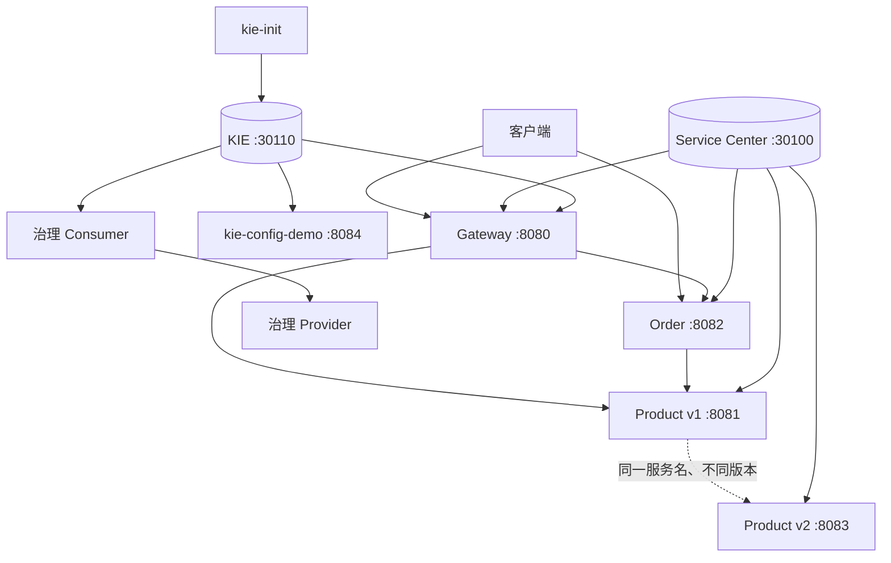
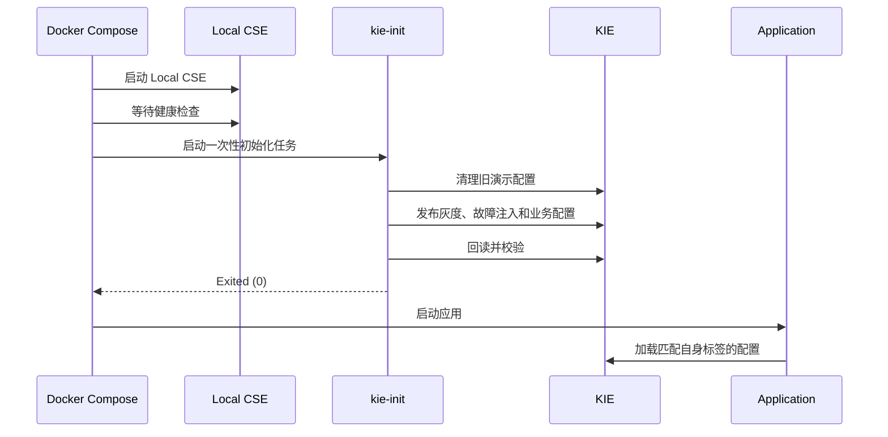

# 架构与配置

## 1. 总体结构



项目由三类组件组成：

- Local CSE：提供 Service Center、KIE 和 Dashboard。
- 核心业务链路：Gateway、Order、Product v1/v2。
- 独立治理专题：重试、实例隔离、舱壁、Consumer 熔断和故障注入。

## 2. 注册与发现

Compose 统一注入：

| 环境变量 | 用途 |
| --- | --- |
| `PAAS_CSE_SC_ENDPOINT` | Service Center 地址 |
| `PAAS_CSE_CC_ENDPOINT` | KIE 地址 |
| `CAS_APPLICATION_NAME` | 应用分组，默认 `demo-application` |
| `CAS_INSTANCE_VERSION` | 实例版本，默认 `1.0.0` |

各应用的 `bootstrap.yml` 在启动早期启用服务发现和远程配置。实例注册包含服务名、版本和端点；Consumer 只使用逻辑服务名，具体地址由发现结果和负载均衡选择。

核心调用链：

```text
GET :8082/api/orders?productId=1
  -> order-service
  -> Feign: product-service
  -> product-service 实例
```

业务调用成功可以同时证明目标服务已注册、Consumer 已获取实例列表且负载均衡能够选择可用实例。

## 3. KIE 配置生命周期



`kie-init` 面向可重复演示，会先清空默认租户中的旧配置。该行为适合本项目的独立 Compose 环境，不应直接用于需要保留既有配置的共享环境。

配置值类型、`fileSource`、block scalar 和动态刷新行为见 [KIE 配置指南](KIE_CONFIG.md)。

## 4. 核心请求链

### OpenFeign 调用

`order-service` 通过 `@FeignClient(name = "product-service")` 声明商品接口。Feign 代理、服务发现和负载均衡共同完成从逻辑名称到具体实例的调用；FallbackFactory 负责调用失败时的统一降级响应。

### Gateway 路由

Gateway 按路径转发请求：

- `/api/products/**` → `product-service`
- `/api/orders/**` → `order-service`

基础路由由 TC-6 验证，灰度上下文传播由 TC-3 单独验证。

## 5. 灰度路由

Product v1 和 v2 使用相同服务名，以 `CAS_INSTANCE_VERSION` 区分。KIE 中的路由规则按请求上下文选择实例：

```text
无 X-Gray-Tag
  -> 100% product-service v1

X-Gray-Tag: gray
  -> 30% product-service v1
  -> 70% product-service v2
```

Gateway 将请求头映射到调用上下文，Order 再将上下文传播到下一跳。因此全链路验证必须观察最终 Product 版本，而不只检查 Gateway 第一跳。

权重选择具有随机性，测试使用 100 次采样和容差区间。规则来源是 `kie-init/init-route-rules.sh`。

## 6. 治理专题

每个治理专题使用独立的 Consumer/Provider，避免端点计数和策略状态污染核心链路。

| 专题 | 服务 | 观察重点 | 验证 |
| --- | --- | --- | --- |
| 重试 | `retry-*` | 失败后是否再次调用、是否恢复 | TC-7 |
| 实例隔离 | `isolation-*` | 调用统计达到条件后是否继续选择实例 | TC-8 |
| 舱壁 | `bulkhead-*` | 并发许可、成功数和拒绝数 | TC-9 |
| Consumer 熔断 | `circuit-breaker-*` | 熔断打开后是否停止进入 Provider | TC-10 |
| 故障注入 | `fault-injection-*` | 注入请求是否在进入 Provider 前失败 | TC-11 |

规则通常由两部分绑定：

1. `servicecomb.matchGroup.<name>` 定义匹配路径和目标服务。
2. 对应策略段使用同一个 `<name>` 定义阈值、并发数或注入比例。

路径、服务名或规则名不一致时，策略不会作用于预期请求。排查时应先确认匹配范围，再检查策略参数。

### Consumer 熔断的可观测性

仅看到错误响应不能证明熔断。TC-10 记录 Provider Controller 实际调用次数；发起 12 次请求而 Provider 调用数小于 12，才能说明部分请求已在 Consumer 入口被短路。状态机和参数关系见 [Consumer 熔断测试](CIRCUIT_BREAKER_TEST.md)。

### 故障注入的可观测性

Consumer 同时统计请求结果和 Provider 调用数。50% 注入时，Provider 调用数应等于成功数；100% 注入时，Provider 调用数应为 0。这能区分真正的调用前注入与普通下游失败。

## 7. Compose profile

| Profile | 服务数 | 范围 |
| --- | ---: | --- |
| 默认 | 5 | Local CSE、初始化任务和核心链路 |
| `config` | 7 | 默认 + Product v2 + KIE 配置演示 |
| `governance` | 16 | 默认 + 全部治理专题 |
| `all` | 18 | 全部模块 |

启动顺序由 `depends_on` 和健康检查约束：Local CSE 健康后运行 `kie-init`，初始化成功后再启动应用。核心服务使用容器健康检查；`verify.sh` 还会按所选用例等待对应治理入口。

## 8. 构建与验证

根 `pom.xml` 统一管理所有 Maven 模块。通用 `Dockerfile` 使用 `MODULE` 参数构建指定模块及其依赖，再把唯一的可执行 JAR 复制到 JRE 镜像。

```text
源码
  -> Maven reactor 构建目标模块及依赖
  -> Spring Boot 可执行 JAR
  -> JRE 运行镜像
```

验证分为两层：

- `check.sh`：脚本、Compose、Maven 测试和仓库卫生。
- `verify.sh`：已启动 Compose 环境的端到端断言。

用例与章节对应关系见 [教程与测试矩阵](TUTORIAL_TESTCASE_MATRIX.md)。
