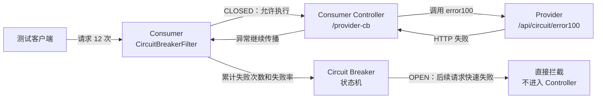
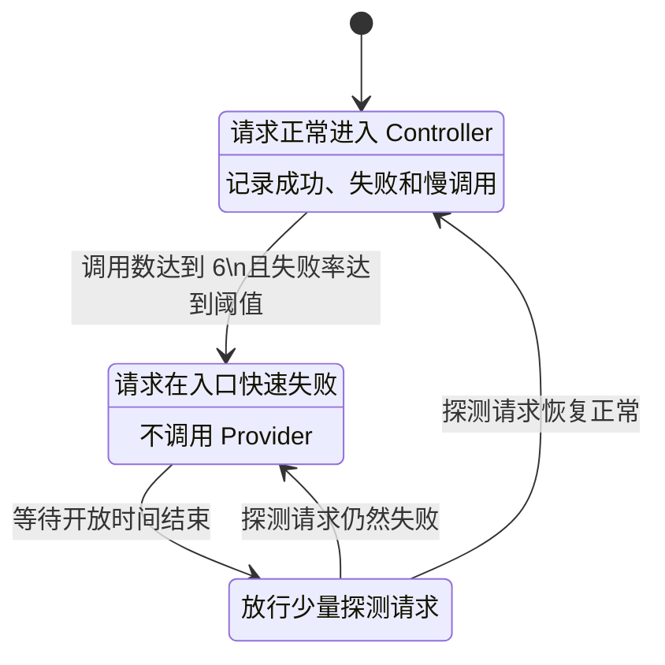

# Consumer 熔断测试说明

本文说明本工程 Consumer 熔断用例的工作原理、配置、操作步骤和结果判定方式。

## 1. 测试目标

验证 `circuit-breaker-consumer` 的熔断器打开后，后续请求会在 Consumer 入口被快速拒绝，不再调用下游 `circuit-breaker-provider`。

本用例不以某段响应文案作为唯一依据，而是读取 Provider 的实际调用计数：

- 向 Consumer 发起 12 次请求；
- 首次冷启动通常在前 6 次请求后打开熔断；
- 后续请求被 Consumer 熔断器拦截；
- Provider 调用计数应小于 `12`。重复执行时，熔断器可能已经处于 `OPEN` 或 `HALF_OPEN`，调用数可能低于 6。

## 2. 服务与端点

| 服务 | 端口 | 作用 |
|------|------|------|
| `circuit-breaker-consumer` | 8097 | 配置并执行 Consumer API 熔断 |
| `circuit-breaker-provider` | 8096 | 提供 100% 失败端点和调用计数 |
| `local-cse` | 30100、30110 | Service Center 和 KIE |

相关端点：

| 方法 | 地址 | 用途 |
|------|------|------|
| `GET` | `http://localhost:8097/api/consumer/circuit/provider-cb` | 触发 Consumer 熔断测试 |
| `POST` | `http://localhost:8096/api/circuit/reset` | 清零 Provider 调用计数 |
| `GET` | `http://localhost:8096/api/circuit/stats` | 查询 Provider 各端点调用计数 |
| `GET` | `http://localhost:8096/api/circuit/error100` | Provider 的 100% 失败端点 |

## 3. 熔断原理

### 3.1 调用链



`CircuitBreakerFilter` 位于 Consumer 的 HTTP 入口。它根据 Consumer API 路径匹配治理规则，并统计该 API 的执行结果。

Controller 调用下游 Provider 时，Provider 的 `/api/circuit/error100` 始终返回失败。Controller 不捕获并转换该异常，因此 Filter 能够看到真实失败并更新熔断状态。

### 3.2 状态转换



本用例的 Provider 失败率为 100%，因此在前 6 次请求后，熔断器由 `CLOSED` 转为 `OPEN`。

### 3.3 为什么不能吞掉异常

以下处理方式会导致熔断失效：

```java
try {
    return restTemplate.getForObject(providerUrl, String.class);
} catch (Exception e) {
    return "ERROR:" + e.getMessage();
}
```

Controller 捕获异常后返回普通字符串，HTTP 请求最终表现为成功响应，入口 Filter 会将其视为成功调用。

当前实现让异常继续传播：

```java
String result = restTemplate.getForObject(
    "http://circuit-breaker-provider/api/circuit/error100",
    String.class);
return "CALL_OK:" + result;
```

这样 Filter 才能统计到失败并触发熔断。

## 4. 熔断配置

配置文件：

`circuit-breaker-consumer/src/main/resources/application.yml`

核心配置：

```yaml
servicecomb:
  matchGroup:
    circuit-consumer-provider-cb: |
      matches:
        - apiPath:
            prefix: "/api/consumer/circuit/provider-cb"

  circuitBreaker:
    circuit-consumer-provider-cb: |
      minimumNumberOfCalls: 6
      slidingWindowSize: 10
      slidingWindowType: COUNT_BASED
      failureRateThreshold: 50
      waitDurationInOpenState: 15000
      permittedNumberOfCallsInHalfOpenState: 3
      recordFailureStatus:
        - 500
        - 502
        - 503
```

### 4.1 路径匹配与策略绑定参数

| 参数 | 当前配置 | 用途及配置影响 |
|------|----------|----------------|
| `servicecomb.matchGroup` | — | 定义治理规则的匹配组。只有请求满足匹配组中的条件，对应的熔断策略才会生效。 |
| `circuit-consumer-provider-cb` | 匹配组名和策略名 | 自定义规则名称。`matchGroup` 和 `circuitBreaker` 下必须使用相同名称，框架才能把请求匹配条件与熔断策略绑定起来。名称可以修改，但两处必须同步修改。 |
| `matches` | 一个匹配条件 | 定义当前匹配组包含的请求匹配条件。可以配置多个条件；本用例只按 Consumer 的 API 路径匹配。 |
| `apiPath` | Consumer 入站 API | 指定用于匹配的 HTTP 请求路径。这里匹配的是进入 `circuit-breaker-consumer` 的路径，不是 Provider 的 `/api/circuit/error100` 路径。 |
| `prefix` | `/api/consumer/circuit/provider-cb` | 使用路径前缀匹配。该路径本身及以其开头的子路径都会命中规则。若只允许完全相等的路径，可改用 `exact`。 |
| `servicecomb.circuitBreaker` | — | 定义熔断策略集合。每项策略通过名称关联到同名 `matchGroup`。 |
| YAML block scalar `\|` | `circuit-consumer-provider-cb: \|` | 将后续多行 YAML 保留为一个完整字符串，供 ServiceComb 治理组件再次解析。缺少 `\|` 时，Spring 可能把内容解析成 Map，治理组件无法按预期读取策略。 |

### 4.2 熔断策略参数

| 参数 | 当前值 | 单位或范围 | 用途及配置影响 |
|------|--------|------------|----------------|
| `minimumNumberOfCalls` | 6 | 正整数 | 熔断器开始计算失败率或慢调用率前所需的最少调用数。样本数小于 6 时，即使全部失败也不会打开熔断器。本用例前 6 次全部失败后才具备熔断条件。 |
| `slidingWindowSize` | 10 | 正整数 | 滑动统计窗口容量。配合 `COUNT_BASED` 时，最多保存最近 10 次调用结果；新调用进入后，超过窗口容量的最旧记录会被移出。该值影响统计的稳定性和对故障的响应速度。 |
| `slidingWindowType` | `COUNT_BASED` | `COUNT_BASED` 或 `TIME_BASED` | 指定滑动窗口类型。`COUNT_BASED` 按最近若干次调用统计；`TIME_BASED` 按最近若干时间单位内的调用统计。本用例需要确定地验证第几次调用后熔断，因此采用次数窗口。 |
| `failureRateThreshold` | 50 | 百分比，通常为 0～100 | 失败率阈值。当有效样本数达到 `minimumNumberOfCalls`，且窗口内失败调用占比大于或等于 50% 时，熔断器从 `CLOSED` 转为 `OPEN`。本用例下游失败率为 100%，因此第 6 次失败后打开。 |
| `waitDurationInOpenState` | 15000 | 毫秒 | 熔断器保持 `OPEN` 状态的时间。当前为 15 秒。在此期间，匹配请求会快速失败，不进入 Controller，也不调用 Provider；时间结束后转入 `HALF_OPEN`。 |
| `permittedNumberOfCallsInHalfOpenState` | 3 | 正整数 | `HALF_OPEN` 状态允许放行的探测请求数。框架根据这 3 次调用的结果判断下游是否恢复：恢复则关闭熔断器，仍失败则重新打开。该值过小可能受偶发结果影响，过大则增加故障期间的试探流量。 |
| `recordFailureStatus` | 500、502、503 | HTTP 状态码列表 | 指定哪些 HTTP 响应状态应计入失败统计。未列入的状态不会按该配置认定为熔断失败。本用例的 Provider 失败会最终表现为这些服务端错误之一。 |

### 4.3 参数之间的关系

本用例的熔断判断可以表示为：

```text
有效调用数 >= minimumNumberOfCalls
并且
失败调用数 / 当前窗口有效调用数 × 100 >= failureRateThreshold
```

按照当前参数：

```text
minimumNumberOfCalls = 6
failureRateThreshold = 50%
前 6 次调用失败数 = 6
失败率 = 6 / 6 × 100% = 100%
```

因此第 6 次失败被记录后，熔断器进入 `OPEN`。第 7～12 次请求发生在 `waitDurationInOpenState` 的 15 秒内，会被快速拒绝，所以 Provider 最终只收到 6 次调用。

`slidingWindowSize=10` 并不表示必须等待 10 次调用才判断熔断。是否允许开始判断由 `minimumNumberOfCalls=6` 决定；窗口大小只决定最多保留多少次调用参与滚动统计。

治理规则使用 YAML block scalar `|`，确保框架读取到完整的字符串规则，而不是解析后的 Map。

## 5. 自动测试步骤

### 5.1 启动环境

```bash
docker compose --profile governance up -d
docker compose ps
```

确认以下服务为 `Up`：

- `local-cse`
- `circuit-breaker-provider`
- `circuit-breaker-consumer`

### 5.2 执行独立熔断用例

```bash
bash verify.sh --tc 10
```

自动脚本执行以下操作：

1. 调用 Provider `/api/circuit/reset` 清零计数；
2. 连续请求 Consumer `/api/consumer/circuit/provider-cb` 12 次；
3. 查询 Provider `/api/circuit/stats`；
4. 断言 Provider 实际调用数小于 12。

预期输出：

```text
TC-10: Consumer 熔断
✅ PASS Consumer 熔断已生效: Provider实际调用<12，其余请求被拦截
```

## 6. 手工测试步骤

### 6.1 清零 Provider 计数

```bash
curl -X POST http://localhost:8096/api/circuit/reset
```

### 6.2 连续请求 Consumer

```bash
for i in $(seq 1 12); do
  code=$(curl -s -o /dev/null -w "%{http_code}" \
    http://localhost:8097/api/consumer/circuit/provider-cb)
  echo "request=$i status=$code"
done
```

前几次请求会进入 Controller 并调用 Provider。达到熔断阈值后，后续请求会在 Consumer 入口快速失败。

### 6.3 查询 Provider 调用计数

```bash
curl -s http://localhost:8096/api/circuit/stats | python3 -m json.tool
```

预期关键字段：

```json
{
  "error100": 3
}
```

### 6.4 判定结果

| Consumer 请求数 | Provider 调用数 | 判定 |
|-----------------|-----------------|------|
| 12 | 12 | 熔断未生效，所有请求都到达 Provider |
| 12 | 0～11 | 熔断生效；首次冷启动通常为 6，重复运行可能更少 |

## 7. 常见问题

### 7.1 Provider 调用数始终为 12

重点检查：

- `matchGroup` 和 `circuitBreaker` 是否使用 `|`；
- `apiPath` 是否匹配 Consumer 的入站路径；
- Controller 是否捕获异常后返回 HTTP 200；
- Provider 是否确实返回 `recordFailureStatus` 中配置的状态码；
- 修改配置后是否重新构建并重启 Consumer。

### 7.2 Consumer 无法调用 Provider

检查服务状态和注册中心：

```bash
docker compose ps
curl -s http://localhost:30100/health
docker compose logs circuit-breaker-consumer
docker compose logs circuit-breaker-provider
```

### 7.3 重新测试时结果不稳定

熔断器具有状态。每次测试前需要：

- 清零 Provider 调用计数；
- 等待 `waitDurationInOpenState` 结束，或者重启 Consumer；
- 避免其他请求同时访问相同测试端点。

如需完全重置 Consumer 熔断状态：

```bash
docker compose restart circuit-breaker-consumer
```

## 8. 测试结论

本工程最近一次完整验证结果：

```text
Consumer 请求：12
Provider 实际调用：6
熔断后拦截：6
测试结果：PASS
```

Provider 调用计数直接证明熔断器打开后停止了下游调用，比仅检查错误文案或 HTTP 状态更可靠。
