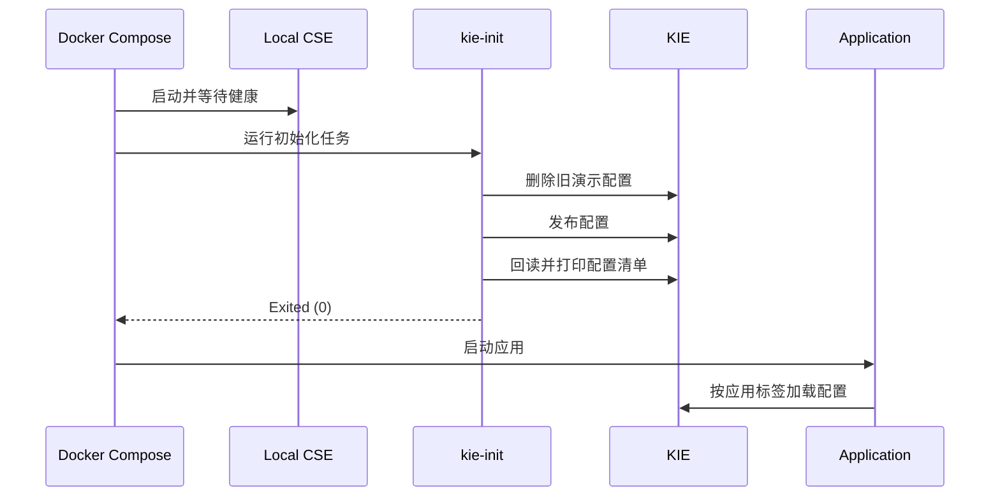

# KIE 配置指南

本文档说明本工程实际使用的 KIE 配置方式，包括初始化、值类型、`fileSource`、灰度规则、故障注入和业务配置读取。示例以 `kie-init/init-route-rules.sh` 与 `kie-config-demo` 的当前实现为准。

## 1. 本工程的配置生命周期



初始化脚本会发布：

| KIE key | `value_type` | 标签服务 | 用途 |
| --- | --- | --- | --- |
| `governance.yaml` | `yaml` | `gateway` | 商品灰度路由 |
| `governance-fault.yaml` | `yaml` | `fault-injection-consumer` | 两组故障注入规则 |
| `demo.conf.text-message` | `text` | `kie-config-demo` | 单值字符串 |
| `demo.conf.yaml-message` | `yaml` | `kie-config-demo` | 展示 YAML 值的读取差异 |
| `demo.conf.props-message` | `properties` | `kie-config-demo` | 单个 properties 属性 |
| `app.business.config` | `properties` | `kie-config-demo` | 多属性业务配置 |

> `kie-init` 会清理默认租户中的既有演示配置，只适用于本项目的独立 Compose 环境。

## 2. 连接配置

应用在 `bootstrap.yml` 中连接 Service Center 和 KIE：

```yaml
spring:
  cloud:
    servicecomb:
      service:
        application: ${CAS_APPLICATION_NAME:demo-application}
        name: ${spring.application.name}
        version: ${CAS_INSTANCE_VERSION:1.0.0}
      discovery:
        address: ${PAAS_CSE_SC_ENDPOINT:http://127.0.0.1:30100}
      config:
        serverAddr: ${PAAS_CSE_CC_ENDPOINT:http://127.0.0.1:30110}
        serverType: kie
```

Compose 统一设置地址和应用名，使相同应用配置可以在容器和本地环境间复用。

## 3. 三种值类型

| `value_type` | 本工程中的行为 | 适用场景 |
| --- | --- | --- |
| `text` | KIE key 作为 Spring 属性名，value 保持字符串 | 单值和完整多行文本 |
| `properties` | 每行 `key=value` 注入为独立属性 | 多属性业务配置 |
| `yaml` | YAML 结构需要结合 `fileSource` 扁平化 | 集中管理治理规则和路由规则 |

### text

```text
KIE key:   demo.conf.text-message
KIE value: hello-from-kie-text-type

Environment:
demo.conf.text-message=hello-from-kie-text-type
```

### properties

```properties
app.tenant-id=tenant-001
app.limit.qps=500
app.feature.gray-release-enabled=true
```

这些行分别成为 Spring Environment 属性，可以通过 `@ConfigurationProperties(prefix = "app")` 绑定到嵌套对象。

### yaml 与 fileSource

Gateway 的 `bootstrap.yml` 声明：

```yaml
spring:
  cloud:
    servicecomb:
      config:
        fileSource: governance.yaml,application.yaml
```

`fileSource` 指定哪些 KIE key 的 YAML 内容需要作为配置文件解析。YAML 中需要保持为完整字符串的治理规则使用 block scalar：

```yaml
servicecomb:
  routeRule:
    product-service: |
      - precedence: 2
        match:
          headers:
            X-Gray-Tag:
              exact: gray
        route:
          - weight: 30
            tags:
              version: 1.0.0
          - weight: 70
            tags:
              version: 2.0.0
```

外层 YAML 被加载为 Spring 属性，`servicecomb.routeRule.product-service` 的值仍是可供路由组件解析的完整规则字符串。

## 4. 灰度路由配置

当前规则只作用于 `product-service`：

- `precedence: 2` 匹配 `X-Gray-Tag: gray`，按 30/70 选择 v1/v2。
- `precedence: 1` 使用空匹配作为默认规则，100% 选择 v1。

配置由 `kie-init/init-route-rules.sh` 发布，Gateway 通过 `fileSource: governance.yaml` 加载。

```bash
docker compose --profile config up -d --build
docker compose logs kie-init
bash verify.sh --tc 3
```

TC-3 使用 100 次请求检查权重容差，并验证 Gateway → Order → Product 的上下文传播。不要使用单次请求判断权重规则是否正确。

## 5. 故障注入配置

`governance-fault.yaml` 同时定义匹配组和策略：

```yaml
servicecomb:
  matchGroup:
    callNormalOperation: |
      matches:
        - apiPath:
            exact: /api/call
          serviceName: fault-injection-normal-provider
  faultInjection:
    callNormalOperation: |
      type: abort
      percentage: 50
      fallbackType: ThrowException
      forceClosed: false
```

`fault-injection-consumer/bootstrap.yml` 使用 `fileSource: governance-fault.yaml,application.yaml` 加载规则。匹配组名与策略名必须一致，路径和目标服务也必须与实际调用相符。

```bash
curl -s http://localhost:8102/api/fault-test/preview
bash verify.sh --tc 11
```

验证同时检查 Consumer 结果和 Provider 调用计数，确保注入发生在进入下游业务代码之前。

## 6. 业务配置读取

启动配置专题：

```bash
docker compose --profile config up -d --build
```

常用观察端点：

| 端点 | 用途 |
| --- | --- |
| `GET /api/conf/current` | 查看主要配置值 |
| `GET /api/conf/value` | 查看 `@Value` 读取结果 |
| `GET /api/conf/env` | 查看 Environment 读取结果 |
| `GET /api/conf/business` | 查看嵌套业务配置绑定结果 |
| `GET /api/conf/history` | 查看应用记录的配置变更 |
| `POST /api/conf/refresh` | 手动触发配置刷新 |

```bash
curl -s http://localhost:8084/api/conf/current
curl -s http://localhost:8084/api/conf/business
curl -s http://localhost:8084/api/conf/env
```

敏感字段在响应中会被掩码处理，但示例配置仍不应存放真实凭据。

## 7. 修改和观察配置

先查询配置并记录目标条目的 `id`：

```bash
curl -s http://localhost:30110/v1/default/kie/kv
```

更新指定条目：

```bash
curl -X PUT http://localhost:30110/v1/default/kie/kv/CONFIG_ID \
  -H 'Content-Type: application/json' \
  -d '{"value":"new-value","value_type":"text","labels":{"app":"demo-application","service":"kie-config-demo","environment":""}}'
```

随后查看应用观察端点。需要主动刷新时：

```bash
curl -X POST http://localhost:8084/api/conf/refresh
curl -s http://localhost:8084/api/conf/current
curl -s http://localhost:8084/api/conf/history
```

不同配置消费者的缓存和刷新方式并不完全相同。修改灰度或治理规则后，应重跑对应 `verify.sh --tc N`；如果结果没有变化，再重建目标 Consumer，而不是仅依据 KIE API 更新成功判断规则已经生效。

## 8. 常见问题

### kie-init 失败

```bash
docker compose logs kie-init
curl -s http://localhost:30110/v1/health
```

检查 KIE 是否健康、初始化容器是否能访问 `local-cse:30110`，以及发布后的回读阶段是否返回非零状态。

### 应用读不到 YAML 规则

检查：

1. KIE key 是否出现在目标应用的 `fileSource` 中。
2. KIE 标签中的 `app`、`service` 是否匹配目标应用。
3. 需要保持多行字符串的规则是否使用 `|`。
4. 匹配组名与策略名是否一致。

### properties 子属性为空

确认 value 使用 `key=value` 多行格式，并以 `value_type=properties` 发布。KIE 条目的外层 key 只是配置记录名称，不会替代内容中的每个属性名。

## 9. KIE API 速查

```bash
# 健康检查
curl -s http://localhost:30110/v1/health

# 查询全部配置
curl -s http://localhost:30110/v1/default/kie/kv

# 删除配置
curl -X DELETE http://localhost:30110/v1/default/kie/kv/CONFIG_ID
```

完整初始化请求体以 [init-route-rules.sh](../kie-init/init-route-rules.sh) 为准，避免在文档和脚本中维护两套容易漂移的配置副本。
