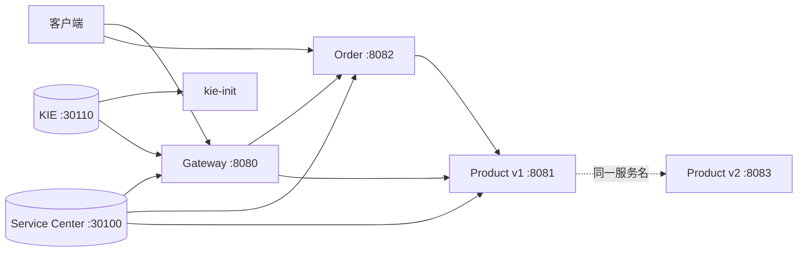

# Spring Cloud Huawei ServiceComb 实战教程

本教程以可观察结果为主线，按核心调用、配置灰度和治理专题逐步体验工程。每一步都对应一个可单独执行的 `verify.sh` 用例。

快速定位：

- [架构与配置](ARCHITECTURE.md)
- [测试用例](TEST_CASES.md)
- [教程与测试矩阵](TUTORIAL_TESTCASE_MATRIX.md)
- [KIE 配置指南](KIE_CONFIG.md)
- [Consumer 熔断测试](CIRCUIT_BREAKER_TEST.md)

## 1. 学习目标

完成教程后，你可以理解：

- 应用如何注册到 Service Center，并通过服务名调用。
- KIE 配置如何在应用启动阶段加载。
- Gateway、Order 和 Product 如何组成核心调用链。
- 商品双版本如何通过实例元数据和路由规则实现灰度。
- 重试、实例隔离、舱壁、Consumer 熔断和故障注入如何被独立验证。
- 如何运行单组或完整端到端验证。

## 2. 架构总览



默认 profile 只启动最小核心链路。配置与治理模块按 profile 加入，避免首次体验时占用不必要的资源。

## 3. 环境准备

需要：

- Docker Engine 与 Docker Compose v2
- `bash`、`curl`、`python3`
- 本地检查需要 JDK 17 和 Maven 3.9+
- 首次构建需要访问 Maven Central 和 Docker Registry

Local CSE 离线包是 `linux-amd64` 版本。ARM64 主机需要启用 amd64 容器模拟，或替换为匹配架构的软件包。

```bash
docker version
docker compose version
curl --version
python3 --version
```

## 4. 第一步：启动基础设施和核心服务

```bash
docker compose up -d --build
docker compose ps
```

默认范围包含：

- `local-cse`
- `kie-init`
- `gateway`
- `order-service`
- `product-service`

`local-cse` 健康后，`kie-init` 发布并校验配置，然后以状态码 0 退出。它不是常驻服务。

```bash
curl -s http://localhost:30100/health
curl -s http://localhost:30110/v1/health
bash verify.sh --tc 1
```

## 5. 第二步：理解注册与发现

所有应用通过 Compose 注入 Service Center 和 KIE 地址。各模块的 `bootstrap.yml` 在启动早期读取这些参数，应用以服务名、版本和实例端点注册。

验证 Order 通过服务名调用 Product：

```bash
curl -s http://localhost:8082/api/orders/products
curl -s 'http://localhost:8082/api/orders?productId=1'
bash verify.sh --tc 2
```

业务代码只依赖 `product-service` 逻辑名称，不保存 Product 容器地址。实例选择由服务发现和负载均衡完成。

## 6. KIE 配置中心

`kie-init/init-route-rules.sh` 等待 KIE 就绪，清理旧的演示配置，再发布灰度、故障注入和业务配置。脚本最后回读全部配置；任一发布步骤失败都会以非零状态退出。

启动配置专题：

```bash
docker compose --profile config up -d --build
docker compose logs kie-init
curl -s http://localhost:8084/api/conf/current
curl -s http://localhost:8084/api/conf/business
```

本工程使用 `text`、`properties` 和 `yaml` 三种值类型展示不同读取方式。配置结构、`fileSource` 和动态刷新说明集中在 [KIE 配置指南](KIE_CONFIG.md)，教程不重复底层解析细节。

## 7. 第三步：OpenFeign 服务调用

`order-service` 中的 `ProductClient` 声明 Product HTTP 接口。`@FeignClient` 使用逻辑服务名，由服务发现解析实例；调用失败时由 FallbackFactory 生成稳定响应。

```bash
curl -s http://localhost:8082/api/orders/products
curl -s 'http://localhost:8082/api/orders?productId=1'
bash verify.sh --tc 2
```

观察响应中的 `version` 和服务端口，可以确认实际命中的 Product 实例。

## 8. 第四步：灰度发布

`product-service` 和 `product-service-v2` 使用相同逻辑服务名，以版本元数据区分。KIE 路由规则定义：

- 无灰度标签时固定选择 v1。
- `X-Gray-Tag: gray` 流量按 30/70 权重选择 v1/v2。
- Gateway 到 Order 再到 Product 的调用继续携带灰度上下文。

```bash
docker compose --profile config up -d --build
curl -s http://localhost:8080/api/products/version
curl -s -H 'X-Gray-Tag: gray' http://localhost:8080/api/products/version
curl -s -H 'X-Gray-Tag: gray' http://localhost:8080/api/orders/version
curl -s -H 'X-Gray-Tag: gray' http://localhost:8080/gateway/gray-diagnose
bash verify.sh --tc 3
```

诊断接口通过 `matchesGrayRule` 明确当前请求是否匹配 `X-Gray-Tag: gray`。权重规则具有随机性，因此 TC-3 使用 100 次采样和明确容差判断，而不是要求单次请求固定命中某个版本。

## 9. 第五步：故障模型与 Consumer 熔断

### 9.1 Provider 故障端点

商品服务的错误端点交替返回 200/502，用来构造稳定的下游故障输入：

```bash
bash verify.sh --tc 4
```

TC-4 只证明故障模型可用，不将普通 HTTP 错误误判成熔断。

### 9.2 Consumer 熔断

启动治理专题：

```bash
docker compose --profile governance up -d --build
bash verify.sh --tc 10
```

TC-10 先清零 Provider 计数，再通过 Consumer 发起 12 次 100% 失败请求。Provider 实际调用数小于 12，才能证明部分请求在 Consumer 入口被短路。窗口、阈值、状态转换和手工实验见 [Consumer 熔断测试](CIRCUIT_BREAKER_TEST.md)。

## 10. 第六步：Gateway 限流

Gateway 对商品路径配置请求速率限制。TC-5 在短时间内发起 30 个请求，并要求出现 HTTP 429：

```bash
bash verify.sh --tc 5
```

限流是状态型规则，紧接着重复执行时可能仍处于同一刷新窗口；测试结果应以脚本汇总为准。

## 11. Gateway 路由

Gateway 根据路径将请求转发到 Product 或 Order：

```bash
curl -s http://localhost:8080/api/products/1
curl -s http://localhost:8080/api/orders/products
bash verify.sh --tc 6
```

TC-6 验证基础服务路由，TC-3 负责验证灰度上下文和版本选择，两者职责不同。

## 12. 第七步：重试治理

重试专题使用独立 Provider/Consumer，避免交替失败计数影响核心业务服务。

```bash
docker compose --profile governance up -d --build
curl -s http://localhost:8091/no-retry
curl -s http://localhost:8091/retry
bash verify.sh --tc 7
```

先观察无重试时的失败分布，再观察策略生效后的恢复结果。具体状态码和重试次数位于 `retry-consumer/src/main/resources/application.yml`。

## 13. 第八步：实例隔离

实例隔离专题根据调用统计判断目标实例是否应继续接收流量：

```bash
curl -s http://localhost:8093/test-minimum-calls
bash verify.sh --tc 8
```

示例将计数型 Provider 与规则型 Consumer 分开，便于观察最小调用数和错误率条件。

## 14. 第九步：舱壁隔离

舱壁通过并发许可限制同时进入下游的请求数：

```bash
curl -s http://localhost:8095/bulk-rate-limiting
bash verify.sh --tc 9
```

TC-9 发起 10 个并发请求，读取结构化结果，并断言成功数不超过 2、拒绝数不少于 8。

## 15. 第十步：故障注入

故障注入专题由两个 Provider 和一个 Consumer 组成。KIE 规则对正常 Provider 使用 50% 注入，对错误 Provider 使用 100% 注入。

```bash
curl -s http://localhost:8102/api/fault-test/preview
curl -s http://localhost:8102/api/fault-test/stats/50
bash verify.sh --tc 11
```

验证不只统计 Consumer 成功/失败，还检查 Provider 实际调用次数：被注入故障的请求不应进入下游业务代码。

## 16. 故障排查

### Local CSE 未就绪

```bash
docker compose ps
docker compose logs local-cse
curl -s http://localhost:30100/health
curl -s http://localhost:30110/v1/health
```

确认宿主机端口未被占用，并检查 amd64 架构要求。

### KIE 初始化失败

```bash
docker compose logs kie-init
docker compose up -d --force-recreate kie-init
```

初始化脚本会清理并重建演示配置。不要在包含需要保留配置的环境中直接复用该脚本。

### 服务调用或规则未生效

```bash
docker compose --profile all ps
docker compose --profile all logs order-service gateway
docker compose --profile all logs retry-consumer circuit-breaker-consumer
```

依次确认 Service Center/KIE 健康、目标 profile 已启动、Consumer 和 Provider 均已运行、规则匹配路径与实际请求一致。

## 17. 完整验证与清理

```bash
bash check.sh
docker compose --profile all up -d --build
bash verify.sh
docker compose --profile all down
```

完整断言和退出码见 [测试用例](TEST_CASES.md)。提交前应确保 `check.sh` 通过并且 Git 工作区没有构建产物。
